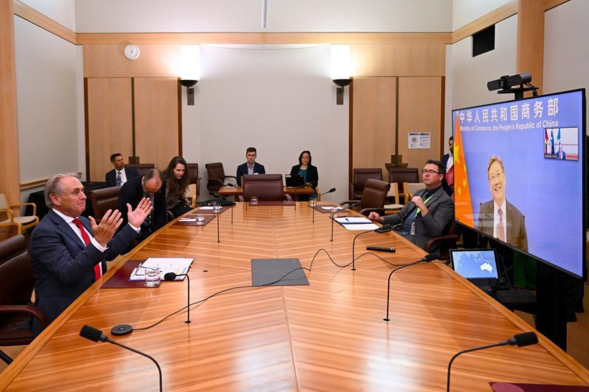
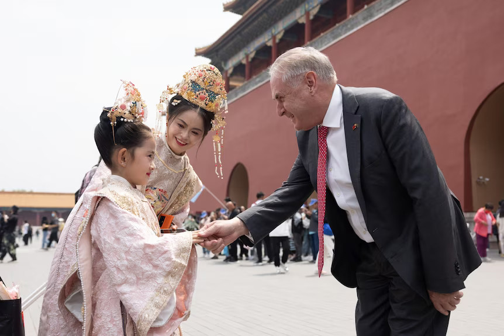
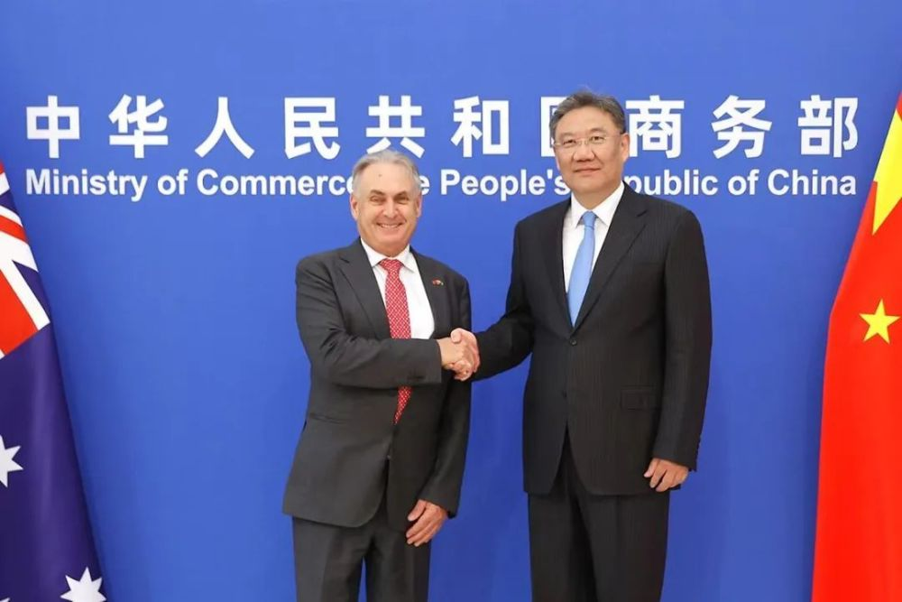

# 澳贸易部长反驳“访华空手而归”：这只是第一步，后续还有更多工作

【文/观察者网 熊超然】5月13日，在澳大利亚贸易部长唐·法瑞尔（Don
Farrell）结束为期两天的访华行程回国后，澳大利亚广播公司（ABC）报道认为，中方并未就一系列针对澳方的贸易禁令作出让步。不过，法瑞尔表示，两国关系已出现“积极的势头”，他12日晚与中国商务部部长王文涛在会谈中同意“加强对话”以解决贸易问题。

对于外界所谓“访华空手而归”的说法，法瑞尔予以反驳称，他此访只是“第一步”，未来还有更多工作需要坚持进行。他强调，自己同王文涛部长的会谈是“积极的”，已经有了“许多进展”，澳大利亚的煤炭和铜矿已重新进入中国市场，有关大麦的贸易争端也找到了解决途径。

_ABC报道截图_

从2017年年中开始，澳大利亚特恩布尔政府和莫里森政府盲目跟随美国，全方位地破坏与中国的双边关系，包括炒作“中国威胁论”、以所谓“国家安全”为由阻碍两国间正常经贸活动，以及响应美国、挑头鼓噪对中国进行有罪推定式的“病毒溯源调查”。自此，中澳关系和经贸往来骤然降至低谷。

与此同时，由于澳方在两国贸易中存在不当之处，中方对澳大利亚大麦、葡萄酒加征了禁止性关税，暂停多家澳大利亚牛肉供应商出口资格。中国海关还在进口口岸，依法依规对包括澳大利亚龙虾和煤炭在内的进口产品实施检验检疫以及质量安全检查和环保项目检测。

ABC称，中澳联合致函世界贸易组织（WTO）中止两国大麦双反措施争端，这为中国取消对澳大利亚大麦和葡萄酒的贸易禁令铺平了道路。

在5月12日深夜的新闻发布会上，法瑞尔称，中方已表示，近期达成的协议“仍在正轨上”，而法瑞尔则说：“我还重申，我们希望在澳大利亚葡萄酒的WTO争端中遵循类似的程序。”

据报道，法瑞尔同时还反驳了有关他“从中国空手而归”的这种说法，他称这次访华是澳中两国贸易接触的“第一步”：“（未来）需要做更多的工作，我一直认为，我们必须继续坚持下去。”

今年2月6日，中国商务部部长王文涛应约与澳大利亚贸易部长法瑞尔举行视频会谈。王文涛当时指出，中澳互为重要经贸合作伙伴，双方经济结构高度互补，双边经贸合作互利共赢。当前两国经贸关系正面临重要窗口期，双方应共同努力，为经贸合作注入更多的积极因素。此次会谈是我们共同推动中澳经贸关系重回正轨的重要一步。

_今年2月6日，中国商务部部长王文涛和澳贸易部长法瑞尔（左一）举行视频会议_

ABC称，在5月12日的会谈中，王文涛也向澳方提出，希望澳方能提供良好营商环境，公平、公正对待中国企业和产品。此前，澳大利亚国库部长吉姆·查默斯（Jim
Chalmers）就拒绝了一家中国公司增持一个关键锂开发项目股份的请求。

中国是澳大利亚最大的贸易伙伴，2022年双边贸易额达到2870亿澳元，占澳大利亚对外贸易总额的28%。同时，澳大利亚也是中国最大的商品供应国之一，去年中国购买的11亿吨铁矿石中，65%来自澳大利亚。

5月11日，澳大利亚贸易部长法瑞尔启程前往北京，开始为期两天的访华行程，期间还举行了自2019年以来两国最高贸易官员的首次面对面会晤，致力于“推动解决悬而未决的贸易障碍”。

5月12日，据ABC报道，就在法瑞尔当天同中国商务部部长王文涛举行会谈前的4个小时，他收到了中方“出人意料的邀请”，由中国商务部高级官员陪同参观故宫。对此，法瑞尔本人感到“非常荣幸”，并对中方表示感谢。澳媒则认为，“这是一个令人鼓舞的迹象”。

_澳大利亚贸易部长唐·法瑞尔参观故宫
图自ABC_

报道称，这是自2019年11月以来，澳大利亚贸易部长首次访华，也是两国关系跌入低谷以来第二位访华的澳大利亚政府高级部长（注：澳外长黄英贤曾于去年12月访华）。此行对于两国经济而言都是一个好兆头，也为两国加强外交关系奠定基础。

ABC援引澳大利亚官员的说法认为，法瑞尔此次访华是一个“受到欢迎的发展进程”，虽然澳方此前淡化了对于两国部长会谈的预期，但仍希望解决中国对澳大利亚产品的贸易禁令问题。

澳大利亚经济学家、悉尼大学教授汉斯·杭智科（Hans
Hendrischke）认为，法瑞尔此访是“（澳中接触的）第一步”，且非常重要，因为有望在中国对澳农产品和其他产品的禁令问题上取得突破。

澳大利亚国际事务研究所中国事务研究员姜云则表示，在此前多次双边接触后，法瑞尔此访是澳中两国“重新接触”的一部分，这已经可以公开提及，不必再讳言。同时，随着澳中两国在各个领域开始接触，未来可能还会有领导人层级的访问出现。

据商务部新闻办公室微信公众号“商务微新闻”消息，5月12日，商务部部长王文涛与来访的澳大利亚贸易部长法瑞尔在京共同主持召开第16届中澳部长级经济联委会。双方就落实两国领导人巴厘岛会晤重要共识、稳步发展双边经贸关系、妥善处理彼此经贸关切、拓展务实合作等议题进行坦诚、专业、全面的交流。

_5月12日，商务部部长王文涛与来访的澳大利亚贸易部长法瑞尔在京共同主持召开第16届中澳部长级经济联委会_

王文涛指出，中澳经济高度互补，经贸合作成果丰硕，联委会时隔6年再次启动，具有标志性意义。双方应继续落实好两国领导人会晤重要共识，着眼于中澳经贸关系长远发展，求同存异、扩大共同利益，在平等互利基础上解决彼此关切，推动双方务实合作迈上新台阶。

双方一致同意，重启自贸协定联委会、高级别贸易救济对话等经贸对话机制，加强绿色低碳、奥运基础设施建设等合作，推动省州经贸对接，并支持两国企业在数字贸易和电子商务领域开展合作。

**本文系观察者网独家稿件，未经授权，不得转载。**

