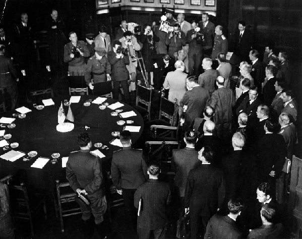
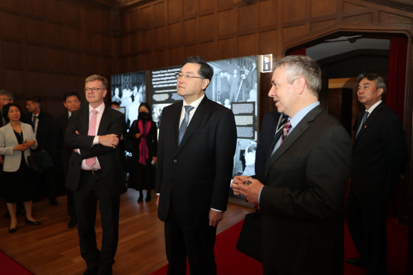
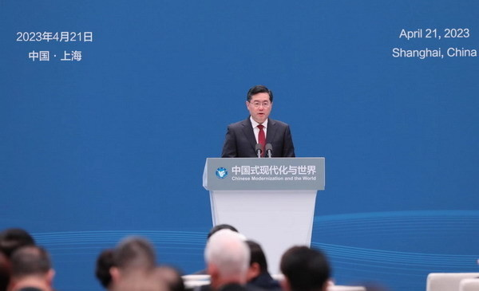
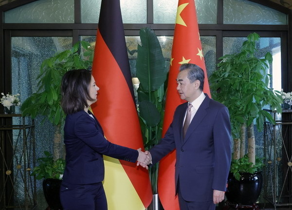

# 秦刚访问德国期间参观的波茨坦会议旧址，与台湾问题有关

【文/观察者网 熊超然】当地时间5月10日，国务委员兼外长秦刚在柏林参观波茨坦会议旧址并发表讲话——“战后国际秩序必须维护、中国国家统一必须实现”。

“中国外长秦刚为何在波茨坦停留？它和台湾有什么关系？”5月11日，香港《南华早报》以此为题发表文章，分析秦刚此次访德期间的这趟特殊行程。作为形成二战战后国际秩序的一个“决定性地点”，波茨坦这座德国城市对中国和海峡两岸关系具有特殊意义。

当年的《波茨坦公告》及《开罗宣言》等国际法律文件，构成战后国际秩序的国际法基础，写明台湾回归中国是二战后国际秩序的组成部分，台湾自古以来就是中国领土不可分割的一部分，两岸同属一个中国，这是台湾的历史，也是台湾的现状。

值得注意的是，自秦刚担任中国外长以来，已多次援引这些国际法律文件谈及台湾问题的历史经纬，就是要以此回应美方，强调美国纵容“台独”分裂活动，破坏战后国际秩序，损害中国主权和领土完整，中国人民决不答应。

同时，访德期间参观波茨坦会议旧址，秦刚也有另一层精心用意，中方希望得到德国的理解和支持。正如中共中央政治局委员、中央外办主任王毅上月在北京会见德国外长贝尔伯克时所说的，中国曾支持德国实现统一，希望并相信德国也会支持中国和平统一大业。

_《南华早报》文章截图_

回顾历史，波茨坦这座城市以及《波茨坦公告》这份文件，对中国和海峡两岸关系具有特殊的意义。

在德国首都柏林以南30多公里处，有一个波茨坦采西林霍夫宫。1945年7月17日至8月2日，美、苏、英三国首脑在此召开波茨坦会议。中国作为战胜国，其实也派员参加了波茨坦会议，只是首脑没有出席，这一点往往被人所忽略。

_资料图：1945年7月26日波茨坦会议召开_

会议期间，中、美、英三国发表《中美英三国促令日本投降之波茨坦公告》。《波茨坦公告》及《开罗宣言》等国际法律文件，构成战后国际秩序的国际法基础。《波茨坦公告》的签署是第二次世界大战反法西斯战争胜利重要成果。

《波茨坦公告》第八条规定：“《开罗宣言》之条件必将实施，而日本之主权必将限于本州、北海道、九州、四国及吾人所决定之其他小岛”。也就是说，日本战后必须归还被其占领的台湾和其他中国领土。

“刚才我参观了波茨坦会议旧址，历史和现实交错，令人感慨良多。1945年召开的波茨坦会议对奠定二战后国际秩序发挥了重要作用，对中国人民具有特殊的历史意义。”秦刚5月10日说，我们要牢记历史给我们的警示：战后国际秩序必须得到维护！国际公平正义必须得到伸张！搞“台独”分裂，挑战国际公理和秩序，逆历史潮流而动，注定是绝路一条。中国国家统一必须要实现！

_图自外交部网站_

事实上，这并非秦刚履新外交部长一职后首次这样说。4月21日，秦刚在上海出席“中国式现代化与世界”蓝厅论坛开幕式并发表主旨演讲时说：“台湾回归中国是二战后国际秩序的组成部分，《开罗宣言》白纸黑字写着，《波茨坦公告》清清楚楚印着。”

_图自外交部网站_

《南华早报》指出，过去20年里，许多中国领导人和高级外交官都曾来过波茨坦，谈及台湾问题的历史经纬，但秦刚本周访问波茨坦时的这番话，则是明确向美国发出讯号。

“今天，美国口口声声要维护以规则为基础的国际秩序，却把自己当年起草的《波茨坦公告》抛在脑后，支持、纵容“台独”分裂活动，破坏战后国际秩序，损害中国主权和领土完整，中国人民决不答应。”秦刚这样说道。

分析人士认为，秦刚的这番发言，正好回应了美国及其盟友针对中国大陆所谓“单方面改变台海现状”和“挑战美国领导的‘基于规则的国际秩序’”等无端指责。

四川大学的国际政治学者庞中英表示，在台海紧张局势不断升级的背景下，秦刚此次访问德国期间参观波茨坦会议旧址，也有特别精心的用意。他表示：“中方显然希望得到德国的理解和支持。德国在二战后分裂为东西德，也经历了寻求统一的历程。”

4月15日，中共中央政治局委员、中央外办主任王毅在北京会见德国外长贝尔伯克时曾指出，中国曾支持德国实现统一，希望并相信德国也会支持中国和平统一大业。

_图自外交部网站_

庞中英认为，访问波茨坦是一个“善意之举”，尽管在俄乌冲突的背景之下，德国和其他欧洲国家在很大程度上靠近了美国。“秦刚对相关国际条约的解释，是中国与其他国家进行有意义讨论的机会，真正的对话将有助于推进中方立场和利益。”

此次参观波茨坦会议旧址，秦刚还在签名簿上留言，重申并强调了“中国声音”：维护战后国际秩序、促进世界和平繁荣、实现中国国家统一。

_图自外交部网站_

**本文系观察者网独家稿件，未经授权，不得转载。**

