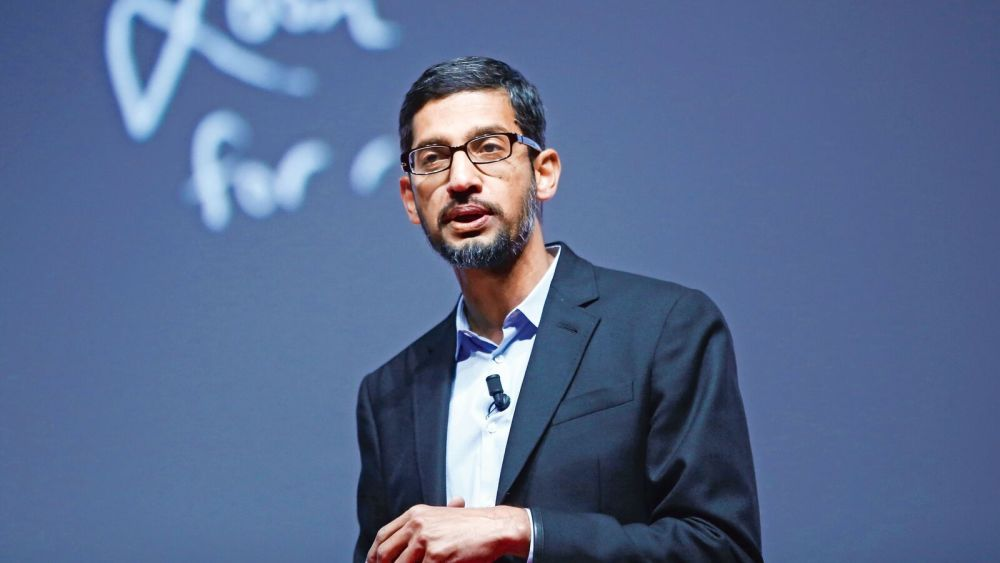

# 谷歌CEO放言：人工智能将触及一切，引发人类社会大变革

**划重点**

  * _1_ 皮查伊认为，人工智能将带来“平台转移”级别的大变革，他称其是人类正在研究的最深奥技术。人工智能将触及一切，影响每个部门、每个行业以及我们生活的方方面面。
  * _2_ 有人认为，此次平台转移并不是由谷歌引发的，而是由OpenAI、ChatGPT和微软共同开启的。但皮查伊解释称，谷歌正在帮助推动这次平台转移，而且推动平台转移的的转换器以及很多底层技术都源于谷歌。
  * _3_ 谷歌搜索就像是大型机，而人工智能则是个人电脑，尽管人工智能不能承担许多大型计算机的工作，但它更便宜，更容易获得。对此，皮查伊称谷歌搜索也在快速进步，比如推出了Bard和搜索生成体验功能。
  * _4_ 皮查伊表示，当我们开始建立更强大的模型时，阻碍我们前进的因素之一是所需要的庞大计算资源。因此，谷歌决定把DeepMind和谷歌大脑整合起来，而且现在正是整合的最佳时机。
  * _5_ 对于人工智能可能导致更多人失业，皮查伊驳斥称，在过去20年的技术自动化中，失业率并没有完全失控。他认为人工智能的发展也会如此，并预测律师职业不会消失，而且人们会有更多机会了解如何成为律师。

腾讯科技讯
5月13日消息，在刚刚结束的年度开发者大会上，谷歌首席执行官桑达尔·皮查伊宣称几乎所有谷歌产品中都引入了新的生成式人工智能（AIGC）功能。这对谷歌来说是个重要时刻，因为该公司发明了当前人工智能背后的许多核心技术。

谷歌指出，爆火聊谈机器人ChatGPT中的“T”代表的就是Transformer（转换器），它是谷歌最先发明的大型语言模型技术，但OpenAI和其他公司已经率先将AIGC产品推向市场，OpenAI还与微软合作推出了新版必应，它似乎正成为很长一段时间以来谷歌搜索的第一个真正竞争对手。皮查伊对此有何看法？他对谷歌业务的核心搜索的未来有何看法？

基于人工智能的搜索可能会以一种更自然的方式回答问题，这意味着其将重塑网络，并且也会重塑谷歌。皮查伊已经在采取行动，他刚刚重组了谷歌和Alphabet的人工智能团队，将名为DeepMind的人工智能实验室转移到谷歌内部，并将其与谷歌大脑(Google
Brain)人工智能团队合并，成立了名为Google DeepMind的新部门。他为什么会做出这个决定？他是如何实现目标的？

皮查伊对谷歌的未来有何愿景？他希望谷歌走向何方？到底是什么推动了他带领谷歌走向未来的雄心壮志？通过本文，我们将从皮查伊的角度看待这次“平台转移”。

**以下为皮查伊专访全文摘要：**

**问：谷歌几乎在我们能够想到的所有谷歌产品和服务中都集成了AIGC功能，你最喜欢其中的哪些功能？**

皮查伊：肯定是我们正在努力推出的搜索生成体验，这是我们最常用的产品，也是最重要的产品。因此，有机会通过这样的技术演进让产品变得更好，令人感到兴奋。我认为，我们的团队已经准备好了迎接挑战。

**问：你在主旨演讲中说人工智能将是一次平台转移级别的大变革，我同意你的观点。但我突然意识到，准确地理解你所说的平台转换是什么意思至关重要。为什么你认为人工智能是一次平台转移，这对你意味着什么？**

皮查伊：我认为这是一次非同寻常的平台转移。人工智能将触及一切，影响每个部门、每个行业以及我们生活的方方面面。思考这个问题的方式与我们对个人电脑、互联网和移动设备带来的平台转移几乎没有什么不同。按照这种逻辑，我认为这将是一次巨大的转变。

但我认为人工智能比前几次平台转移更深刻。在某些方面，我称它为人类正在研究的最深奥的技术，将影响到我们所做的一切。因此，我认为这是那种更深层次的转变之一。即使是非常传统的行业，随着时间的推移，人工智能也将逐渐产生巨大影响。有鉴于此，我认为“平台转移”一词在这里也有更深刻的含义。

**问：平台转移发生时，很多人将会改变他们的行为。谷歌是一家快速崛起的公司，特别是随着互联网的出现。随着向移动时代的转变，我认为谷歌成为了主导者。你看到谷歌在这次平台转移中面临的风险了吗？**

皮查伊：我更多地感受到了移动平台转移带来的风险，谷歌为此开发了安卓系统。作为一家公司，我们必须适应移动转变趋势。我们建立在互联网基础上，但不管怎么看，我们都不是所谓的移动原生公司。因此，当移动时代到来时，我们的产品必须努力适应它。这是一个颠覆性的时刻。人们现在可以直接使用应用程序，你可以在自己的手机上安装应用。

至于人工智能，我觉得这是我们作为人工智能先行公司的第七年。我觉得我们是人工智能领域的原住民，谷歌的大多数团队都直观地理解在我们的产品中使用人工智能意味着什么。

此外，我们还推动了最先进的技术发展。在某些方面，我们正在帮助推动这次平台转移。我们深刻理解推动技术发展并将其融入我们的产品意味着什么，所有这些转变都是颠覆性的，但我看到了人工智能未来机遇的规模，我觉得我们已经成功了。很长一段时间以来，我们在人工智能领域投入了大量资金，我们清楚地知道，不仅要在我们的产品中构建人工智能，还要向世界其他地方提供人工智能。我们从一开始就计划好了，所以这一刻让我很兴奋。

**问：每个人都可以看到，正在发生的平台转移并不是由谷歌引发的。在某种程度上，它是由OpenAI、ChatGPT和微软共同开启的，这是因为你们坚持负责任的、谨慎的立场。我认为，也许这次平台转移是一个意外，我不认为OpenAI是在为这样的时刻而战。是什么让谷歌对此做出反应，而不是主动拉开平台转移的序幕？**

皮查伊：我认为，推动平台转移的某些因素源自谷歌在转换器方面所作的努力，还有很多底层技术也是如此。我认为改变拐点的是用户是否做好了准备。就像那一刻你意识到：虽然这些技术有缺陷，但我们已经处于人们准备好使用它的时刻。他们理解它，并且正在适应它。就在那一刻，我们意识到了这一点，并开始着手研究。我只是觉得我们花了些时间才做对。对我们来说，这很重要，因为我们的产品被很多人使用，在重要的时刻，我认为把它做好很重要。

**问：作为谷歌所有产品的负责人，你认为你在ChatGPT中看到的幻觉或错误，对你来说是不可接受的吗?**

皮查伊：我们必须弄清楚如何在正确的情况下使用它，对吗？例如，如果你在搜索中输入三岁儿童服用泰诺的剂量，在这种情况下人工智能产生幻觉很危险。然而，如果你只是要求人工智能帮你写关于某个主题的诗，那么即使写错了也没关系。我所说的做好就是做好这些细节。在搜索中，我们已经在幻觉问题上取得了进展，只是我们还需要时间。我不是说它不能用，只是我们得花点时间把事情做好。

**问：但我要说的是，OpenAI在很大程度上是这个领域的颠覆者。他们的产品在回答问题方面不如谷歌搜索那么可靠，但在某些查询上的表现更好。ChatGPT使用起来更有趣，这是一个不同的范式。用户已经为接受它做好了准备，但后来它不断犯错。我最常用的例子之一是：人们走进图书馆，要求借根本不存在的书。我认为，这在谷歌搜索中是不可接受的。**

皮查伊：我利用Bard搜索了许多产品，它给提供了购买网址，一个URL，但实际上其根本就不存在。所以，所有这些模型都有同样的潜在问题，但也有很多让我们都感到兴奋的用例。所以我认为两者可以同时存在。

**问：但你看到了那种典型的颠覆曲线吗？谷歌搜索就像是大型机，而人工智能则像是个人电脑，这是一个典型的颠覆例子。尽管个人电脑不能做大型计算机所能做的一切，但它更便宜，更容易获得，也许结果在某些情况下更有用。**

皮查伊：不，我不这么认为，因为谷歌搜索也在快速进步，它并不总是在原地踏步，我们总是在努力为用户提供正确的服务。这是一个用户预期正在转变的时刻，我们会适应这一趋势。我们推出了Bard，现在我们正在让Bard被更广泛地使用，这给了我们沙盒。在那里，我们以一种不受约束的方式，寻找着可能存在的边界。我们还推出了搜索生成体验，Bard对我来说并非是零和游戏。人们正在使用搜索，尝试新的东西，这就是为什么我为推出这些新体验感到兴奋的原因，因为我认为人们会对此做出反应。

**问：几个月前，我参加了由ChatGPT支持的新必应的发布仪式。我看到微软首席执行官萨蒂亚·纳德拉在那里，他说：“我非常尊重皮查伊和他的团队，但我希望谷歌能共舞。我想让人们知道，是微软让谷歌下场的。”你对这段评论有何看法？**

皮查伊：我已经说过，我非常尊重纳德拉及其团队，我想他这么说的部分原因是他在向我发出信号。我们去年开始致力于打造新的搜索生成体验。对我来说，纳德拉的信号是，有一种新的方法可以让搜索变得更好，也有一种方法可以让我们的用户体验变得更好，但我们必须把它做对。所以我才说，努力工作并把它做好最重要。

**问：我们接下来讨论下搜索的现状。我们都知道，搜索业务的利润非常丰厚，欧盟花了20年时间试图在搜索领域引入竞争，谷歌仍然占据主导地位。但随着时间的推移，谷歌的市场份额在下滑。你有没有做过搜索，结果却发现了非常糟糕的搜索引擎优化内容？这种事会发生过在你身上吗？**

皮查伊：是的，这种情况已经吃了20多年了。搜索总是从别人那里找到高质量的内容。所以有时候我们会觉得，有一个方向我们做得不对，或者落后了，但我们会努力去纠正它。搜索一直是这样的。不过，我们可以定量测量这些东西。在内部，我们努力量化用户对搜索的满意度，弄清楚用户如何查找搜索？随着时间的推移，我们正取得进展，在搜索中看到质量大幅改进。

**问：但如果你是个新来的创作者，你只是想和部分粉丝交流，你很可能最终会出现在TikTok、SubStack或Instagram上，也许还有你可以访问的YouTube上。但这些平台对普通谷歌搜索用户来说并不是那么可见。因此，新的东西，高质量的东西，更有趣的东西，可能最终出现在谷歌搜索看不到的平台上。我想知道，你是否认为搜索生成体验是改变现状的机会？你认为这会为再次为网络创造更好的激励吗？**

皮查伊：我认为移动时代已经到来，视频将继续存在，因此，将会有许多不同类型的内容。网络不再像过去那样处于一切事物的中心，而且这种情况已经持续了一段时间。话虽如此，具有讽刺意味的是，最近推出的所有这些产品都很像Bard、ChatGPT，它们都是基于网络的产品。

我在Chrome上工作，我关心网络已经很久了，但我认为网络不属于任何人。因此，这其中有内在的价值。而且，网络的某些方面比大多数人意识到的更强大，但我不会低估人工智能。随着人工智能变得多模式，我们感觉到的文本、图像和视频之间的区别随着时间的推移而变得模糊。今天，我们感受到了这些阻碍。在谷歌，我们始终试图在这些事情上架起桥梁。我们做了更全面的搜索，我们试图将所有这些形式结合在一起。我认为，有了人工智能，也许年轻的创作者以视频的形式创造了内容，但最终人们可以不同的形式消费它。显然，所有细节都必须弄清楚，包括商业模式。

**问：当你在搜索生成体验中回答越来越多的问题时，你认为搜索引擎带来的流量会和过去一样多吗？还是会减少?**

皮查伊：这是我们设计目标的关键部分。我认为人们来谷歌有很多不同的目的。有些时候，你只是想要一个答案。比如我明天要去纽约，我想知道那里是否在下雨。但很多时候，特别是对谷歌来说，人们是来探索、发现的。我认为这是真的，人们想要阅读评论。

在搜索生成性体验中，你会看到很多可以单击展开的链接。对于大型语言模型（LLM）所生成的每一项内容，我们都会提供详细介绍，以及可靠的验证来源。因此，我们的目标之一是确保人们来体验网络的丰富性，因为我认为创建这种双赢结构对我们来说很重要。这是我们已经花了很多心思在做的事情。

**问：你是Alphabet和谷歌的首席执行官，你已经对组织结构做出了重大调整，将DeepMind与谷歌的人工智能部门合并，并选择了新的领导层。在“我想要制造这些产品，我需要改变我的组织结构图才能做到这一点”的背景下，你为何要做出这样的决定？**

皮查伊：我感到很幸运，我们拥有世界排名前三的人工智能研究团队中的两个。如果你看看推动我们走到今天的10到20项开创性突破，会发现这两个团队加起来占了很大一部分。但我们很清楚，当我们开始建立更强大的模型时，阻碍我们前进的因素之一是我们需要更庞大的计算资源。因此，我们需要把他们整合在一起。如今是个绝佳的时机，因为我们正在从纯粹的人工智能研究转向商业化，同时也需要以安全负责任的态度推进，这意味着你必须投入大量资源进行测试和确保安全。我认为，所有这一切是促使DeepMind和谷歌大脑团队合并的正确时机。

**问：你们有两支人工智能研究队伍，他们在资源需求和基础设施需求上存在冗余。你是如何做出合并决定的?**

皮查伊：我认为最重要的是要清楚你想要完成什么目标。一旦确认了目标，其他的事情就会清晰起来。在这种情况下，谷歌大脑负责人杰夫·迪恩希望成为首席科学家，他之前帮助建立了我们今天在谷歌使用的最重要的系统。至少对我来说，毫无疑问，他是谷歌有史以来最好的工程师，他的愿望是花更多的时间在这方面。

DeepMind创始人德米斯·哈萨比斯是一个非凡的团队领袖。从我见到他的第一天起，他就始终在致力于构建更强大的人工智能系统。这是他一直想做的事，他对合并感到非常兴奋。所以了解你拥有的团队，确定什么是有意义的，所有这些都来自你想要完成的第一原则，也是决定其他因素的关键。

**问：我想说，这两个团队的合并预示着谷歌和整个科技行业将发生更大的变化，这个行业正在变得更小、更高效、更少冗余。你是更专注于执行吗?**

皮查伊：我想说的是，我确实认为这是我们的优势之一。我们有15款产品达到了惊人的规模，有6款产品的用户都超过了20亿，这并非偶然。这些是我们长期以来始终专注的产品。但很明显，我认为我们现在都在努力做更多的整合。在那些你可以更加灵活的领域，我们一直非常关注，也是我们一直在做些事情。我们曾经拥有YouTube音乐和Google
Play音乐，所以我不得不将这两个团队合并。

十多年来，我们一直专注于人工智能技术的开发。在这个领域，合并团队是个深思熟虑的决定，因为它非常重要。我们接受来自两支不同团队的探索，因为这两支团队有不同的优势。DeepMind是强化学习的早期探索者，而谷歌并非如此。因此，对我来说，多样性也很重要。

**问：谷歌还面临着另一个挑战，对吧？即使你们认为这是又一次平台转移，但监管机构的理解可能是第一次平台转移，因为什么样的劳动力将被取代非常明显。我了解的情况显示，主要是律师受到的威胁最大。监管机构可能看到，一群白领将会消失。他们似乎非常关注这种风险。**

**当谷歌第一次做搜索时，它是一个失败者，但它显然提供了大量的价值。现在，你会前往白宫参加人工智能峰会，我相信你最终会在世界各地的政府首脑谈论人工智能。你觉得你现在的处境和那个发明互联网、斗志昂然的弱者不同吗？谷歌已经是巨头，你们会扮演不同的角色吗?**

皮查伊：这个问题可以分为两个部分。第一部分，简单地说，在20年的技术自动化中，人们预测许多工作都会消失。比如电影院应该会消失，然而电影行业现在却比以往任何时候都更繁荣。至于编剧罢工，以前也有作家罢工吧！这种事情还会继续。

在过去20年的技术自动化中，失业率并没有完全失控。20年前，当人们准确预测技术自动化会带来什么时，他们非常具体地宣布了哪些工作类别将会消失，但事实并非如此。所以我认为人工智能的发展也会如此，我认为律师职业不会完全消失，而且我们将有机会了解更多关于当律师的知识。

有些东西告诉我，更多的人可能会成为律师，因为法律和法律体系存在的根本原因不会因为这些是人类的问题而消失。因此，人工智能将在某些方面使这个行业变得更好，可能会产生一些意想不到的后果，但我可以打赌，从现在起10年后，也许会有更多的律师出现。

所以我不太清楚这一切是怎么发生的，但我们经常认为，新的职业会不断被创造出来。我确实认为，社会劳动力市场将出现重大动荡，政府需要参与进来，我们需要适应，技能将会变得很重要。但我认为我们也不应该低估其中一些事情的好处。

关于你的第二个问题，我认为政府和法律体系将永远面临同样的问题。当新技术出现时，它有机会带来前所未有的好处，但它也有缺点。在人工智能的问题上，人们比以往任何时候都更想提前思考，这让我感到欣慰，因为这项技术存在一些潜在的缺点。我觉得我们需要审慎思考，并需要尽可能早地预测其影响。

但我确实认为，这些问题的答案对我来说并不总是很重要，但我认为用一刀切的方式阻止人工智能研究并不是正确的答案。这是一个非常复杂的问题，我们将随着时间的推移而去努力解决。我认为，从我们的角度来看，我们是一家更大的公司，所以我认为我们会以更负责任的方式来解决这个问题。我们会在某些地方尝试找到正确的答案。我想，随着我们的研究，也许我们的方法会带来不同。

**问：现在，世界各地的许多出版商、媒体公司、好莱坞艺术家都在反对你们使用它们的内容或数据训练人工智能，甚至已经出现相关版权诉讼。作为大型科技公司，你认为在这场对话中，谷歌是否负有比初创公司更大的责任？**

皮查伊：我确实认为我们有更大的责任。所以，我认为YouTube在内容ID方面做得很好的一件事，就是其为内容版权所有者带来了一个影响深刻的框架。我认为，我们在那里的责任是确保这种浪潮继续帮助艺术家和音乐产业。这是我们在经历这一切时会深入思考的事情。

**问：你认为是否必须与出版商和音乐家分享收入？因为这是他们最担心的事情。**

皮查伊：以YouTube为例，我们已经显然直接这样做了，我认为这非常重要。我们的目标将是帮助音乐行业，与他们合作并帮助他们。这意味着，也许可以给艺术家对变革性作品的选择和控制，给他们更大发言权，并找出正确的答案。

**问：谷歌已经成立了25年，你从创始人手中接管了公司，变成了Alphabet。你在谷歌的工作非常紧张，也非常成功，尤其是在运营方面。这家公司发展得非常快，重组、任命新领导人、调动人员、改变文化，使其变得更加专注，善于应对监管机构，让竞争对手追赶不及。所有这些都需要一种非常独特的雄心和专注力。那么，就你个人而言，你的抱负是什么？是什么驱使你个人带领公司度过这一时刻?**

皮查伊：这真的源自第一原则，即要弄清楚自己到底要做什么。我相信我们的使命。对我来说，接触科技使我的生活发生了很大变化，所以我的动力一直是把信息和计算带给更多的人，造福社会。这样一来，我就清楚了我需要做的所有事情。在某种程度上，从第一原则出发，事情会变得简单多了。

但这是个激动人心的时刻，我已经为人工智能迎来这一刻准备了十多年。在谷歌，我们聘请了杰夫·辛顿、建立了谷歌大脑，收购了DeepMind，这些都绝非偶然。我们花了所需的投资，研发TPU芯片。我们大概在六年前就在I/O上发布了TPU，这是我期待已久的事情。我很兴奋，因为这是一个转折点。但对于你之前的问题，因为我们已经成立了25年，我们从第一天起就知道负责任是多么重要。（金鹿）

