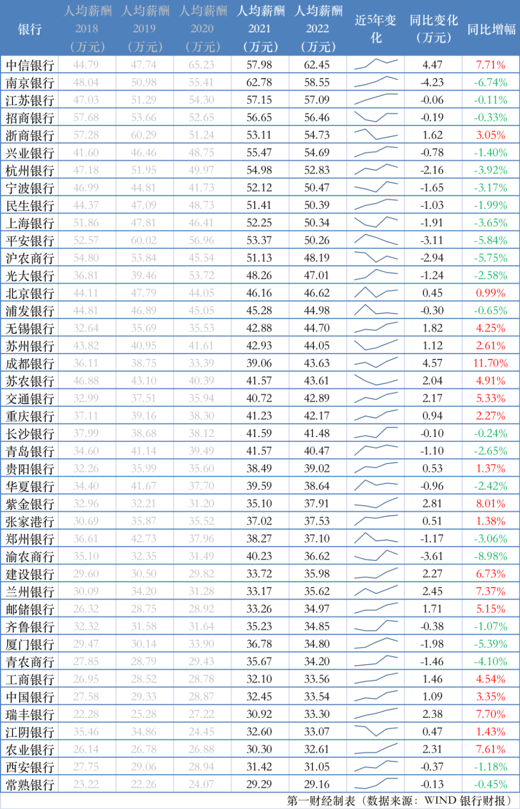

# 银行薪酬降没降？一半上市银行人均工资减少，税前最多相差33万

近年来，尽管金融行业就业热度有所下降，但金融机构高薪仍是热门话题。随着上市银行年报披露完毕，各行2022年薪资大体情况也浮出水面。

第一财经记者综合银行财报和Wind统计，去年42家上市银行员工薪酬总额约为9934亿元，较2018年增长28%，相比上年末增长5.8%，增速较2021年有所回落；4年间，银行薪酬总金额增长了2182亿元，同期，行业年度营业收入增加了1.22万亿元，净利润增长了约4826亿元。

从人均报酬来看，多数上市银行人均薪酬维持在30万元以上，相比2021年，去年有22家下降。其中，中信银行人均薪酬以62.45亿元居首，还有南京银行、江苏银行、招商银行等10家人均薪酬在50万元以上。纵观近5年变化，银行间员工人均报酬差距最大在2020年达到41.17万元高点，去年则降至33.28万元。

**255万银行人分万亿报酬**

具体来看各银行情况，2022年有5家银行员工总数减少，其中，工商银行、农业银行、中国银行分别减少6502人、2916人、140人，另外，江阴银行（-20人）、西安银行（-4人）总员工数略有下降。不过，从员工总报酬来看，5家银行除西安银行略降外，其余4家均有不同程度增长。

截至去年年末，上市银行金融人合计约有255万人，继续保持了人员增长，相比2018年末增加约10.52万人。国有大行中，农业银行、工商银行总员工数在40万人以上，分别为45.23万人、42.76万人，建设银行、中国银行总员工数分别在35万人、30万人以上，邮储银行、交通银行员工数分别约为18万人、9万人。招商银行是唯一一家员工数在十万人以上的股份行。

城农商行员工多数在万人以下，有12家上市银行员工数在5000人以下，其中，苏农银行、江阴银行、无锡银行员工数不足2000人。

去年全年，42家上市银行员工薪酬总额约为9934亿元，较2018年增长28%，总金额增长了2182亿元，同期年度营业收入增加了1.22万亿元，净利润增长了4826亿元。

相比2021年，2022年上市银行薪酬总金额增长了约930亿元，增幅5.8%，有所回落。员工总报酬最低为江阴银行5.91亿元，最高为农业银行1474.64亿元。总薪资超千亿元的上市银行从2021年的3家增加至4家，除农业银行外还有工商银行、建设银行、中国银行；邮储银行、交通银行职工薪酬分别约为630亿元、394亿元，招商银行以638亿元总薪酬比肩国有大行。

**22家人均薪酬减少**

按照行业总报酬支出和总人数，银行业人均收入水平大约为39万元。不过银行之间差距较大，2018年以来，行业人均薪资最高值与最低值差距从35.41万元扩大至2020年的41.17万元之后，逐渐收窄，去年差距缩减至33.28万元。

2022年，共有11家上市银行人均薪资超过50万元，比2021年减少1家。其中，中信银行以62.45万元人均报酬居首，是唯一一家人均报酬超过60万元的上市银行，也是继2020年之后再次超过60万元。其余10家“高薪”银行阵营以股份行、城商行为主，包括南京银行、江苏银行、招商银行、浙商银行、兴业银行、杭州银行、宁波银行、民生银行、上海银行、平安银行。

国有大行中，交通银行、建设银行、邮储银行、工商银行、中国银行、农业银行人均薪酬分别为42.89万元、35.98万元、34.97万元、33.56万元、33.54万元、32.61万元。

股份行中，除中信银行、招商银行、浙商银行、兴业银行、民生银行、平安银行6家人均薪酬超过50万元外，光大银行、浦发银行分别为47.01万元、44.98万元，华夏银行人均薪酬为38.64万元。

总体来看，2018年、2019年、2020年，人均薪资30万元以下的上市银行分别有10家、8家、10家，2021年骤减至1家。到了2022年，30万～40万元依然是主要薪酬范围，40万元和30万元梯队银行各有12家、18家，常熟银行仍然是唯一一家人均薪酬在30万元以下的银行，人均29.16万元，较上年略降。

相比2021年，去年有22家上市银行人均薪酬下滑，数量仅次于疫情冲击明显的2020年，降幅在0.11%～8.98%之间。2019年～2021年，人均薪酬下滑的上市银行各有11家、27家、2家。

具体来看，渝农商行、南京银行、平安银行、沪农商行、厦门银行人均报酬降幅超过5%。从金额变化来看，南京银行人均收入下滑最多，由上年的62.78万元降至58.55万元，人均减少4万多元；渝农商行、平安银行人均减收超过3万元。

尽管去年行业经营压力不减，但仍有20家上市银行人均收入有不同程度增长，其中有9家上市银行人均薪酬上涨超过5%，其中包括除中国银行外的5家国有大行。成都银行增幅最为明显，人均薪酬由2021年的39.06万元增加至43.63万元，增幅11.7%，中信银行人均收入也增加超过4万元，紫金银行、兰州银行、瑞丰银行人均收入增长均超过2万元。

**薪酬规范逐渐完善**

第一财经记者翻阅财报发现，有多家银行披露了反向讨薪进展。比如，招商银行在年报中提到，2022年该行对2876名员工追索扣回绩效薪酬总金额5824万元，相当于人均退薪2.03万元；渤海银行也有370人被追回1760万元，相当于人均退薪4.76万元。

工商银行、光大银行、哈尔滨银行等也提及相关举措但未披露数据，其中工商银行称，截至年报披露日，其高级管理人员及对总行风险有重要影响岗位的员工2022年度不涉及绩效薪酬需追索扣回相关情形。

2021年1月，银保监会曾发布《关于建立完善银行保险机构绩效薪酬追索扣回机制的指导意见》（下称《指导意见》），要求银行保险机构根据风险暴露情况追回不当发放的绩效薪酬，强化薪酬与风险承担的一致性。持续开展薪酬延期支付情况现场检查和评估，同时要求加强薪酬信息披露的全面性和透明性。去年8月，财政部也发布《关于进一步加强国有金融企业财务管理的通知》（下称《通知》），要求金融企业应当制定绩效薪酬追索扣回制度，绩效薪酬追索扣回规定适用于已离职或退休人员。

目前来看，上述规定已经在执行当中。银保监会今年3月披露的数据显示，截至目前，95%以上机构已制定并实施了绩效薪酬延期支付和追索扣回制度。特别是在一些高风险机构，相关制度为追究违规高管责任、挽回资产损失发挥了重要作用。例如，山西5家城商行合并重组期间，对61名高管和关键岗位人员追索扣回绩效薪酬3359万元。

部分银行还在去年财报中披露了绩效薪酬追索扣回的具体原因，其中江西银行称，该行主要对不良资产形成负有责任的人员，按不良责任本金大小进行认定，并追索扣回相应绩效薪酬。另有多家银行提到已制定并实施了绩效薪酬延期支付和追索扣回相关机制，但并未披露数据。

另外，上述《通知》还提出，金融企业应当主动优化内部收入分配结构，充分发挥工资薪酬的正向激励作用，有效落实总部职工平均工资增幅原则上应低于本企业在岗职工平均工资增幅，中高级管理岗位人员平均工资增幅原则上不高于本企业在岗职工平均工资增幅的政策要求。金融企业应当合理控制岗位分配级差，充分调动一线员工、基层员工的积极性，有效平衡好领导班子、中层干部和基层员工的收入分配关系，对于总部职工平均工资明显高于本企业在岗职工平均工资的，其年度工资总额要进一步加大向一线员工、基层员工倾斜力度。

据Wind数据，管理层报酬靠前的几家银行（主要为股份行、城商行）2022年相关金额多数有所下降，多家国有大行管理层薪酬有所增长。不过，相关数据多数并非管理层报酬的最终金额。
**（注：文中所指员工薪酬按照财报应付职工薪酬期末余额-应付职工薪酬期初余额+支付给职工以及为职工支付的现金计算，为税前报酬。）**

