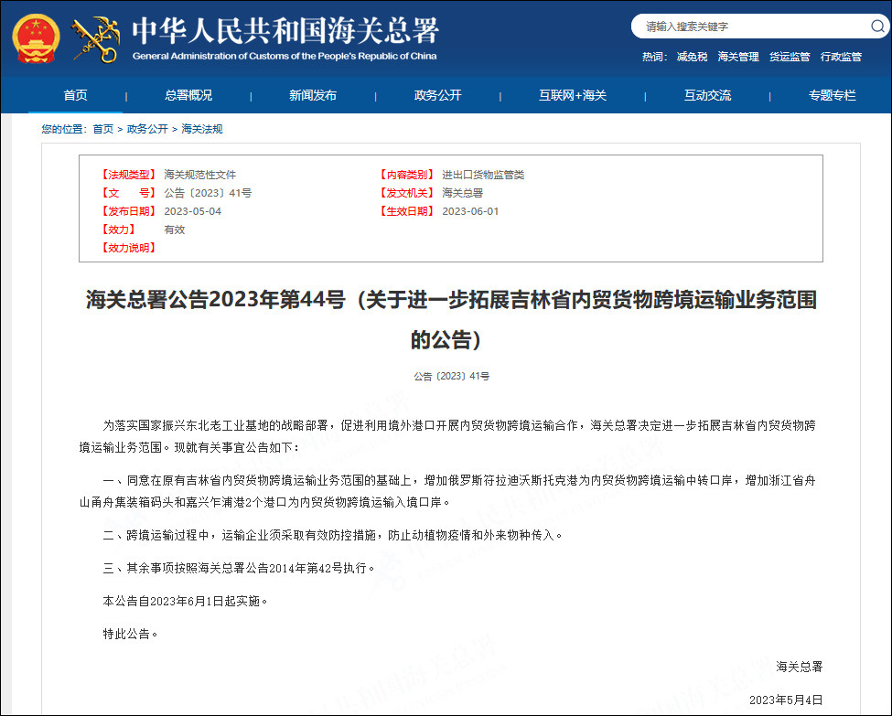
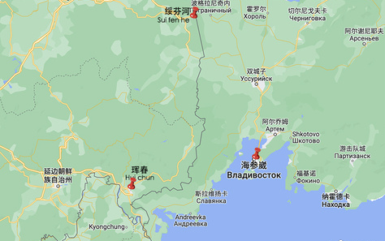

# 俄符拉迪沃斯托克将成内贸货跨境中转口岸，吉林陆运距出海口大大缩短

据海关总署网站消息，近日，海关总署联合三部委批复同意吉林省进一步扩大内贸货物跨境运输业务范围，增加俄罗斯符拉迪沃斯托克港（海参崴港）作为内贸货物中转口岸，浙江省舟山甬舟集装箱码头和嘉兴乍浦港作为内贸货物跨境运输入境口岸。

_截图自海关总署网站_

**以下为全文内容：**

为落实国家振兴东北老工业基地的战略部署，促进利用境外港口开展内贸货物跨境运输合作，海关总署决定进一步拓展吉林省内贸货物跨境运输业务范围。现就有关事宜公告如下：

一、同意在原有吉林省内贸货物跨境运输业务范围的基础上，增加俄罗斯符拉迪沃斯托克港为内贸货物跨境运输中转口岸，增加浙江省舟山甬舟集装箱码头和嘉兴乍浦港2个港口为内贸货物跨境运输入境口岸。

二、跨境运输过程中，运输企业须采取有效防控措施，防止动植物疫情和外来物种传入。

三、其余事项按照海关总署公告2014年第42号执行。

本公告自2023年6月1日起实施。

特此公告。

海关总署

2023年5月4日

_海参崴所在位置_

