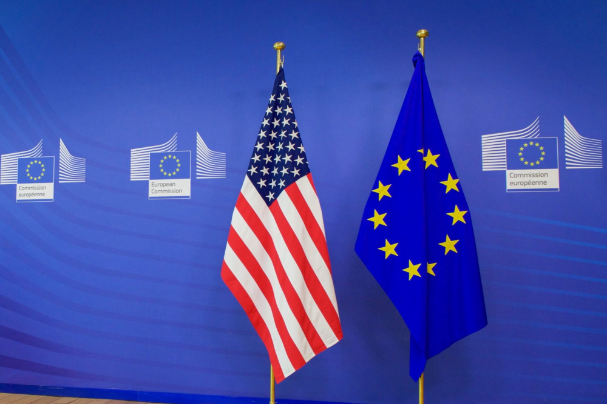

# 又要下手？英媒曝美欧计划采取联合行动，在出口管制等领域针对中国

【环球网报道】“欧盟和美国承诺对中国采取联合行动”。路透社13日以此为题援引一份声明草案透露，美国与欧盟将在本月的一场会议上承诺采取联合行动，在多个领域针对中国，并协调双方对半导体和其他商品的出口管制。有关美欧被曝老调重弹对华“下手”的相关内容和说法，中方已逐一明确表态。

_美国国旗（左）欧盟旗帜（右）
资料图 图源：外媒_

报道称，美国国务卿布林肯、欧盟委员会执行副主席玛格丽特·维斯塔格和其他高级官员将于5月30日至31日在瑞典吕勒奥举行第四届“美国-
欧盟贸易和技术委员会”（TTC）会议。根据路透社看到的声明草案，届时，美国与欧盟将解决“非市场行为和经济胁迫”问题，并计划就如何阻止其企业技术与对外投资挂钩以帮助战略竞争对手进行定期会谈。路透社炒作称，这是在暗指中国。

报道继续称，根据声明草案的说法，美国与欧盟方面还将协调对包括具有军事用途的物品和半导体在内的“敏感物品”进行出口管制。路透社声称，该声明两次提及中国，并有可能在会议前进行更改。

一段时间以来，美国为维护自身霸权，泛化国家安全概念，滥用出口管制措施，限制对华出口，外交部发言人毛宁本月4日在记者会上表示，美方打压遏制的不仅是中国，而是要剥夺广大发展中国家科技进步和正常发展的权利，将这些国家永远压制在产业链低端。这种自私自利的科技霸凌行径不公平、不合规，破坏全球产供链稳定，不利于世界经济发展，最终也将反噬自身。

与此同时，路透社提到的声明草案还在多个方面针对中国。有关医疗器械行业，声明宣称跨大西洋伙伴正
“探索可能的行动”，以应对所谓“非市场”政策和做法所带来的“威胁”；有关俄乌冲突局势，声明又炒作所谓“操纵信息”的行为。

中国存在所谓全球经济的“非市场”政策和做法与事实完全不符。商务部新闻发言人束珏婷曾表示，这种说法既缺乏国际经贸规则依据，也与事实完全不符。从全球来看，存在不同的市场经济模式。过去40多年中国经济取得的成功，是改革开放政策的成功，也是发挥市场机制作用和发挥政府作用有效结合的成功。这是中国经济发展的宝贵经验。

恶意指责中方“散布涉乌克兰虚假信息”的说法也早已不新鲜，外交部发言人汪文斌今年3月24日在记者会上表示，指责中方散布涉乌克兰的虚假信息，本身就是在散布虚假信息。中方始终本着客观公正的态度，为早日实现停火止战，避免人道主义危机，恢复和平稳定作出积极努力。我们一贯主张，乌克兰应当成为东西方沟通的桥梁，而不应成为大国博弈的前沿。

路透社这篇报道最后还老调重弹，拿中方正当举措炒作所谓“经济胁迫”一说，声称美欧表示致力于与七国集团（G7）合作，协调行动抵制“经济胁迫”行为。

就七国集团（G7）将以“经济胁迫”向中国发出信号的有关传言，外交部发言人汪文斌5月12日已在例行记者会上敦促G7不要做经济胁迫的同谋和帮凶，“如果G7峰会把应对经济胁迫列入议程，建议先讨论美国的作为”。“说到经济胁迫，第一个应当受到声讨的恐怕非美国莫属。”汪文斌说，美国一再泛化国家安全概念，滥用出口管制措施，对别国企业采取歧视性和不公平做法，其行为严重违反市场经济和公平竞争原则。中国自身就是美国经济胁迫的受害者，中方一贯坚决反对其他国家搞经济胁迫。中方也敦促七国集团顺应开放包容的时代大势，停止搞封闭排他的“小圈子”，不要做经济胁迫的同谋和帮凶。

