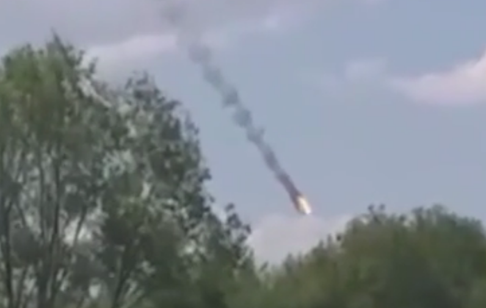

# 外媒：一天内俄军4架战机在同一地区疑被乌方击落

环球时报 | 作者 梁由之

综合俄罗斯塔斯社及美国“政客”新闻网13日消息，当天俄军有4架军用机在俄乌边境附近坠毁，有分析认为，这4架军用机是被乌克兰方面击落。

_图片截取自塔斯社社交媒体官方账号_

消息称，坠毁的俄罗斯军用机分别是1架苏-35战斗机、1架苏-34战斗机和2架米-8直升机，坠毁位置在俄罗斯布良斯克地区，距离俄乌边界约50公里，机上人员均已死亡。

美国“政客”新闻网援引一位俄罗斯军事分析人士的话称，这四架军用机很可能是被空对空导弹击落，不过，塔斯社及俄罗斯官方目前仅承认1架米-8直升机坠毁，且并未具体说明坠毁原因，乌克兰方面也暂未宣称对4架俄罗斯军用机坠毁负责。

_俄军米-8直升机坠毁视频截图_

另外，俄罗斯《生意人报》在报道中提到，这4架军用机来自俄罗斯空天军同一支部队，该部队的任务是对乌克兰北部进行轰炸。

