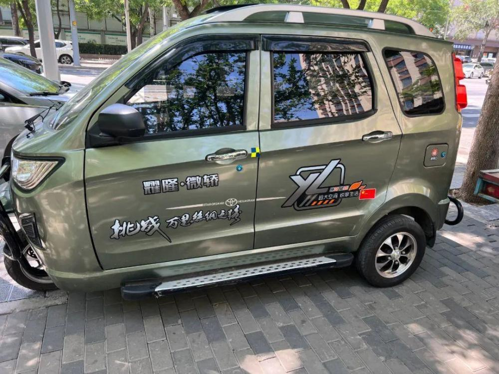
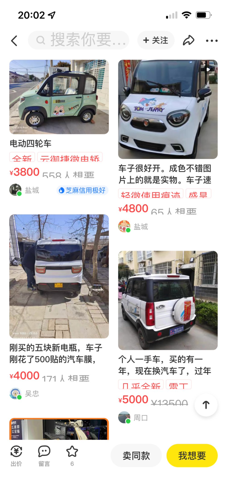

# 多地出手严控老年代步车，“老头乐”乐不起来了

行人苦“老头乐”久矣？

没有“老头乐”出行苦矣？

假如“老头乐”再也不能上路行驶，甚至不能在公共场所停放，谁赞成，谁反对？

这就要看，答题者是经常被违规行驶、占道停车以及剐蹭后无法解决的行人及机动车驾驶员，还是接送孩子远、没地方建充电桩以及摇不上号的“老头乐”使用者。

凭借着价格低、不上牌、不需驾照、不上保险、充电方便等特性，俗称“老头乐”的低速电动车近年来销量节节攀升，并“与时俱进”地推出了外形酷似保时捷、奔驰、宾利等品牌经典车型的产品。部分年轻消费群体甚至笑称，难以实现的豪车梦就靠“老头乐”实现了。但这类违规电动车在路上随处可见的危险，却让人再也笑不出来。

_摄影：郑宇_

近日，多地严查低速电动车的违规行为。被称为“老头乐”的电动三、四轮车成为整治重点。北京市交管局也于近日再次强调，自2024年1月1日起，违规电动三、四轮车不得上路行驶，不得在道路、广场、停车场等公共场所停放。

此外，江苏、安徽等多地也在今年开始通过不同方式对“老头乐”进行严控。

一系列严查严管背后，是“老年代步车”所带来的安全隐患不断增加。据交管部门统计，2022年，北京共发生违规电动三、四轮车交通事故131起，死亡逾百人。而早在2017年工信部公布的一项统计数据显示，当时全国五年内发生低速电动车交通事故83万起，造成1.8万人死亡，18.6万人受伤。

安全隐患问题，早已注定了这一市场无法延续发展。

**谁要被禁止上路？**

近日，在北京市街头，经常能看到交警对在道路上违规的电动三四轮车进行拦停处罚。据悉，这是北京交管部门对过渡期政策进行宣传的同时，对违规电动三四轮车开展通行秩序整治执法。

在4月14日北京市公安局召开的全民国家安全教育日主题新闻发布会上，北京市交管局新闻发言人、副局长赵鑫表示，自2024年1月1日起，违规电动三、四轮车不得上路行驶，不得在道路、广场、停车场等公共场所停放。违规上路行驶或停放的，执法部门将依法查处。

赵鑫介绍，如果车辆已列入工信部《道路机动车辆生产企业及产品公告》，要尽快到机动车检测场完成验车程序后，到北京市部分交通支大队车管站（六环外）办理机动车注册登记，符合申请条件和相关规定的领取京b摩托车号牌，同时驾车时驾驶人需持有相应准驾车型驾驶证。

“过渡期”源于2021年7月，北京市公安局、北京市交通委员会、北京市市场监督管理局、北京市商务局、北京市城市管理委员会等五部门联合发布《关于加强违规电动三四轮车管理的通告》，规定至2023年底过渡期满，违规三、四轮电动车将不得上道路行驶以及不得在公共场所停放。

其中明确指出，明年1月1日起，未经工信部许可生产、未列入《道路机动车辆生产企业及产品公告》，车辆性能不符合机动车安全技术标准，使用电力驱动用于载客或载货的三轮、四轮机动车将不得上路。

在此之前，北京市对于违规电动三四轮车无序增长、乱停乱放、乱穿乱行、时常发生道路交通事故等问题已经多次予以整治。早在2018年7月1日起，北京市全面禁止销售各类“超标电动车”。但因网购的盛行以及多种因素下，违规“老头乐”依旧比比皆是。

_图片来源：闲鱼_

事实上，“老年代步车”一词本就是商家为销售所杜撰的品类，“老头乐”更是对这一杜撰品类的戏称。常规情况下，市面上常见的这一类低速三四轮电动车都归属于微型低速纯电动乘用车。2018年11月，工信部等六部委印发了《关于加强低速电动车管理的通知》，通知中明确表示老年代步车属于此次被纳入监管的低速电动车范畴。当时的工作思路是“升级一批、规范一批、淘汰一批”，因此除了要求各地清理整顿已有产能外，《通知》还严禁新增低速电动车产能。

此后，多家低速电动车生产企业开始通过收购生产资质、与传统车企合作等方式升级。其中较为出名的是，有“老头乐一哥”之称的雷丁汽车在2018年4月收购陕西秦星获得新能源商用车和特种车生产资质，转战新能源汽车市场。但转型最终却以今年5月7日雷丁汽车新增一则破产审查案件黯然收场。

《通知》发布后，相关部门不断收紧对低速电动车的管理和审查，2021年3月，工信部发布《低速电动车标准制定会议纪要》，对四轮低速电动车的标准进行了修订；2021年6月，工信部对新版国标《纯电动乘用车技术条件（征求意见稿）》公开征求意见，此次征求意见稿中增加了微型低速纯电动乘用车的定义和标准，并将其作为纯电动乘用车的一个子类进行管理，老年代步车就归属其中。

在日渐细致的标准下，包括北京市在内的多地开始对低速电动车严加管控。

**多地出手、“断源”查扣**

连续多年的严管已经初见成效，以北京市为例，不少电动三四轮车都已经挂上了“京B”牌照，违规低速电动车行也相继被查处。

据悉，北京公安交管局会同相关部门对违规电动三四轮车开展执法行动，对非法运营等违法人员实施高限处罚，违规车辆一律查扣，自2020年以来，共拘留非法运管人员1660人，查扣并集中销毁违规车辆3729辆；同时，对逆行、闯红灯、乱穿道路等危及交通安全的行为依法进行查处，累计处罚电动三四轮车各类交通违法34.5万起。

自2021年以来，北京市公安局会同交通、商务、市场监管、城管执法等有关部门，坚持源头治理销售环节与路面规范通行秩序相结合，强力开展非法售卖“断源”行动，持续推进电动三四轮车综合治理工作，累计查处非法销售门店151处，刑事拘留175人；集中约谈22家电商平台，关闭违规商家220个。

由于各地对于电动三四轮车的交通管理规则并不相同，“断源”被认为是最高效的治理违规低速电动车的手段之一。根据相关规定，合规车辆出厂时，应取得机动车整车出厂合格证明，同时纳入工信部所发布的《道路机动车辆生产企业及产品公告》。这一公告是不断更新的，日前已经发布了第371批。据不完全统计，其中已经有170多个品牌，900多个型号的低速电动三四轮车纳入其中。

江苏省于3月29日对《江苏省道路交通安全条例（修订）》审议时明确提出，近年来我省城乡特别是农村地区有不少以“老年代步车”名义出售的低速电动车，未经安全检测，不上正规车牌和保险，成为极大隐患。追溯源头，此次修订加强了对非道路用车辆和其他具有动力驱动工具的管理，以及对不符合国家标准车辆生产销售的监管力度。

安徽省芜湖市也宣布将从4月15日起，在主城区设置电动三四轮车（“老头乐”载人三四轮电动车、行业及普通货运三四轮电动车）严管路段，通过严格措施全面加强管理。

尽管各部门及地方政府已经相继出手整治违规低速电动车，并且大多给予了一定时间的“过渡期”。但在“断源”之余，当执行到具体的使用者层面，仍有一部分人群对此表达了强烈的反对态度。

毕竟，无论是电动三轮车还是四轮车，合规生产、强制上牌以及持证驾驶，都意味着成本增加。但多数“老头乐”使用者看中的正是价格低廉，更有相当一部分人群，享受的就是无牌无证所带来的“无拘无束”。

_图片来源：北京市交通综合治理领导小组办公室_

但对于大多数人而言，严查违规“老头乐”是大快人心。毕竟这类车辆行驶在道路上时，即便没有违规行为，重心不稳突然侧翻也是经常发生，更遑论在居民楼中充电或停放在公共场所时的燃烧隐患。

随着“断源”工作的不断深入，市面上销售的低速电动三四轮车无论品牌还是型号都将大幅减少。不过，在价格上与其最接近的A00级纯电动车却正在受到更多消费者的青睐。据中国汽车流通协会新能源汽车分会数据显示，目前全国共有29家企业在生产、销售共计53款A00级纯电动车。

除了近年来大火的五菱宏光MINIEV之外，五菱于3月31日推出了五万元以上的缤果车型，4月的销量超过了1.6万辆。售价3.99万元起的吉利熊猫mini在4月的销量也突破了万辆，此外，这一细分市场中还有奇瑞小蚂蚁、长安Lumin等车型。尽管较之“老头乐”，这些车型的价格要高出一些，但以汽车的安全标准生产出来的A00级纯电动车，显然要可靠得多。

作者：郑宇

