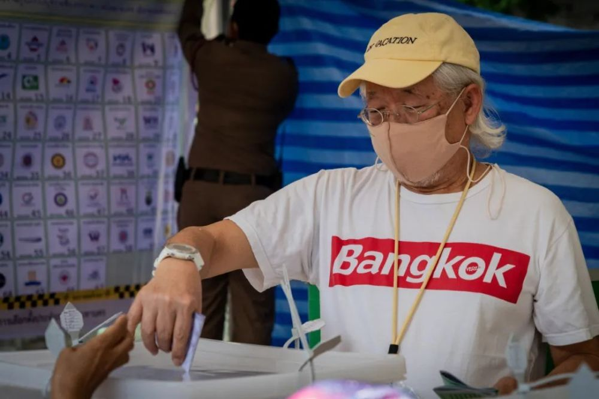
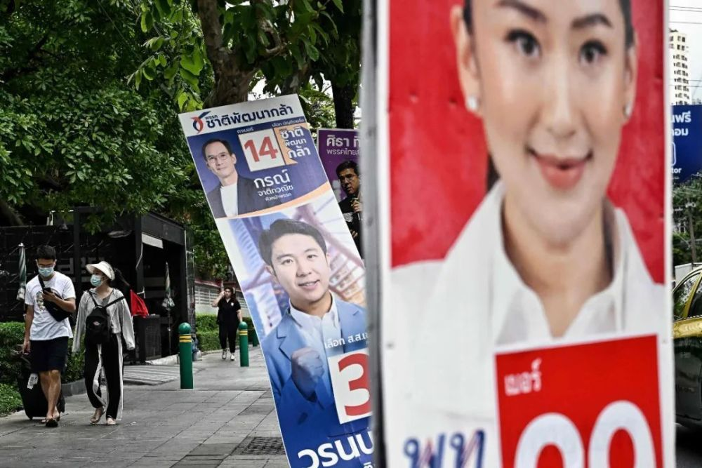

# 泰国“二十年来最重要大选”结果今日即将揭晓

泰国大选在今天（5月14日）正式拉开帷幕，这是泰国自2014年军事政变后的第2次大选，可能导致统治泰国近十年的军方支持的领导人巴育下台。

此次选举主要是军方支持的政党与两大反对党的对决。反对党方面的“种子选手”是他信所属的为泰党，为泰党提名了三名总理候选人，最受欢迎的是前总理他信的小女儿贝东丹·西那瓦（Paetongtarn
Shinawatra）。

据路透社报道，当前民调结果显示，目前，贝东丹和前进党的皮塔·利姆加罗恩拉特（Pita
Limjaroenrat）等反对党总理候选人支持率飙升，处于领先位置。而泰国现任总理巴育，目前选情落后于这两位年轻对手。

尽管巴育近期仍不断在各地拉票，理论上也存在“逆袭”组建少数派政府的可能性，但他选前也表示，如果其政党无法在大选赢得足够议席组建政府，他将退出政坛。

泰国自1932年改为君主立宪制以来，前后经历了13次军事政变，最近一次正是巴育所发动。

然而，分析人士表示，泰国扭曲的选举制度意味着新政府的形态“非常不可预测”，目前尚不清楚民主派候选人是否能成功推翻这位军方支持的领导人。

**泰国“二十年来最重要大选”启动 军方承诺不会发动“政变”**

据路透社报道，大选投票于当地时间5月14日8时至17时（北京时间9时至18时）举行。大约5200万符合资格的选民将在全国9.5万个投票站参与投票。

每名选民手中握有两张选票，一票投给选区候选人，另一票投给选民自己认可的政党。在这其中，约有330万名选民年龄在18岁至22岁之间，是首次参加投票的“首投族”，无论是亲军方的保守派还是承诺改革的反对派，都在争取年轻选民的支持。

报道称，17时将关闭投票站，非正式计票结果将于当天晚间10时出炉。由于政党即使获得众议院多数席位或压倒性胜利，仍不足以单独执政，因而可能需要更多时间与其他政党谈判，以组织联合政府。

此外，还有200多万名身在海外的登记选民和无法在大选日当天到户籍地参加投票的选民已提前于5月7日进行投票，这类选票与14日大选日的投票将一起计票。选举官员报告说，7日提前投票的投票率高达91%
。

_当地时间2023年5月14日，泰国曼谷，大选期间，人们在投票站投票。图/视觉中国_

前总理他信所属的为泰党，目前在民调中处于领先地位。这一政党是由泰爱泰党的原成员于2008年组建。如今，为泰党推出的总理候选人之一、现年36岁的贝东丹，正是他信的小女儿，她的支持率在今年3月时还曾遥遥领先，以38.2%位列第一。

曾在英国学习政治学和酒店管理的贝东丹是政治新人，2021年才步入政坛，担任为泰党的包容和创新顾问委员会主席。她同时也是SC
Asset地产股东和Thaicom Foundation基金会董事。去年3月，贝东丹又接手一个为其专设的职位——“为泰家族”领导人。

贝东丹从一步入政坛就人气爆棚，在距离大选投票不到两周之时，贝东丹二胎产子，而生完孩子仅过两天，她就重返竞选活动。

另一个反对党——前进党在竞选期间获得了年轻选民的大力支持，最近的人气也正在上升。前进党也是各政党中最激进的政党，要求修改泰国宪法、改革王室、取消冒犯君主罪、对泰国进行民主改革。前进党的支持者以城市年轻人为主。2020年，多个学生组织在曼谷举行了大规模反政府和反王室游行，这也是抗议者首次将矛头对准王室。

该党领导人皮塔，也是该党推出的总理候选人，很可能成为本届大选的“黑马”，由于他在年轻选民中收获了大批拥趸，进入5月以来，皮塔的民调支持率已经反超了贝东丹。

而反观现任总理巴育，目前支持率明显落后于这两位年轻对手。其所在的泰国人团结建国党属于军方支持的政党，也被称为保守党。

当地时间5月11日，巴育在泰国南部洛坤府拉票时说：“我们必须赢得尽可能多的下议院席位，这样我们才能组建一个强大而稳固的政府。如果我们只赢得少数选区议席，我将打道回府。”

_图为：为泰党总理候选人贝东丹·西那瓦（左），泰国总理巴育·占奥差（中），泰国前进党领导人皮塔·利姆加罗恩拉特（右）。图/视觉中国_

新加坡《联合早报》报道称，对于外界担忧大选后可能出现军事政变，泰国陆军总司令纳隆攀（Narongpan
Jitkaewthae）称，即使大选后出现政治动荡，泰国军方在他的领导下将不会发动政变，会保持中立。“我无法确定国家会否和平，和平只能通过大家共同努力来实现。但我可以向你保证，过去发生的事情（政变），现在重演的机会是零。”

泰国曼谷塔玛萨特大学的政治学家普拉贾克·孔吉拉提（Prajak
Kongkirati）说，今年的选举“不仅是对军队的全民公投，也是对整个建制派的全民公投”，尤其是当越来越多的人质疑泰国王室在社会中的作用，孔吉拉提说，这次投票“将是泰国回归民主的关键一步”。但他补充道：“这条路可能并不平坦。”

**为泰党或成今年最大赢家 但最深层问题或仍无法撼动**

《纽约时报》分析指出，如果军方支持的政党失败，泰国君主制的未来可能会变得不那么安全。军队一直被视为泰国王室的守护者，如果不是军队领导政府，泰国的保守党派可能会感到紧张。

二十年来，泰国政治一直由他信领导的西那瓦家族与军方支持的政党之间的分歧所左右。双方之间的权力斗争导致了长期的街头抗议和两次军事政变。而如今，想要顺利掌权，各政党可能仍需要得到军方支持。

_当地时间2023年5月10日，泰国大选在即，民调显示反对党目前领先。图/视觉中国_

据《卫报》报道称，民调显示，虽然前进党在泰国18岁至30岁的年轻群体中更受欢迎，但为泰党在所有地区都保持领先优势。这意味着为泰党有可能实现争夺众议院控制权的目标。

《路透社》分析称，为泰党将成为本届大选的赢家，只是目前仍无法断言为泰党能赢得保守目标200席，还是压倒性胜利的310席。赢得310席，意味着为泰党组织联合政府和提名属意总理人选的难度大大降低；赢得200席，则为泰党可能需要与不同政党谈判组建联合政府。

上周五（5月5日）的Super
Poll民调显示，在500个下议院席位中，为泰党或拿下139席，排名第一。这也意味着即便为泰党在周日的投票中获胜，为了获得下议院多数席位，该党也需要与其他政党组成联盟。

但这并不意味着保守派政党全输。《联合早报》援引学者分析时表示，虽然目前巴育民调落后，其领导的泰国人团结建国党仍可能联合其他小党组成少数派政府。未来仍有可能出任总理。

贝东丹此前也暗示，为泰党如果获胜可能与前进党组成联盟，不会与军方支持的政党合作。《纽约时报》分析称，但要想在总理人选上得到军方支持，为泰党联盟的政党更可能是亲军方政党，也就是巴育所代表的政党。

人权观察组织泰国问题高级研究员苏奈·法苏克（Sunai
Phasuk）对《卫报》说：“也许泰国社会最深层的软肋之一是君主制。”而这次选举可能决定这个东南亚国家最终是走向民主，还是进一步滑向军人统治。

记者 | 姚远

编辑 | 张磊

