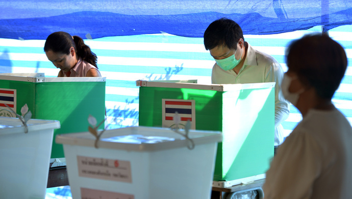

# 泰国大选：亲军方政党对阵革新派，无论谁上台都面临诸多挑战

14日，泰国大选正式揭开战幕。数千万选民冒着高温前往全国9万个投票站，只为亲历这场“20年来的最重要选战”。民调显示，以为泰党、远进党为代表的反对派正对当前执政的亲军方政党发起有力冲击，但亲军方势力有上院议席“保底”，实力仍不容小觑。最终总理人选花落谁家还需等待新一届国会确立之后。

分析认为，相比4年前，本次大选呈现年轻选民增多、政坛代际更替明显等特点。加上选前“中左中右合流”趋势日趋明显，这些都让选举格外引人注目。但“热闹”过后，接下来无论何种政治力量主导泰国政坛，都将面临艰巨的稳定和发展任务，需要的是冷静、专业和团结。

**两大力量竞逐**

泰国大选并非直接选举政府总理，而是对议员和政党进行选举，再由国会选出总理。

国会分为上下两院，根据2017年新宪法，上院全部250名议员由军方指定，下院500名议员则由选举产生，此次大选就是围绕下院议席进行争夺。

新一届国会成立后，国会主席将召集上下两院750名议员就各政党推举的总理候选人进行表决，获得半数以上支持的候选人当选新总理。

据悉，泰国目前共有超过5200万合法选民，本次投票率预计超过80%。泰国当地时间今晚11时（北京时间12时）将公布非官方选举结果。正式结果预计在60天内公布。

另据泰国官方提供的时间表，在新一届下院成员名单确定后，两院将于7月底前选出总理，内阁成员将于8月初任命。

虽然本次大选共有70个政党参加，总理候选人数也多达数十位，但外界最关注的是两股主要博弈力量：一是以泰国人团结建国党、国民力量党为代表的亲军方势力，二是以为泰党、远进党为代表的反对派。

民调数据显示，反对派势头强劲，无论在下院议席还是总理人选的支持率方面，均高出亲军方政党不少。

先说说呼声最高的反对党为泰党。民调普遍预测它将成为下院选举的赢家，只是无法断言究竟赢得保守目标200席，还是“大胜”所需的310席。

为泰党的领袖是前总理他信的女儿、36岁的贝东丹·西那瓦。叱咤泰国政坛20多年的他信家族曾有过“一门三总理”的高光时刻。外媒指出，他信家族广受农民阶层拥戴，但它被传统官僚势力和亲王室的军队视为眼中钉，这导致该家族多位政治人物因军方政变下台。他信也长期流亡海外。

为泰党的竞选策略仍是主打“惠民牌”——承诺将泰国经济年增长率提升至5%，到2027年将最低日薪提升至600泰铢，农民平均收入增加2倍，等等。

另一反对党远进党被视作冉冉升起的新星。民调预测其有望斩获70—100个下院议席。

远进党被外媒称为“最进步党派”，是唯一承诺对王室、军队、“亵渎君主罪”法律进行改革的政党。不过这一点正成为双刃剑——既使其吸引大量年轻选民，又因为激进“标签”使其他政治力量“敬而远之”、不考虑与其联合组阁。

值得一提的是，远进党推出的总理候选人皮塔，已超过贝东丹成为最热门候选人。42岁的他是一名成功的商人，还拥有出色的教育背景，是第一位获得哈佛大学国际学生奖学金的泰国学生。

再把目光转向亲军方的政党。

现年69岁的泰国总理巴育正寻求再次连任，尽管宪法规定的任期限制意味着他只能再担任两年最高职位。他所在的政党名为泰国人团结建国党，巴育于今年1月加入。

自2014年政变以来，巴育长期主导政坛。支持者认为，巴育为国家带来了稳定，并有效应对新冠疫情。但也有不少反对者对其提出批评。过去4年，巴育一边推进改革措施，一边试图提升自身形象，通过参加电视节目、讲笑话等方式，展现亲民和幽默的一面。泰国《国家报》报道，巴育在近期选举讲话中，经常以支持者对他的昵称“叔叔”称呼自己。

现年77岁的泰国副总理巴威则是国民力量党的代表。他与巴育同为军人出身，有着逾半个世纪兄弟般的情谊。不过有分析称，巴威为人更亲和，善于与各方沟通协调。例如，相比巴育充当忠心的保皇派、不与他信合作，巴威愿意与他信谈判。此次国民力量党提出的口号，便是“跨越矛盾”。

总的来看，亲军方的政党在下院的选战中处境不佳。泰国人团结建国党的支持率约为8%，可以转化为约40—50个席位。但鉴于亲军方政党有上院250席“保底”，实力仍不容小觑。

泰国政治学专家、朱拉隆功大学教授提蒂南·蓬苏迪拉克表示，考虑到20多年来，泰国经历了漫长的拉锯（发生了两次军事政变，诞生两部新宪法），今年的选战将是迄今为止最关键、最重要的选战，“是一场动荡的拉锯战的高潮”。

**显现诸多特点**

分析认为，与4年前相比，今年的泰国大选有诸多不同，一些特点和趋势值得注意。

**北京外国语大学亚洲学院亚洲地区研究教研室教授宋清润**
表示，第一，今年是泰国民选政府在正常任期内举行的大选，不似上届在政变后的军政府执政期间举行。第二，本次选举40岁以下年轻选民占比是近年来较高的一次，“Z世代”等年轻群体未来对大选和政局的影响力会越来越大。三是年轻议员、年轻总理候选人数量多于以往，形成老中青齐上阵的激烈较量态势，政坛代际更替更为明显。四是采取“双票制”，即每位选民分别投票给选区候选人和政党。“这种设计旨在使选票更为集中。因为4年前大量小党占据议席，造成议席分散，不利于议会决策效率和政府稳定性。”

**云南省社会科学院中国(昆明)南亚东南亚研究院泰国研究所所长余海秋** 表示，今年泰国大选前，呈现出两大趋势。

一是政治极化进一步增强。巴育离开原执政党国民力量党，加入极右翼政党泰国人团结建国党，并公开表示如果能连任，那么在两年后届满时泰国人团结建国党主席、极右翼代表人物披腊潘将接任总理职位。巴育此举标志着泰国极右翼势力可能正式参与国会政治，并与极左翼的远进党形成严重对立。

二是“中左中右合流”日趋明显。从2021年泰国修宪开始，中左阵营为泰党与中右阵营国民力量党的政治结盟传闻从未平息。近期以来，巴威公开表示将以政治和解为己任，推动构建“大团结政府”。为泰党方面，虽然贝东丹等候选人表示不会与国民力量党结盟，但拥有决策权的党执委会始终态度暧昧，普遍认为倾向于联合执政。

**如何“合纵连横”？**

在谈及选战态势时，宋清润用“激烈”一词形容反对派与亲军方政党的争夺战。

“由于年轻选民的参与，预计更多选票会流向为泰党和远进党，对支持军方的政党的优势可能有所扩大。”宋清润说，但由于最终能斩获过百下院议席的政党预计不会超过3个，因此更大的可能性是通过多党结盟来推举总理，形成新的政治架构。

宋清润补充道，由于泰国代表不同阶层利益的政治力量比较分散，因此许多第三势力和中间力量绝非“单纯陪跑”，它们日后都会成为两大力量争取的结盟对象，可能出现不同的排列组合。“即便是现在看上去关系不太好的为泰党和亲军方政党，在出现利益需要时，也不排除走到一起。一切都要看未来几个月各方如何博弈。”

余海秋说，从泰国“中左中右合流”的政治趋势来看，以政治和解为基础构建“大团结政府”存在较高可能，但有两个阻碍，即为泰党要让出总理职位给巴育，以及极右翼势力要同意他信归国。

余海秋说，尽管从各方释放的信号来看均有合作意向，但长期政治争斗使其缺乏互信，难以率先让步。远进党或将因“亵渎君主罪”遭到打压或者解散。值得注意的是，由于2017年宪法并未明确规定推选总理的时间限制，因此理论上可以无限制重复推选，直到保守阵营从革新阵营争取足够议席支持巴育连任。其间，巴育将作为看守政府总理主持泰国日常工作，并可通过国王授权方式颁布临时法案。

**未来挑战艰巨**

分析人士认为，接下来无论何种政治力量主导泰国政坛，都面临诸多挑战。

宋清润说，国内而言，未来多党执政联盟的最大任务还是稳定和发展。需要在各种力量激烈博弈的情况下维持团结、稳定政局。另外还取决于多党政府在国会下议院是占据少数议席的弱势政府还是强势政府，这事关执政稳定性。

在经济方面，走出新冠疫情后，泰国是东南亚经济复苏势头最弱的国家之一，去年增速为2.6%，远落后于马来西亚、越南等国。“受到疫情、洪灾、世界经济低迷等因素影响，泰国经济形势不佳，出口增速下降，国际游客数量不及预期……稳定发展的任务比较艰巨。”宋清润说。

“泰国未来新权力架构还需面对一系列外部挑战。”余海秋说，“一是在中美博弈态势下如何纵横捭阖，争取利益最大化。二是如何巩固东盟中心地位。三是妥善处理与周边国家的关系。”

谈及大选后泰国的对华政策，宋清润认为，1975年中泰建交以来，泰国各大政治派别基本都保持对华友好，未来这一大方向不会发生颠覆性变化。只是可能在对华合作的重点领域、合作方式、推进速度上会有所微调。“如果是以激进派为代表的远进党执政，可能在对西方理念上的认同感或亲切感上，比现政府或传统政府更多一些，但不会大幅度弱化中泰关系……在中美博弈大背景之下，泰国也不会过度偏向西方。”

余海秋说，泰国对华关系稳定向好，与此同时，美泰关系也在进一步回暖。如果泰国大选后出现政治僵局或政治动荡，可能影响中泰命运共同体建设进程，尤其是中泰铁路等重大项目的推进或受到一定冲击。另外需要关注的是，大选后泰国联合政府为争取美西方支持，是否会进一步加速美泰关系回暖，加速“印太战略”在泰国的落实和推进。

