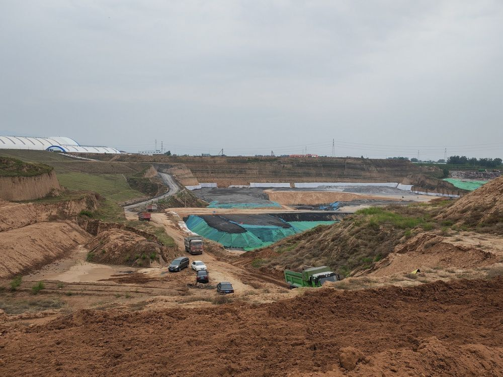
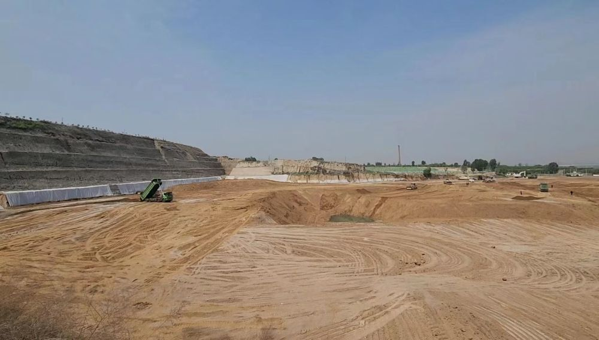

# 耕地红线屡被突破，山西平遥200多亩耕地成粉煤灰填埋场

据新华社消息，连日来，山西平遥200多亩耕地变成粉煤灰填埋场事件引发广泛关注。目前，当地已对事件关联企业负责人采取强制措施，对所涉及的土地进行复垦。

“新华视点”记者实地调查发现，在两年多的时间里，涉事企业在耕地里填埋粉煤灰达113万多吨。当地土地主管部门监管不到位，耕地保护红线被一次次突破。

**20年间用途多次变化，耕地变成粉煤灰填埋场**

近日，有平遥县村民反映，当地有企业在耕地里建工业垃圾填埋场，并倾倒大量粉煤灰，导致200多亩耕地遭到破坏。

_5月10日拍摄的平遥县晟顺绿化建设公司粉煤灰填埋场。
新华社记者王劲玉 摄_

记者了解到，粉煤灰填埋场项目区约258.46亩，其中耕地207.27亩。2022年12月12日，平遥县自然资源局对涉事的晟顺绿化建设公司开出行政处罚决定书，称其未经法定程序批准，擅自占用土地新建粉煤灰平整填充项目，罚款1933万多元，限期复垦。

记者调查发现，20年来，填埋场项目区的土地用途不断变化，使用者多次变更：2003年，东庄村委会将42亩土地出租给当地村民张福全，用来建砖厂，此后砖厂占地面积不断扩大；2014年，张福全将砖厂转让给东庄村村民郝晓智；2019年，郝晓智与东庄村委会签订土地承包协议，紧邻砖厂承包46.27亩土地，用来开发引进建材等项目。

2019年，郝晓智成立晟顺绿化建设公司，承接粉煤灰填埋项目。有关文件在解释该项目时称：“由于开发区内地势落差悬殊，需通过平整，以增加园区内土地利用效率。”

至此，200多亩耕地最终变成粉煤灰填埋场。

记者采访了粉煤灰的来源——山西耀光煤电有限责任公司的相关负责人。据介绍，从2020年10月开始，晟顺绿化建设公司开始处置电厂粉煤灰，截至目前已处置113万多吨。每处置1吨，电厂付给晟顺绿化建设公司20多元。

值得注意的是，当地群众反映，涉事企业不仅从处置粉煤灰业务中获利，还存在违规取土问题。根据土地管理法实施条例相关规定,国家对耕地实行特殊保护,禁止擅自取土。

根据举报线索，记者在距粉煤灰填埋场附近大约2公里的一处深沟看到，这处名为“一条龙”的深沟目测长四五十米、宽二三十米，最深处一二十米。目前大部分深沟已被黄土填平。填土层与周边土层颜色迥异。

当地多名村民介绍，填沟所用黄土来自郝晓智的砖厂。一位村民介绍，当时有人从砖厂拉土填沟，把田间道路都压坏了，后来动用铲车进行修复。

这条深沟目前属于平遥经济开发区范围，正位于一条规划中的道路上。开发区相关负责人10日接受记者采访时表示，填沟所用黄土部分来自粉煤灰填埋场所在地的砖厂。

据当地人介绍，包含运费在内，一方土可以卖十几元。

**土地保护红线多次被突破**

记者调查发现，200多亩耕地最终变成了粉煤灰填埋场，与有关部门长期对耕地的保护、监管不力有关。

——收了土地复垦保证金但后期不组织实施。

2011年平遥县政府批准张福全砖厂64.82亩生产临时用地，当时砖厂向平遥县国土资源局缴纳耕地复垦保证金26820元。

复垦协议规定，临时用地两年期满后，砖厂按国家复垦技术标准和已审查确定的复垦方案组织复垦，确保复垦后土地的水利、耕作层和交通设施完善。临时用地期满3个月内，砖厂未按要求组织复垦，不予返还土地复垦押金，由平遥县国土资源局组织土地复垦或异地开垦。

据了解，双方后来都没有组织复垦。

——对违法项目态度模糊。

2022年12月12日，平遥县自然资源局开出行政处罚决定书称，晟顺绿化建设公司未经法定程序批准，擅自占用土地进行开发区内平整填充项目工程，违反了土地管理法相关规定。

然而，3年前，该项目在办理手续过程中，平遥县自然资源局的表态却十分含糊。

2019年10月30日，平遥经济技术开发区管委会办公室发出《平遥经济技术开发区关于同意平遥县晟顺绿化建设工程有限公司利用粉煤灰进行开发区内平整填充项目的函》，称开发区原则上同意该项目的实施，请平遥县自然资源局、晋中生态环境局平遥分局依据相关政策法律法规对项目予以支持办理，并出具对该项目实施的相关意见。

平遥县自然资源局的复函表示：“该项目应严格按照国家发改委、国土资源部、环境保护部等十部门第19号令关于‘粉煤灰综合利用管理办法’、山西省煤炭资源综合利用规划的通知和山西省制定的粉煤灰填充技术规范地方标准，并严格按法定程序到相关部门办理环评以及其他相关手续。”

——对群众举报的问题予以否认。

关于晟顺绿化建设公司违法用地问题，当地村民早有举报，然而平遥县自然资源局却在答复中否认了相关问题的存在。

在2022年1月25日的一次答复中，平遥县自然资源局称，经核实，该项目在开发区内平整填充治理工程所占用土地，依照合法程序逐项办理了各项审批手续，“不存在非正常手段获取审批行为和非法占用耕地行为”。

直到2022年5月10日，晋中市规划和自然资源局向平遥县自然资源局发出《自然资源土地违法案件督办通知书》，明确表示“现责成你局对该项目认真核查，对违法占地行为依法进行立案查处并进行复垦，以确保耕地面积不减少、质量不降低”，平遥县自然资源局才对晟顺绿化建设公司违法占地问题立案调查。

**严查严罚违法占用耕地**

在记者采访过程中，不少群众和干部表示，保护耕地既是国策也是政策红线，绝不能随意突破，对违法行为要坚决查处。

平遥县委、县政府反馈，目前已启动土地复垦工作，力争短时间内全面完成土地复垦。记者日前在现场看到，多台挖掘机和运输车辆正在进行土地复垦作业。

_这是5月11日覆土后的场地。 新华社记者赵阳 摄_

平遥县纪委监委已组成专案组，对涉及此事的相关部门和乡村两级有关人员跟踪调查。专案组表示，如发现违纪违法行为，将坚决依法依规处置。

此外值得关注的是，这一事件也暴露出当地一个突出矛盾——为建设粉煤灰填埋场非法占地问题屡屡发生。业内人士告诉记者，在山西等煤电资源富集地区，用煤发电产生大量粉煤灰，后期填埋和处置需要大量用地。

据了解，负责给耀光电厂处置填埋粉煤灰的企业有两家，另一家企业也存在非法占用耕地问题，被管理部门处以罚款。

事实上，2021年第二轮中央生态环境保护督察向山西省反馈的督察意见中提到，部分地市有多个粉煤灰堆场违法压占土地。

根据国家相关政策，新建电厂不允许建设永久性粉煤灰堆场（库），只能建设库容量不超过3年的应急灰场。面对粉煤灰消纳难题，不少煤电企业与第三方公司合作，在荒山荒沟以“填沟造地”“填沟造林”等方式进行填埋。一些第三方公司在填沟造地过程中，存在非法占用耕地等问题。

对此，去年底山西省自然资源厅征求意见，提出把乡（镇）人民政府作为填沟造地项目的实施主体和责任主体，具体负责项目的组织实施，不得占用永久基本农田及生态敏感区和脆弱区。（记者秦交锋、梁晓飞、王劲玉、赵阳）

编辑 辛婧

