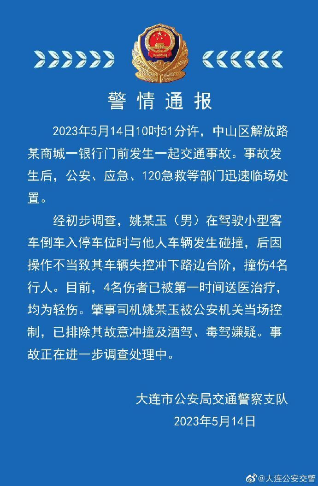

# 辽宁大连：一司机撞伤4名行人，已排除故意冲撞及酒驾、毒驾嫌疑

来源：大连公安交警

警 情 通 报

2023年5月14日10时51分许，中山区解放路某商城一银行门前发生一起交通事故。事故发生后，公安、应急、120急救等部门迅速临场处置。

经初步调查，姚某玉(男)在驾驶小型客车倒车入停车位时与他人车辆发生碰撞，后因操作不当致其车辆失控冲下路边台阶，撞伤4名行人。目前，4名伤者已被第一时间送医治疗均为轻伤。肇事司机姚某玉被公安机关当场控制，已排除其故意冲撞及酒驾、毒驾嫌疑。事故正在进一步调查处理中。

大连市公安局交通警察支队

2023年5月14日

