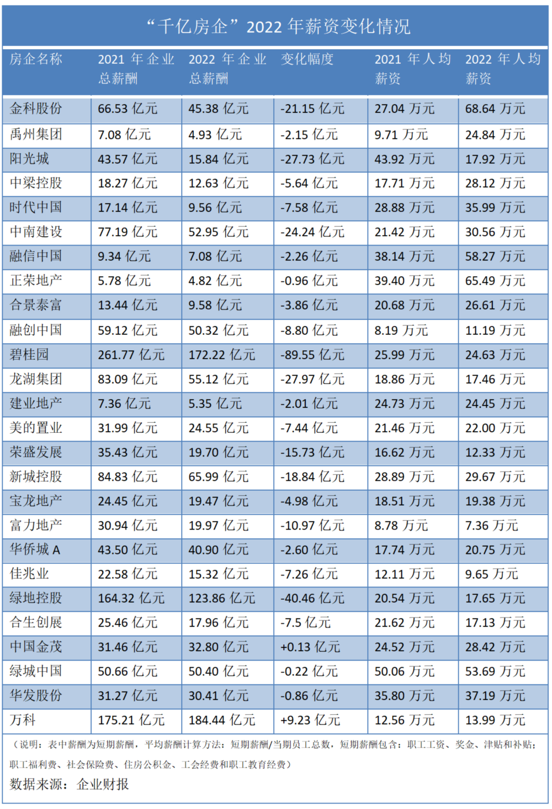

# 2022地产众生相：九成房企薪酬下降，20万人出走，高管收入断崖式下滑

随着房企年报公布收尾，2022年地产人的生存状况真实地展现在世人面前。

如果说2021年是寒冬开启的信号，那么2022年便是地产行业的隆冬，“寒气”不可避免地传导到了每一个人。

2022年，地产行业告别过去高杠杆之下的飞速增长，进入下行期，超过20万人离开服务的企业，多家房企人员规模腰斩。在这一年，地产人成为少有的平均薪资下降的群体，超过一半的房企取消年终奖。

在行业风险出清、挤出泡沫的阵痛中，有不少地产人相信，行业已经触底，即将迎来新的周期。

**规模缩减，20万人出走**

减员，是许多房企2022年最重要的课题。

经历了十年黄金发展期的地产行业在过去两年骤然进入寒冬，在流动性压力下，企业纷纷走上降本增效、探索低杠杆运营模式的道路。在各项成本中，人员成本首当其冲。

九派财经梳理历年“千亿房企”2022年财报后发现，超过八成千亿房企在2022年经历了不同程度的减员，一些房企的人员规模甚至腰斩。

统计企业中，7家房企人员缩减规模超过50%，其中金科股份和禹州集团超过七成员工流失，龙湖集团、金科股份、中南建设、融创中国和碧桂园的减员人数过万。

而2022年也是过去三年中地产行业人员流失速度最快的一年。可研智库数据显示，相比2019年，近三年来地产开发从业人员减少了40万，地产开发上下游产业减少约600万个岗位，全产业链上下游预计一亿相关从业人员就业受到不同程度的波及与影响。

在这场行业大规模降本运动中，生产操作人员和销售人员是重灾区。

以裁员比例较高的金科地产和阳光城为例，金科地产的操作人员数量从2021年底的10334人降至8人，几乎砍掉了所有操作人员，销售人员从3117人降至1917人，四成销售人员出走；阳光城的生产人员数量从3811人降至1460人，缩减比例为61.69%，销售人员从4440人降至1355人，缩减比例为69.48%。

在从业者大幅流失的同时，进入地产行业的人也在大幅减少。调研数据显示，2022年，地产行业客服岗人员需求减少了95%，设计岗人员需求减少87.76%、投资拓展岗人员需求减少86.21%、人力岗人员需求减少85%。此外，财务、成本和运营岗位的人员需求下降比例也在70%以上。

**少发三百亿薪资，但人均收入上涨**

离开地产行业的人出现在各行各业的求职名单中，而留在行业内的人日子并不好过。

国家统计局近日发布的数据显示，2022年的房地产系19个调研行业中就业人员平均工资唯一下降的行业——在城镇非私营单位中，房地产行业就业人员年平均工资为90346元，比上一年下降了0.9%。在城镇私营单位中，房地产行业就业人员年平均工资为56435元，比上一年下降了3.2%。

九派财经梳理的近30家发生减员的千亿房企中，超过九成房企总体薪酬同时下降，下降总额超过340亿元。这其中，碧桂园总体薪资规模下降近90亿元；绿地控股下降40.46亿元、阳光城、金科股份、中南建设、龙湖集团的总体薪资下降幅度都超过20亿元。

一份地产人力调研数据显示，2022年超70%地产人出现年收入下降，其中收入下降10%-30%的占比高达33%。在九派财经统计的房企中，阳光城的员工平均薪资降幅近六成，荣盛发展的员工平均薪资下降幅度为25.81%。

地产人待遇的下滑更直观地表现在年终奖上，过去，年终奖是地产人年收入的大头，而上述调研数据显示，2022年，有47%的地产人没有拿到年终奖，2021年这项数据为20%。

值得关注的是，更多的减员房企中出现了员工平均薪资上涨的情况，如金科地产、禹州集团、中梁控股、时代中国、融信中国的员工平均薪资均大幅上涨。

一方面，这几家房企的人员缩减规模都在一半或以上，人数变化较大，由此拉高了企业人均待遇。另一方面，这些企业往往人均薪资上涨幅度与减员比例失衡，这一定程度说明了离开房企的人多为薪资水平较低的基层员工。

以金科股份为例，2022年其员工数量下降73.13%，总体薪酬下降31.79%，人均薪酬上涨153.85%；再如禹洲集团，2022年其员工数量下降72.79%，总体薪酬下降30.37%，人均薪酬上涨155.82%。

而一份由上千人参与的地产行业的问卷调查同样显示，尽管行业内对薪资的悲观情绪普遍，但岗位级别越高，薪资水平越高的地产人，考虑离开行业的比例就越低。

**高管收入锐减，再难见“打工皇帝”**

在不少业内人士看来，降薪实际上是挤出泡沫的一面，是地产人不得不面对的阵痛。这种阵痛是每一个地产行业的从业者需要经历的，话事人也不例外。

过去，房地产行业常常能看到年薪上亿的职业经理人，他们被戏称为“打工皇帝”，其中有如前任恒大集团二把手夏海钧，其年薪最高达到2.7亿元；碧桂园总裁莫斌薪酬在2021年达到1.92亿元；龙湖前任CEO邵明晓2021年的年薪也达到了8146万元。

但来到2022年，房企高管的薪资普遍缩水。统计数据显示，在披露董事长薪资情况的170家上市房企中，2022年薪资总和为3.7亿元，相较2021年的5.31亿元下降30.32%。其中，年薪超千万的房企董事长人数为6人，而2021年这个数字为15人。

在九派财经统计的多家房企中，关键管理人员的薪酬下滑乃至减半的企业比比皆是。2022年，融创的董事高层总薪酬为2732.2万元，相较2021年下滑62.26%；碧桂园董事高管的总薪酬为6132.9万元，较2021大幅减少82.77%；中国金茂董事高层总薪酬为1379.1万元，相较2021年下降66.72%；中梁控股则取消了2022年董事高管的绩效奖金，这一数字在2021年为484.2万元。

在降薪的高管中，碧桂园总裁莫斌堪称年度“最惨打工人”，其2022年薪资为957.8万元，仅为2021年1.92亿元的5%，此外，龙湖集团合伙人邵明斌2022年薪资为5208.6万元，相较2021年下降2937.6万元；融创中国原西南区总裁商羽2022年薪资为800.4万元，相较上一年减少2161.4万元；美地置业董事局主席郝恒乐2022年的薪资为1505.2万元，相较2021年下降1738.1万元……

除了职业经理人外，地产老板们在降薪上更加身先士卒。2022年，融创中国董事局主席、创始人孙宏斌的年薪资为24万元，相较2021年的699.3万元，大幅减少96.57%；而碧桂园创始人杨国强，和其女儿、现任碧桂园董事局主席的杨惠妍薪资分别为477万元和38.5万元，并且没有奖金，而2021年，杨国强和杨惠妍的薪资和奖金分别为1530.7万元、1150.7万元。

九派财经记者 陈静仪

编辑 郭梓昊

【来源：九派财经】

