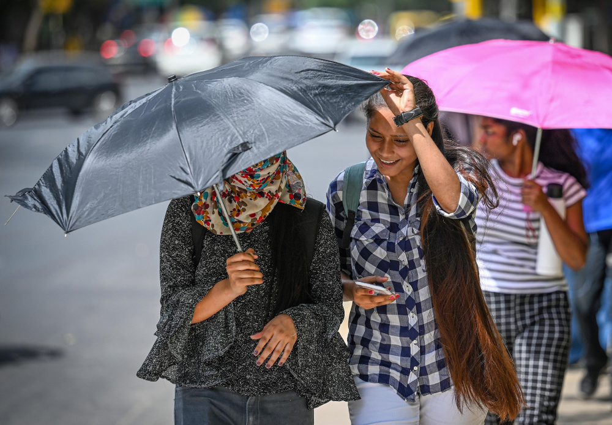
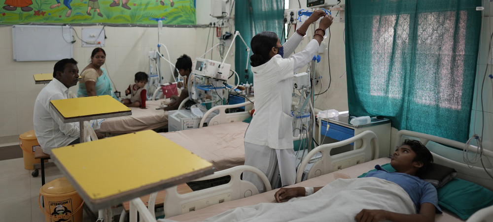
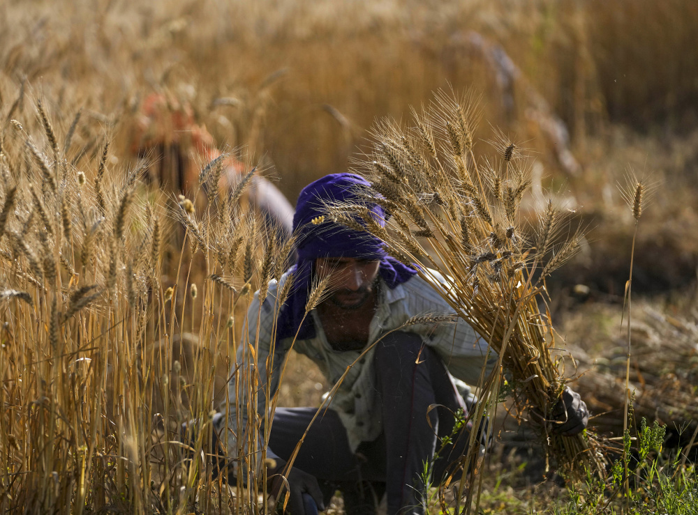

# “白夜”将至？厄尔尼诺现象或将归来，亚洲面临超级高温“烤”验

“没人能经受住44.2℃的炙烤。”来自印度奥里萨邦的阿拉达娜（Aradhana
Brahma）在晌午穿过当地的商业广场，4月的广场四下不见人影，街边的商店和饭馆大门紧闭，万籁俱寂。这个场景被阿拉达娜形容为“奥里萨的白夜”。在户外待了不到四分钟，阿拉达娜全身上下已被汗水浸透，空气在高温中像凝固了一样，让她感到喘不过气。

一场严重的热浪在今年4月席卷了南亚、东南亚、东亚的多个地区，许多国家再次出现创纪录的高温。据英国广播电视台（BBC）5月7日报道，越南经历了有记录以来的最高温度44.1℃。此前泰国西部麦省的气温达到创纪录的44.6℃。缅甸东部一个城镇的气温高至43.8℃，是十年来的最高气温。

_当地时间2023年4月19日，印度新德里，人们打伞躲避高温。_

长期追踪全球温度记录的西班牙气候历史学家埃雷拉（Maximiliano Herrera）
在社交平台上写道，最近亚洲地区的热浪是“有记录以来最严重的高温事件之一”。

5月3日，世界气象组织（WMO）宣布，今年7月到9月产生厄尔尼诺现象的可能性为80%，并且有60%的可能性将在5月到7月出现。持续三年并导致海洋降温的长期拉尼娜现象已经结束，厄尔尼诺现象将对全球许多地区气候产生与拉尼娜现象相反的影响，可能加剧全球升温。

这种影响很可能已经显现。根据全球多个权威气象统计机构的数据，今年前三个月全球地表温度仅次于2016、2020和2017年（按照热的程度排序）。2023年将很有可能成为有记录以来最热的四个年份之一。

过早到来的高温再次凸显出气候变化影响的真实性和迫切性。在情况变得更糟糕之前，我们是否有做好准备？越南可持续发展和气候变化专家萧永健（Renard
Siew）告诉澎湃新闻，关键的问题是大多数人往往忽视长时间暴露在极端高温中的危险，认为这就是日常生活。因此亟需提醒人们应对极端高温。

那些待在有冷气的室内、乘车、点外卖、富裕的人群或许可以轻而易举地通过各种方式规避高温。“但更多人必须直面烈日。”关注气候变化中弱势群体所受影响的人类学家麦奎德博士（Katie
MacQuaid）在接受澎湃新闻采访时警告道，近期的极端热浪将进一步加深脆弱人群在气候变化影响下所承受的苦难。

**困在极端热浪中的亚洲**

在位于气候危机前沿的印度，有48个气象站在4月18日录得42℃以上的气温，其中奥里萨邦的最高气温为44.2℃，相较于前一天的气温骤增6.1℃。此前印度刚经历了自1901年以来最热的12月和2月。印度气象部门在3月就发出预警，5月底之前该国气温将高于平均水平。对于印度今年的气温波动，联合国环境规划署
(UNEP) 表示，今年的极端热浪比正常情况来得早，覆盖范围广阔，持续时间比典型热浪长得多。

印度是最容易受到高温影响的国家之一。政府报告显示，相较于2000年至2010年间，在其后十年里，印度经历的热浪事件增加了四分之一，与热浪相关的死亡率增加了27%。一项发表于《柳叶刀》（The
Lancet）的研究称，2022年印度经历了122年来最热的3月和4月。该研究预计，到本世纪中叶，极端高温的天数将增加两至四倍，同时热浪在变得更加频繁和炎热的基础上，会更早到来且停留得更久。

今年的高温热浪不仅在南亚地区早早到来，在毗邻的东南亚地区亦是来势汹汹。4月，马来西亚气象局在多个州发出热浪警报，其中马来西亚中部森美兰州于4月22日录得38.4℃的最高气温。由于热浪，马来西亚教育部下令暂停全国学校的所有户外活动。4月25日，马来西亚东海岸吉兰丹州一名11岁男孩因中暑和严重脱水死亡。同一天，当地一名19个月大的幼儿死于严重脱水。

5月初，越南北部清化省也录得了有记录以来的最高温度44.1℃。当地官员警告人们为防止中暑最好待在室内。据法新社报道，越南气候变化专家阮玉辉（Nguyen
Ngoc Huy，音译）称，鉴于气候变化和全球变暖的背景，越南的新高温记录令人担忧。
“我相信这个记录会被重复多次。”他说，“它证明了极端气候模型是真实的。”

5月6日，老挝琅勃拉邦达到打破全国高温纪录的43.5℃，当周老挝首都万象也达到42.5℃，超越了该市的历史纪录。

在泰国，5月6日的41℃创下了曼谷有记录以来的最高气温纪录。根据泰国气象部门数据，4月中旬，西北城市达克成为该国第一个超过45℃的地方。自3月下旬以来，泰国大部分地区气温已在40℃上下，将电力需求推至新高峰。据报道，许多选民在投票站排队等待泰国大选提前投票时晕倒。泰国总理巴育也对“各地出现危险的高温”表示了担忧。

**对脆弱人群更致命的高温**

相比较有钱人，穷人和弱势群体更容易受到高温的伤害。如果今年的高温再创纪录，亚洲很可能出现由热应激导致的超额死亡和过早死亡。

“在有冷气的地方，人们不需要为热浪感到烦恼。”麦奎德博士对澎湃新闻说。这也更加凸显出气候变化影响下，极端高温热浪事件对不同人群的不平等影响。

过去十年里多次打破纪录的高温使空调成为印度家庭和办公室的重要设备——据Statista的数据显示，印度的空调销量在2022年到2023年达到近100万台。

即使空调使用率创历史新高，绝大多数印度人仍然买不起空调。为了使空调更加实惠，印度政府在2022年开始实施生产挂钩激励计划（Production Linked
Incentive），该计划旨在通过促进本地制造来减少零部件的进口——进口零部件占空调成本的50%。

“但人们需要承担的不只是购买空调的费用，还有维持空调运作的高昂电费。即使能运行这些设备，也无法保证远离高温，因为夏季断电很常见。”麦奎德博士表示，“在贫民窟和农村等脆弱区域，基础设施落后的问题仍然无法得到有效解决。”

_当地时间2023年4月16日，印度新德里，气温飙升至40℃以上，工人运送冷气机。_

这种情况阿拉达娜有着亲身体会。在霍尔达区的皮库里村（Pichukuli），等待空调运作时的嗡嗡声成为当地村民的日常状态。“村里大部分房屋都安装了空调。”阿拉达娜告诉澎湃新闻，她在这个奥里萨邦南部村庄长大，“但煤炭短缺导致的断电是常有的事，有时等一个小时电就来了，有时需要等四五天”。

在没有电的日子里，阿拉达娜和她的家人会睡在地上或屋顶上，手工扇子仍然是每户人家的必备品。即使人们可以借助充电式电扇度过一个停电的下午，但太阳能电池板只能维持几个小时，不能解决长时间停电的问题。

“停电的时候，水是最有效的降温办法。”每过几个小时，阿拉达娜都会用浸湿的毛巾擦拭皮肤。但皮库里村正面临严重的缺水问题。“村民的饮用水大都为井水，当地下水干涸时，我们能获得的水就非常少。”阿拉达娜说。不过她仍然认为自己是幸运的，因为皮库里村的每户人家都有自己的水井。而有些村庄只有两三口水井供全村人取水，这意味着人们需要耗费大量时间在高温下获取非常有限的井水。

虽然热浪造成的烦恼在印度是常有之事，但不少印度民众对极端高温的重视程度仍显不足。来自印度滨海城市孟买的塔尼娅（Taniya Firoz
Khan）告诉澎湃新闻：“在受热浪影响相对较小的地区，比如孟买，人们容易疏于意识到自己正处于危险边缘。”孟买地处海岸线，气候相对较为温和。不过，随着全球变暖的影响，近年来孟买也开始经历愈发频繁和严重的极端热浪。

4月18日，美国有线电视新闻网（CNN）报道了一起发生在孟买新城镇的悲剧——在头顶烈日参加完一场政府赞助的活动以后，至少13人死于中暑，多人被送往医院。当地媒体报道称，当天该地最高气温达到38℃。但活动图片显示，仍有数千人直接坐在阳光下，没有采取任何防晒措施。

另一方面，在作为历年热浪必经之地的奥里萨邦，热浪似乎不再是当地人眼中的威胁。阿拉达娜对此深有体悟：“正是因为经历过多次极端热浪，人们会认为即将到来的热浪只是每年夏季如期而至的寻常高温。”她的祖父是一位经历过饥荒的农民，不久前因为在令人窒息的高温下持续劳作而当场昏厥。在昏厥之前，子女曾再三劝告他搁置农活，但他仍在高温天一头扎入农田。

阿拉达娜补充道：“他们的行为动机往往取决于个人感受。”据了解，阿拉达娜的祖父通过电视了解到马哈拉施特拉邦有多人死于热浪，但他认为自己能够凭借过往经验和强健体魄捱过高温。

_当地时间2022年4月24日，印度普拉亚格拉杰，高温持续，很多孩子因中暑在医院治疗。_

个人感受真的可靠吗？科学家发现，普遍存在于沿海城镇的高湿度是极端热浪的一种重要危险因素。“湿热”相较于“干热”有着更大的危害。较高的湿度不仅会使人体散热困难，还可能导致在相对较低的温度下，人体感受到的温度高于实际温度，从而使人体需要更多的能量来维持正常体温，进而产生虚弱、头晕等症状，严重时会危及生命。

塔尼娅和阿拉达娜所言并非一己之见，一项发表于《自然通讯》（natural
communications）的研究显示，当极端热浪发生时，社会倾向于依据他们最近经历过的类似事件来应对当前的灾难。因此，考虑到极端热浪日益加剧的趋势，印度可能会低估当前灾难的严重性。此外，该研究还发现，即使在已经经历了创纪录高温的地区，当地居民仍可能没有为未来的极端热浪做好准备，因为年平均气温依旧是温和的。

科学家就人类能够生存的气温上限已经提出“湿球温度”的概念，即自然风作用下湿润物体的温度。研究表明，在约31℃的湿球温度下，出现脑损伤和肾衰竭的风险几率攀升。而持续暴露于35℃的湿球温度被认为是致命的。据世界银行在去年11月发布的报告显示，印度可能会成为湿球温度频繁超过35℃生存阈值的首批地区之一。

此外，加剧高温影响的另一个问题是夜晚比以前也热了很多。夜间较低温度通常是人们缓解、预防中暑的最重要因素之一。但是越来越炎热的夜晚会扰乱人们睡眠并使身体紧张，增加中暑的几率。

**高温下农民生计堪忧**

除直接威胁生命以外，这种提早到来的高温压力正在颠覆越来越多人的生活和生计。

萧永健告诉澎湃新闻，热浪对人们造成了巨大的影响，特别是对那些必须在户外工作的工人（建筑业、农业）。在如此恶劣的条件下工作，可能会导致工人们热应激，并对身体状况造成损害，这也会影响他们的生产力水平。

以印度为例，一项发表于《柳叶刀》的最新研究称，2021年极端高温导致印度人损失1672亿个小时的潜在劳动时间，造成的收入损失相当于该国生产总值（GDP）的5.4%左右。而据权威研究预测，到2050年，受极端高温影响，印度人在白天的户外工作能力将减少15%，印度的GDP和生活水平将下降2.8%。

印度是全球重要的粮食供应国，直接或间接依赖农业作为主要收入来源的人群占印度14亿人口的近60%，小麦减产将引发人们长期以来对粮食安全和收入稳定的担忧。据印度气象部门称，2月份部分小麦产区最高气温连续几天突破39℃，比常年高出近10℃，持续的高温可能会对小麦产生不利影响，因为小麦正接近对温度敏感的生殖生长期。小麦开花期和成熟期时的高温会降低小麦产量。

_当地时间2023年4月24日，克什米尔查谟地区，农民在收割小麦。_

而这种情况在去年的高温中已经发生。印度旁遮普邦农业部主任古尔温德·辛格（Gurvinder Singh）告诉印度的环境保护门户网站Mongabay-
India：“在2022年，由于热浪影响，旁遮普邦的小麦产量从2021年的1700万吨下降到1390万吨。我们预测今年的小麦产量可能也不会超过去年的数字。”

值得注意的是，随着世界气象组织预警今年厄尔尼诺现象发展的可能性正在增加，它的再次出现不仅“可能会加剧全球气温升高”，还可能会破坏印度的季风降雨，使印度的农业雪上加霜——印度将近一半的农田靠雨水浇灌，而且受季风影响。提供天气服务的大型私营印度公司Skymet在一份声明中指出，自2000年以来，印度出现的6个厄尔尼诺现象年中有5个发生了干旱，其中两年出现“严重干旱”。

鉴于极端高温影响下的作物经济损失，提早到来的极端热浪意味着更多的减产。对小农户而言，背负巨额债务是普遍现象。由于当前全球变暖使农业更不稳定，这些农民不知如何偿还债务。

除却降水不足导致的额外灌溉资金投入，印度农民还面临工作时间缩短引起的收入减少。“大部分农业公司以利益为导向，在农业不景气的背景下，被雇佣农民的工作时间减少意味着他们能为企业创造的价值减少。即便知道高温下长时间的户外工作是致命的，为了生存，许多农民还是这样做了。”阿拉达娜对澎湃新闻说。

农业危机将许多人推向城市。然而，由于印度经济结构的失衡与断层，经济增长的利好并不包含就业机会的增加。而且大多数城市岗位都是户外工作，今年的极端热浪使其面临更大的风险。一种找不到出路的恐惧情绪长久笼罩着印度的农田——据印度国家犯罪统计部门透露，自1995年以来，印度自杀的农民人数超过了29万，但这些数据没有具体说明自杀原因。

虽然印度政府保证会为农民提供社会保障，但这些承诺至今仍停留在口头上。来自印度北方邦的黑兹尔（Hazel
Borkar）告诉澎湃新闻：“事实上政府不会向农民提供任何实质性帮助。即使我们设法取得了一些补偿，这些钱也只是出于政府名誉的维护。”

“印度现有的农作物保险覆盖面很低。”班加罗尔农业研究基金会主任桑迪潘·巴克西（Sandipan Baksi）在接受Mongabay-
India采访时说。据印度农业研究基金会称，2012年至2013年间，只有不到5%的种植水稻和小麦的农户有农作物保险；从2018年到2019年，种植水稻和小麦的农户的相应比例分别略微增加到8%和7%。

来自新德里的农业专家戴维德·夏尔马（Devinder Sharma）在接受Mongabay-
India采访时表示，印度现有的农作物保险计划旨在让私人保险公司受益，而不是农民，“除非改变这种方法，否则农民将继续受苦，而且现在极端天气事件将更加频繁”。

夏尔马在印度杂志《展望》（Outlook）中进一步补充说：“农民的大部分需求只有政府能解决。气象局应在每年的1月提出温度预测，这样农民就可以做相应的准备，政府的应急计划和政策举措也可以提前形成。”该报道称，尽管印度政府已于2019年启动了国家气候变化和人类健康计划，但其努力尚未见效。

**应对高温亟需更多举措**

极端高温天气越来越频繁，越来越严重的背景下，我们该如何应对？

为应对极端热浪，印度政府早在2013年就启动了高温行动计划（HAP），即通过规定印度各地区预防措施、灾难响应和灾后响应措施以减少极端高温的破坏性影响。目前已有的高温行动计划已经扩散到该国多个司法管辖区，它们敦促不同解决方案类型的健康组合。例如，基于自然的解决方案不仅有效降低了城市高温风险，还能保护和恢复有助于应对社会挑战的生态系统。

据印度政策研究中心（CPR）在今年3月底发布的HAP影响评估结果显示，在审查的37项高温行动计划中，相当一部分干预措施是长期措施，如急救设施的健全、冷却屋顶的建造和日薪劳动者工作时间的调整等，这些措施可以降低两个或更多炎热季节的高温风险。在奥里萨邦，当地政府在发布高温预警的同时还立即要求学校暂停线下教学。“这只是从线下到线上的教学模式转变，学生的课业不会受太大影响。”阿拉达娜说，“负担不起电子设备的学生可以向政府申请免费的电子设备支持。”

与此同时，评估报告还提出了这些计划的不足之处——报告称，37项高温行动计划对极端热浪的看法过于简单化，且并未做到因地制宜。高湿度的印度沿海城镇和印度中部的矿业城镇是两个截然不同的热浪现实，但对照的高温行动计划却毫无二致。至关重要的是，没有任何计划将气候预测纳入规划，这限制了对何时何地对印度不断扩大和密集的城镇进行结构性改革的理解。

另外，评估表明，几乎所有的高温行动计划在识别和帮助脆弱群体方面的表现都不尽如人意。“老年人可能被困在他们的房子里或缺乏社会支持，性别不平等在气候适应中发挥着重要作用，难民群体在获取国家支持的过程中可能面临诸多困难。”麦奎德博士说，“相较于其他社区，居住在贫民窟的人群更容易受到热浪影响。”由此，她进一步提出，脆弱区域需要建立专门应对热浪的社区中心，“这些避难所可以为中暑的住民提供降温和急救服务。”

_当地时间2023年5月10日，印度艾哈迈达巴德，人们走在干涸的河床上。_

据悉，在印度的艾哈迈达巴德，已有市政公司提供类似救助服务。但麦奎德博士认为他们可以做得更多：“虽然一些地区建立了降温中心，但他们没有考虑到独居老人和残疾群体的出行不便。”除对脆弱群体缺乏关注以外，研究人员还认为，大多数高温行动计划还存在资金不足、法律基础薄弱、透明度低等问题。

巴尔汗博士在接受CNN采访时表示：“过去五年里，印度在扩大高温行动计划方面发挥出巨大的效力。但随着印度和印度次大陆的热浪提早到来并且逐渐加剧，我们有必要重新评估该国气候脆弱性的指标。”

在此基础上，麦奎德博士进一步补充，评估人员和政策制定者需要直接接触脆弱群体，以确保他们的需求和看法在气候政策和规划中得到充分体现。“只有这样我们才能了解谁在气候政策中受益，而谁被这些计划排斥。”

高温行动计划是相对较新的公共政策项目，因此一直都在不断更新发展。2022年12月，印度政府表示，印度国家灾害管理局（NDMA）和印度气象部门正在与23个易受热浪影响的州合作制定州级行动计划。今年4月18日，印度焦特布尔市启动了有史以来的第一个高温行动计划。该计划是拉贾斯坦邦第一个包含脆弱性评估的项目，评估纳入了对各地热负荷的考察、对脆弱人群的气候敏感性分析以及对社区资源分布图的绘制。

全球变暖已非遥不可及的前景。在不远的未来，随着极端天气气候事件日益常态化，“奥里萨的白夜”或将在更多国家和地区随处可见。在亚洲国家，贫穷、粮食安全、健康等社会问题在全球变暖的影响下愈演愈烈。频繁发生的极端天气事件意味着国家面临更大的灾害风险和严重的经济损失，这些都使得后疫情时代下政府在促进经济、恢复民生等方面的发展道路更加困难重重。

“气候变化的影响是真实的，政策制定者需要尽快制定方案，以确保社区准备好面对越来越恶劣的天气。
我们需要政府所有部门、整个社会一起参与。各方需要形成更强有力的共识和巨大的紧迫感，就这一问题采取行动。”萧永健说。

