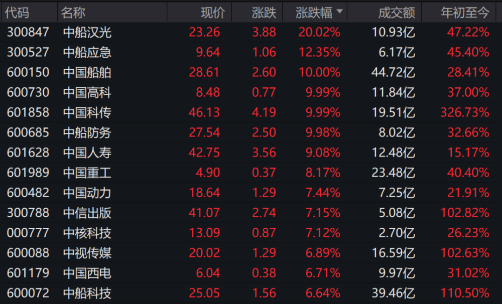
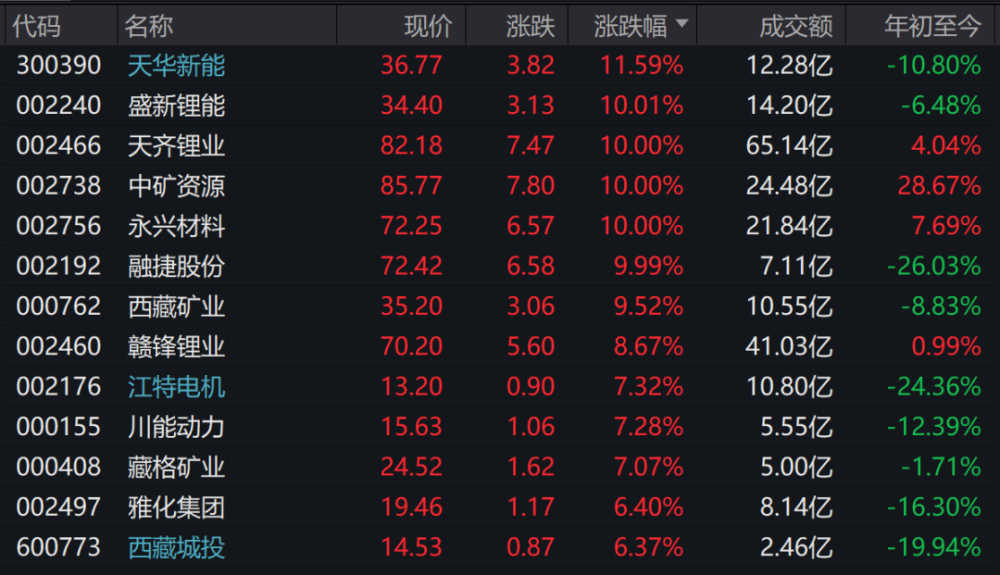
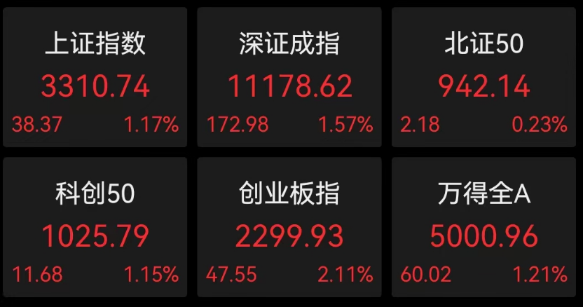
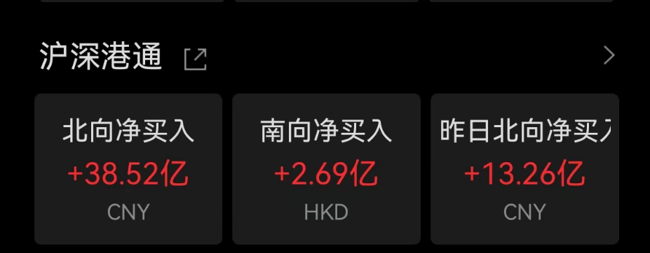
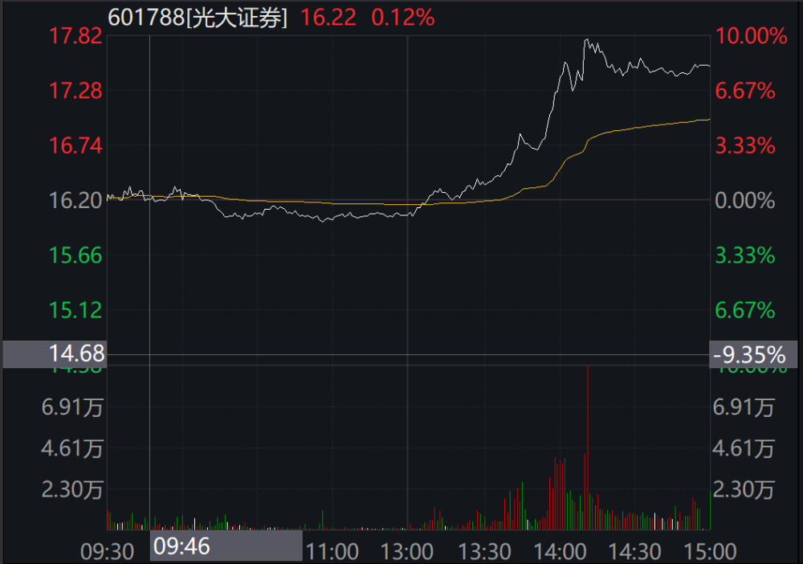
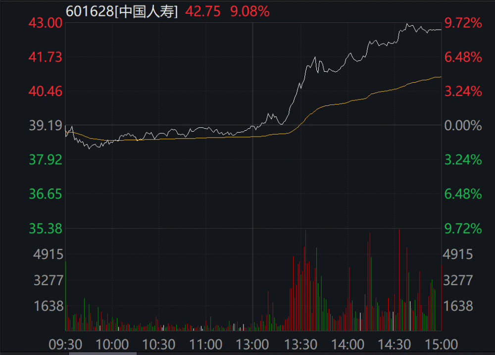
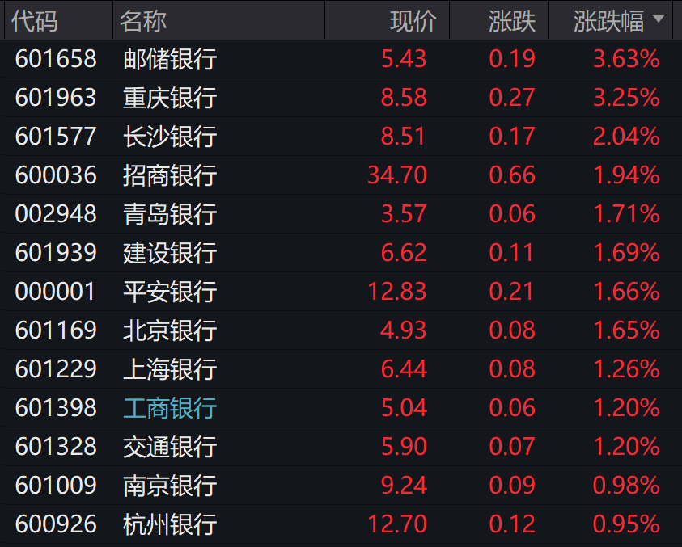

# 两大利好来袭！A股全线大涨沪指站上3300点，“中特估”板块大反攻

中国基金报 安曼

各位兄弟姐妹们，A股三大指数齐飞，3300多只个股上涨，又到了基金君帮大家找原因的时候了……

基金君了解了一圈，今天大涨的原因主要有以下几个：

1、据上证报报道，由上海证券交易所主办、工商银行承办的“沪市金融业专题座谈会”将在本周三召开。此次会议讨论的重要内容为“在服务中国式现代化中促进金融业估值提升和高质量发展”。参会机构包括银行、保险、基金和券商人士。

受此消息影响，沪指午后涨超1%站上3300点，早盘一度跌超1%，保险、券商、中字头等权重板块集体拉升，光大证券触板，中国人寿涨9%再创阶段新高，中船系集体爆发，中国船舶封涨停。

2、据上海有色网最新报价显示，5月15日，碳酸锂（99.5%
电池级/国产）涨16000.0元报25.8万元/吨，创逾1个月新高，连涨8日，近5日累计涨26%；氢氧化锂（56.5%
电池级粗颗粒/国产）涨14500.0元报24.2万元/吨，创逾1个月新高，连涨6日，近5日累计涨21%。

此外，锂电产业链下游排产也于近期逐步回升。

今天，据传民生证券首席策略牟一凌在微信群里表示，新能源短期悲观情绪过度，有望反弹。

15日，新能源板块全天维持涨势，其中锂矿板块掀涨停潮，盛新锂能、天齐锂业、中矿资源、永兴材料、融捷股份集体封板，天华新能涨近12%。

来看详情：

**中字头午后狂飙**

截至收盘，上证指数涨1.17%，早盘一度跌逾1%；深证成指涨1.57%，创业板指涨2.11%，北证50涨0.23%。

成交量方面，A股全天成交9399亿元，午后反弹之路上伴随有效放量；北向资金净买入40.85亿元，连续7日加仓。

板块方面，中特估概念午后狂飙，大金融开启加速键。光大证券触及涨停。

中国人寿一度冲板创阶段新高，中国平安涨近5%。

银行方面，国有四大行午后集体翻红，邮储银行升超3%。

消息上，上交所将召开沪市金融业专题座谈会，讨论促进金融业估值提升。参会机构包括银行、保险、基金和券商人士。

中船系成为另一大驱动引擎，中船汉光20cm封板，中国船舶、中船防务直拉涨停，中船应急升超11%。

其余中字头也贡献绵薄之力，叠加AI的中国科传涨停，中国重工冲板，中国海油、中国移动等早盘大跌权重集体翻红走高。

祝福今天挣钱的小伙伴们！

