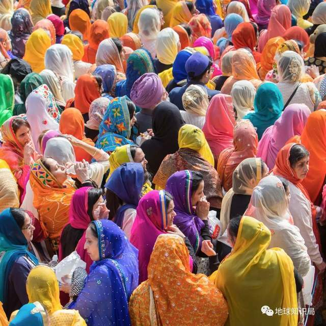
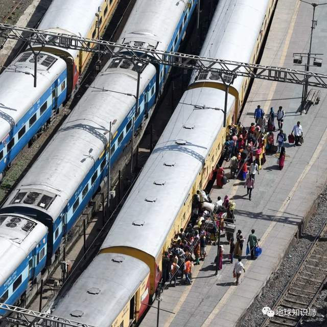
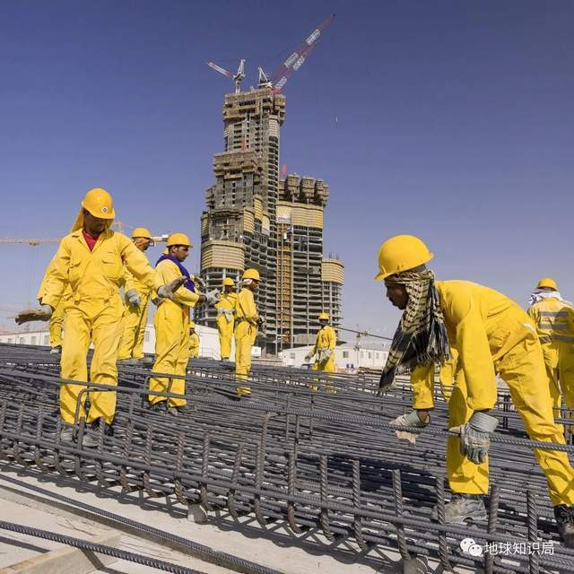
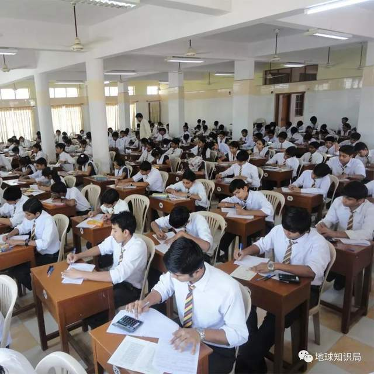
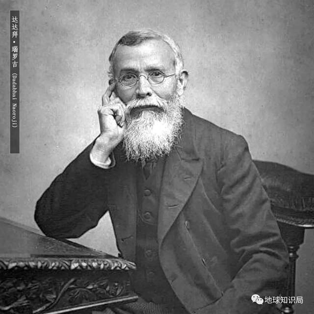
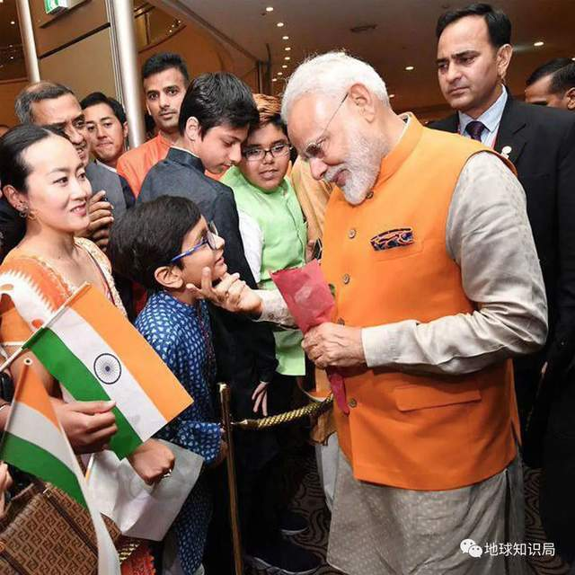
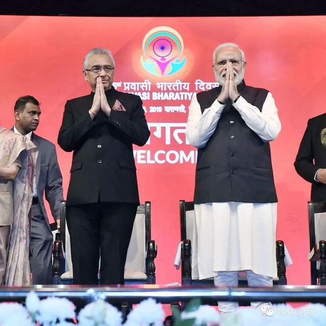

# 从富豪到工人，印度迁出移民人口达世界第一，“润”了也能为国服务

文字：尼耆拉

校稿：辜汉膺 / 编辑：蛾

根据联合国的估算，印度人口已经在4月中旬超过中国，达到约14.258亿，成为了全球人口第一大国。由于印度近年来没有进行人口普查，所以印度人口到底在什么时间超过中国，还存在争议。

不过，在人们较少关注到的另一个赛道，印度人的数量早已是无可争议的世界第一——那就是“润”出国的印度移民数量。

印度对外输出的不只是仿制药和码农，还有印度移民带来的纯正印度味。

_（英国，图：shutterstock）_

实际上，印度长期以来居于全球移民来源国榜首。根据国际移民组织最新数据，有近1800万印度人生活在国外，使其成为世界上迁出移民人口最多的国家。

那么，究竟哪些人在“润”？“润”去哪？这造成了什么影响？印度国内对这些人又持什么态度？

_个体的流动，带动命运的流转 （图：shutterstock）_

从富豪到工人，情况迥异

富豪们的行动往往反映出一个国家的发展趋势，堪称衡量经济状况、社会稳定程度的晴雨表。

根据亨氏顾问公司Henley&Partners发布的数据，2022年印度富裕人口净流出量世界第二，约8000名富豪放弃印度国籍，选择移民。欧洲、阿联酋、澳大利亚、新加坡都是富豪移民的热门目的地。腰缠万贯，说走就走，选择太多了。

_（英迪拉·甘地国际机场，图：shutterstock）_

促使印度富人外流的原因有很多，可能是出于经济上的考虑，比如为了规避印度国内针对富人征收的高税收、将 **财富分散** 到国外；也可能是为了国外更优质的
**教育资源** 、更多元的生活环境；在疫情期间，富豪们纷纷“出逃”，也是为了享受更好的 **医疗服务** 。总结一下：避税保值，为后代计，更好的享乐。

_（英国印裔婚礼，图：壹图网）_

有需求的地方就有生意。一些欧洲国家的移民难度，很对印度大款们的胃口。著名的葡萄牙“黄金签证”就是砸钱换取居留权的典型例子。

在2012年葡萄牙爆发主权债务危机的背景下，该国开放了“ **黄金签证**
”。简单来说该政策就是外国人通过对葡萄牙的投资，换取居留权，从而最终实现入籍。对了，葡萄牙总理科斯塔(右)也有印度血统。

_（图：twitter
@antoniocostapm）_

以投资换取居留权的移民方式粗暴但有效，显然只适合富人。总的来说，移民去欧洲的印度富人数量不少，但是比例并不算多。

家有老钱的顶尖印度富人毕竟还是少数，真正的移民主战场还要看北美。由于印度国内的生活环境较为落后、经济发展水平不高、行政管理能力低下，许多胸怀抱负的
**技术人才** 热衷于前往美国谋求更好发展，所以就人数上来说，美国，是印度经济移民首选目的地。

_印度骑手，美国摩托（图：shutterstock）_

2020年在美国所有的外来移民中，印度人数量 **排名第二**
，有272万人。在硅谷，印裔人口有约30万人，他们从事的都是高新技术行业。这些闯美的印度人人均年收入和人均受教育程度都高于普通美国人。

很多印度人很早就明白了一个道理：原来代码敲得好，是可以改变命运的。

_（工具书专卖店，图：shutterstock）_

而随着美国对H-1B签证的改革，签证审批越来越向 **高技能** 、 **高职位** 、 **高层次**
的人才倾斜，加上拜登政府对STEM（科学、技术、工程、数学）领域专业人才在移民政策上所采取的积极态度，可以预见，未来印度将有越来越多专业领域人才
**留美工作** 。真就是“学好数理化，走遍天下都不怕！”

_（格子衬衫亮了，图：shutterstock）_

还有一类留居海外的印度人明显区别于前两类有钱有技术的中产以上人群，那就是输出到海湾国家的劳务人员，其中尤以到 **阿联酋** 和 **沙特阿拉伯**
的人数最为众多。

由于海湾国家人民绝大多数信仰 **伊斯兰教** ，而印度国内穆斯林占到总人口的10%以上，他们文化和信仰相通，在印度国内就业压力较大的背景下，大量印度人
**来此务工** 。

_比如在清真寺当清洁工（图：壹图网）_

这类移民通道早已有之，几十年来输送的印裔劳工在海湾国家从事的是门槛较低，出卖体力的建筑或家政服务类工作。

印裔海外劳务大军不在乎目标国家生活环境、教育水平和入籍问题，因为他们本来也无望入籍，在当地的政治参与度较低，他们只是谋求在签证年限内尽可能多赚钱，汇往家乡，供养亲人。

_生活不易，当个工具人，挣点辛苦钱养家（图：shutterstock）_

与生享受良好福利且富裕程度极高的海湾本国居民形成鲜明对比的是，不甚光鲜、在热带沙漠严苛气候条件下从事体力劳动的数百万印裔劳工。

_用血汗浇筑出海湾王公的建筑奇观（图：shutterstock）_

_仅是为了生存，就已经花光所有力气（午休，图：shutterstock）_

虽然在中东要面临炎热的自然环境、不完善的劳动保护措施和沉重剥削，但如果印度国内的条件更优厚，又怎么会有如此众多的人们前赴后继来此工作？

同样是海外印度人，顶尖的印度富豪们是为了给自己本就奢侈的生活 **锦上添花**
，避税的同时追求更优质的享受；接受了高等教育的技术人才怀揣知识，离开自己的祖国去追求“ **美国梦**
”，过上中产阶级的生活；而广大移民劳工在遥远的异国他乡 **流下血汗** ，只是为了自己和家人的温饱。

你潇洒多金，他读书深造，我工地搬砖。三条命运线上的印度人，永远没有交集。

_（图：shutterstock）_

出于不同原因出国的印度人都只是上千万海外印度人中的一个数字，但是个体与个体之间境遇却有天壤之别。海外印度人的迥异人生，又何尝不是印度国内巨大贫富差距的缩影呢？

润了，但没完全润

印度文化是极富特点而又极包容的文化，哪怕印度人跑的再远，甚至过了好几代，印度文化依然会深深刻在他们的生活习惯乃至一言一行里。大量出国的印度人与印度本土的联系
**依然紧密** ，在各方面都对印度国内乃至全球产生了巨大影响。

_即便到了异国他乡，也要保持印度本色（图：shutterstock）_

在经济上，印度多年来都是世界最大侨汇接收国，2020年接收侨汇超830亿美元。侨汇已成为印度规模最庞大的国际流入资金。这对于增强国家宏观上的经济安全、减贫和提高人民生活水平具有重大意义。

但是，大量高新技术人才流失对印度本国长期经济发展造成很大危害。

印度国内产业结构不合理、高等教育与市场需求 **不相匹配** 、行政效率 **低下** ，加之精英对欧美发达国家的 **盲目推崇** 追随，使得大量
**人才外流** ，而人才外流又反过来使得印度本土情况更糟糕，形成一个留不住人才的 **恶性循环** 。

_印度人才用脚投票（图：shutterstock）_

印度移民对于印度国内政治也有很大影响。有研究表明，印度国内接收侨汇多的地方，比如喀拉拉邦、泰米尔纳德邦，教育、医疗等公共服务私人化趋势较为明显。这意味着当地能提供更多高水平的私立学校和私立医院等，在公共服务方面对中央拨款的依赖性降低。

_对一些印度学子来说，学而优则“润”_

这在政治上造成的最终结果是，体现地方人民政治诉求的地方政党势力壮大，这些小党在地方选举中获得强势地位，成为邦级执政党，进而对印度整体的政治格局能够造成一定影响。

在欧美政商界，海外印度人的影响力不容小觑。印裔游说集团对美印双边关系产生过一定影响，堪称美国最强大的游说集团之一，曾在2005年美印民用核能合作中起到桥梁作用。就是说，海外印度人的软实力也跟上来了。

_（图：壹图网）_

另外，海外印裔还涌现出不少政治家。早在19世纪英殖民时代，印度早期民族主义理论家 **达达拜** · **瑙罗吉**
就成功当选为英国下院议员，成为印度进入英国议会的第一人，试图以此为自己的祖国争取更大的利益。

_瑙罗吉是印度国大党奠基人之一（图：wiki）_

到了今天，二代及以上的印裔中也出现了诸如英国首相 **苏纳克** 、美国副总统 **哈里斯**
等欧美政坛重要人物。不过，印裔政治家即便在生活习惯和宗教信仰上保持一些印度风格，也不见得会采取多少有利于印度的政策。

对于这些生长在别处的印裔政客来说，印度，很可能只是遥远的祖籍而已。

_（图：shutterstock）_

与此同时，近年来微软、IBM、谷歌、星巴克等著名企业的CEO均为印裔，展现了海外印度人在商界的非凡影响力。

在软性的 **文化层面**
上，几十年来移民文化在印度造就一种以“海湾情结”为代表的独特文化，还诞生了成果丰硕的印度裔离散文学。远离祖国的印度人好似蒲公英，把许多带有强烈印度气息的文化符号带去他们扎根的世界各地。

_洋装虽然穿在身……（图：thewire.in）_

_新加坡“小印度”社区的印度寺庙外墙
（图：shutterstock）_

比如美国白宫早已有每年庆祝 **印度排灯节** 的传统，主要信仰伊斯兰教的阿联酋也因为大量印度人的涌入，建起了价值千万的 **印度教寺庙** 。

可以说，遍及全球的千万海外印度人产生的影响是巨大而深远的。

_总统出面，点个灯玩玩_

_位于阿联酋阿布扎比的印度教寺庙
（建设中，图：baps.org）_

“润”了也能为国服务

印度总理莫迪谈及广大海外印度人时曾表示：“我们现在正走在将人才流失转化为人才增加的道路上。我们希望生活在其他国家的印度人获得‘ **最大的便利** ’和‘
**最小的不便** ’。这也将有利于我们自己的国家。”

_2019年，莫迪在日本与印度侨民见面
（图：twitter @narendramodi）_

海外印度人是否真的能如莫迪所期待的那样为印度带来利益，而为了发挥海外印度人对印度的贡献，印度政府又采取了什么样的态度呢？

印度政府对印度人“出海热”的态度是不断变化的。印度建国初期，尼赫鲁宣布该国不接受双重国籍。到了80年代，侨务政策 **仍旧冷淡** 。

_此时，印度政府还没意识到办好侨务的重要性
（图：paragkhanna.com）_

随着1991年经济改革，印度政府开始拉拢印裔，试图利用他们的影响力、资金、技术服务印度的经济发展。

到2004年，印度政府还成立海外印度人事务部，举办 **海外印度人节** ，后来甚至在法律上设置
“海外印度人公民身份”，虽然不同于双重国籍，但仍使该身份持有者获得一系列在印留居、探亲等权利。

_2019年，莫迪(右)出席“海外印度人节”大会
（图：indbiz.gov.in）_

而对于只是出国务工的印籍 **劳务移民** ，印度政府在国内完善相关法律，设置负责机构，对外则与海湾国家签订相关协议，构筑保护海外印度劳工权益的安全网。

_2016年，莫迪与在沙特的印度工人见面
（图：wikimedia）_

可以说，印度政府对海外印度人的态度与政策，一方面是想要利用他们所拥有的大量资源服务于印度经济建设，另一方面通过赋予他们权利并对其加以保护拉拢，展现印度政府的能力，归根结底都是为了助力印度的“
**大国梦想** ”。

_对一个人口大国来说，办好侨务大有好处 （图：shutterstock）_

在印度的《每日太阳报》等媒体中，时常能够看到关于侨居国外的印度人“光荣事迹”的报道，能够感觉到，印度人对“润”出国的移民的态度并 **不反感** 甚至有点
**小骄傲** 。

千万海外印度人发挥巨大影响力是不争的事实，想尽办法让他们为印度国内带来各种利益也是印度政府努力的方向。不过归根到底，一个国家要发展，留住人才，才是治本之策。

参考资料：

1.世界移民组织《世界移民报告2022》

2.全球化智库《全球人才流动与趋势发展报告2022》

3.刘鹏 《印度海外移民能否带动印度外交崛起》

4.王豪 杨茁《葡萄牙“黄金签证”移民政策的历史演进与经验借鉴》

5.高子平《印度技术移民与劳务移民的比较研究》

6.张倩雨《移民汇款、央地财政关系与印度地方政党的兴起——以旁遮普邦和泰米尔纳德邦为例》

7.毛悦《大国战略视角下的印度海外印度人政策研究》

8.https://dainik-b.in/Cm92zrmRpwb

9.https://www.henleyglobal.com/newsroom/press-releases/henley-global-citizens-
report-june-2022-millionaires-on-the-move

*本文内容为作者提供，不代表地球知识局立场

**封面：壹图网**

**END**

