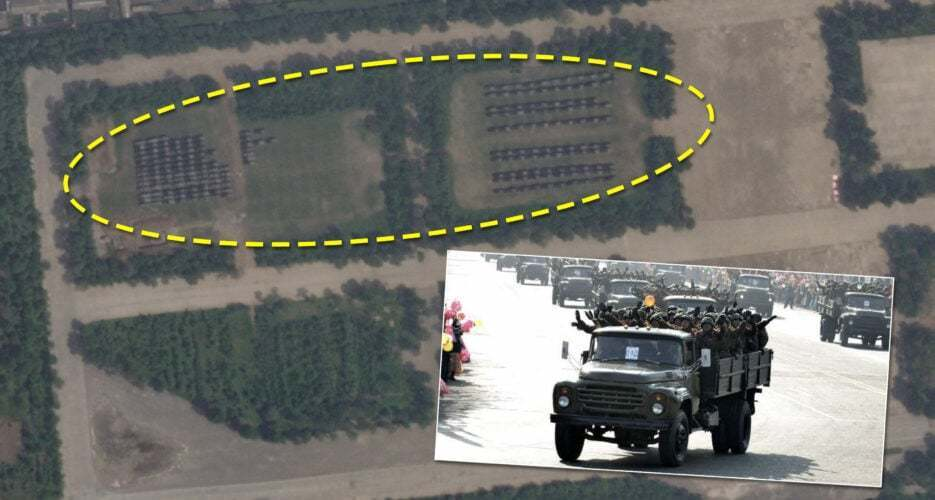
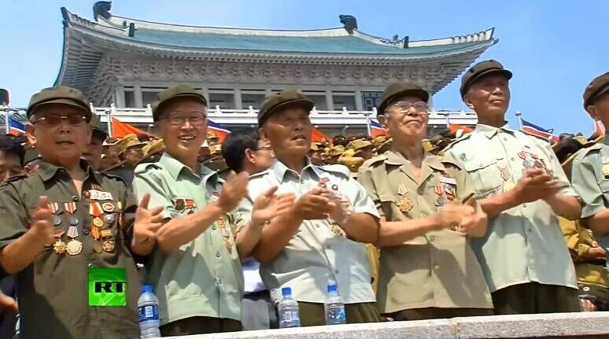
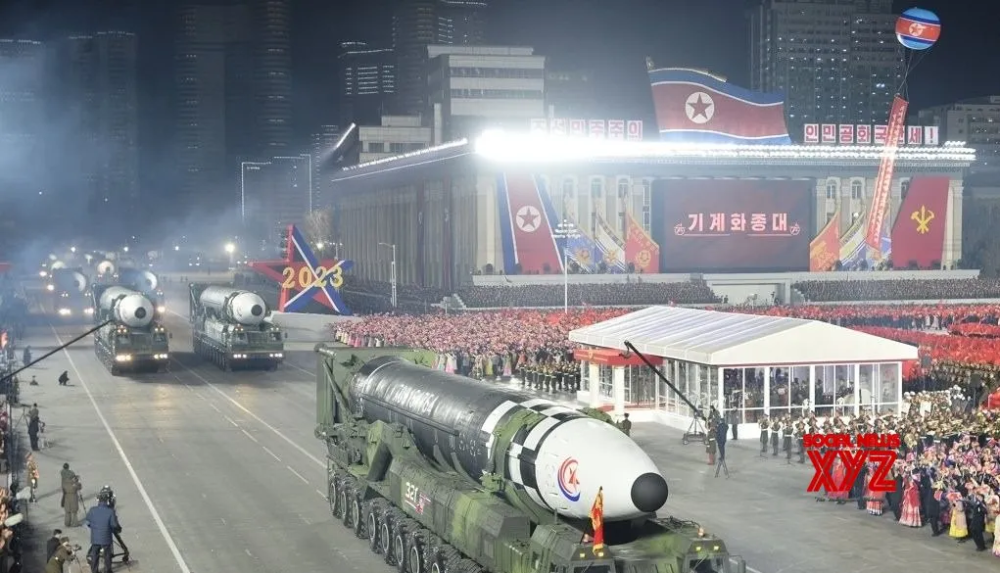
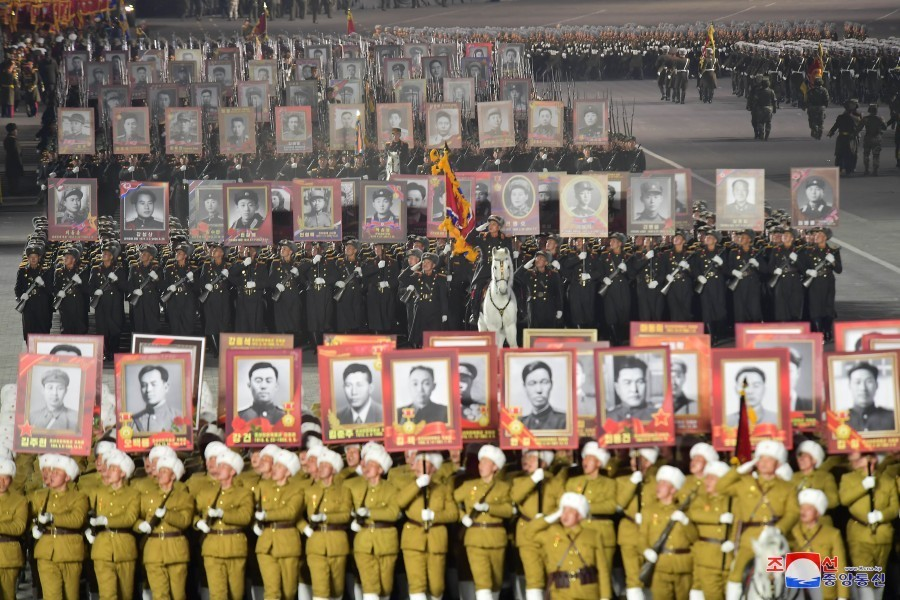
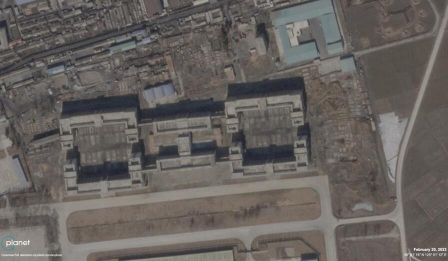
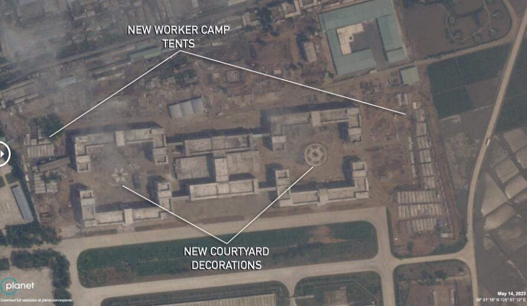
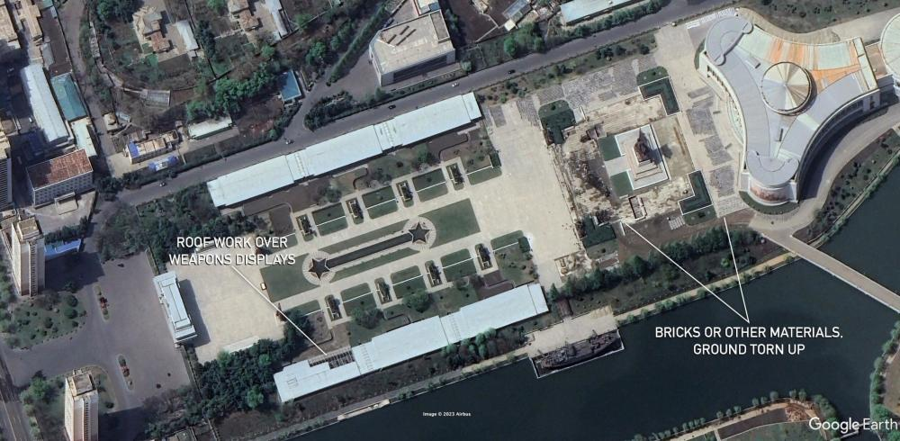
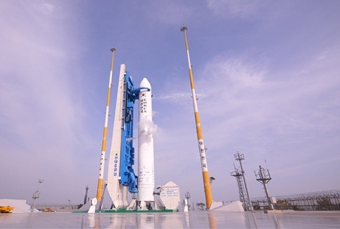

# 卫星照片显示朝鲜集结部队，或正准备祖国解放战争胜利70周年阅兵式

（观察者网
讯）今年2月8日，朝鲜在首都平壤举行了庆祝朝鲜人民军建军75周年阅兵式。而在三个多月后，5月14日美国“星球实验室”公司发布的卫星照片显示，在平壤郊外的美林阅兵村停车场，又有近190辆可能用于运输人员的卡车集结于此。参照朝鲜历次阅兵之前的类似情况，这一场景的出现很可能意味着，朝鲜即将在7月27日举行庆祝祖国解放战争（朝鲜战争）胜利70周年的阅兵式。

_5月14日，美林阅兵村西侧停车场出现的卡车
图片来源：卫星图像提供商“星球实验室”（Planet Labs）_

朝鲜曾在1993年7月27日举行了纪念祖国解放战争胜利40周年阅兵，这也是金日成最后一次出席平壤阅兵。此后在金正日执政的2003年，朝鲜并未举行纪念祖国解放战争胜利50周年的阅兵活动。在金正恩成为朝鲜最高领导人之后，2013年7月27日，朝鲜举行了纪念祖国解放战争胜利60周年阅兵式，并邀请中国人民志愿军老战士代表前来观礼。

_2013年7月27日，平壤阅兵观礼台上的志愿军老战士代表
图源：今日俄罗斯_

2022年12月31日，金正恩在朝鲜劳动党八届六中全会的闭幕式讲话中强调，2023年是纪念祖国解放战争胜利70周年和朝鲜民主主义人民共和国成立75周年的历史性一年，要“使之成为百般增强共和国武装力量政治思想威力之年、战争动员准备和实战能力升级的转变之年”。外界由此普遍认为，朝鲜将在今年7月27日前后，举行包括阅兵在内的大规模庆祝活动。

尽管朝鲜在“2·8”阅兵中，史无前例地同时展示了11辆火星-17液体燃料洲际弹道导弹的发射车和4辆火星-18固体燃料洲际弹道导弹的发射车；但相比2022年4月25日纪念朝鲜人民革命军成立90周年阅兵，“2·8阅兵”在受阅装备规模上仍然有所保留，特别是两款高超声速中程弹道导弹没有受阅；其他地面装备展示品类也较少，飞行展示环节更是少了米格-23ML和米格-29歼击机编队先后低空飞掠金日成广场的精彩。

_“2·8”阅兵中受阅的火星-17洲际弹道导弹纵队
图片来源：朝中社_

除了新装备本身之外，朝鲜近年来逐渐成熟的夜间阅兵模式，也不断为阅兵式增添亮点。例如在“2·8”阅兵中，受阅徒步方队官兵擎起的，由抗日战争到祖国解放战争时期，人民军历代英模形象组成的“不朽军团”，当属那场阅兵徒步方队的最大看点。时隔不到半年后，金日成广场上是否会出现由中国人民志愿军英模形象组成的“不朽军团”，非常值得关注。

_“2·8”阅兵中的“不朽军团”，前排为“革命的一代”——金策（김책）安吉（안길）崔庸健（최용건）吴仲洽（오중성）姜健（강건）林春秋（림춘추）池炳学（지병학）等东北抗日联军朝鲜籍指战员肖像
图片来源：朝中社_

从“星球实验室”发布的照片来看，受阅部队进驻美林阅兵村的时间不早于5月12日，队列训练尚未开始，包括重装备在内的受阅主力装备也未进驻，不过仍能看出，美林阅兵村新建的保障设施有了一定进展。另外自今年2月下旬以来，平壤市内的祖国解放战争胜利纪念馆也在进行重大整修，朝鲜曾于2021和2022年在此隆重举行战胜节老兵庆祝晚会。

_对比2月20日和5月14日的美林阅兵村，可见随阅兵部队进驻而搭建的工棚，以及建筑内部新建的花坛
图片来源：卫星图像提供商“星球实验室”（Planet Labs）_

_4月16日，整修中的祖国解放战争胜利纪念馆
图片来源：谷歌地球_

除了筹备祖国解放战争胜利70周年相关活动之外，朝鲜近期也在准备其他活动，特别是其官方此前宣称已经做好发射准备的“军事侦察卫星”。据韩联社5月15日报道，专门负责收集别国导弹发射前相关迹象的美军RC-135S“眼镜蛇球”侦察机，已经连续两天飞往朝鲜半岛西部海域开展侦察。韩联社据此声称，朝鲜可能在本月下旬七国集团广岛峰会前后“发起挑衅”。

_值得注意的是，韩国的“世界”号运载火箭也将在5月24日进行第三次发射，并将首次搭载韩国自制的实用卫星“新一代小型卫星2号”
图片来源：韩国宇宙开发局_

**本文系观察者网独家稿件，未经授权，不得转载。**

