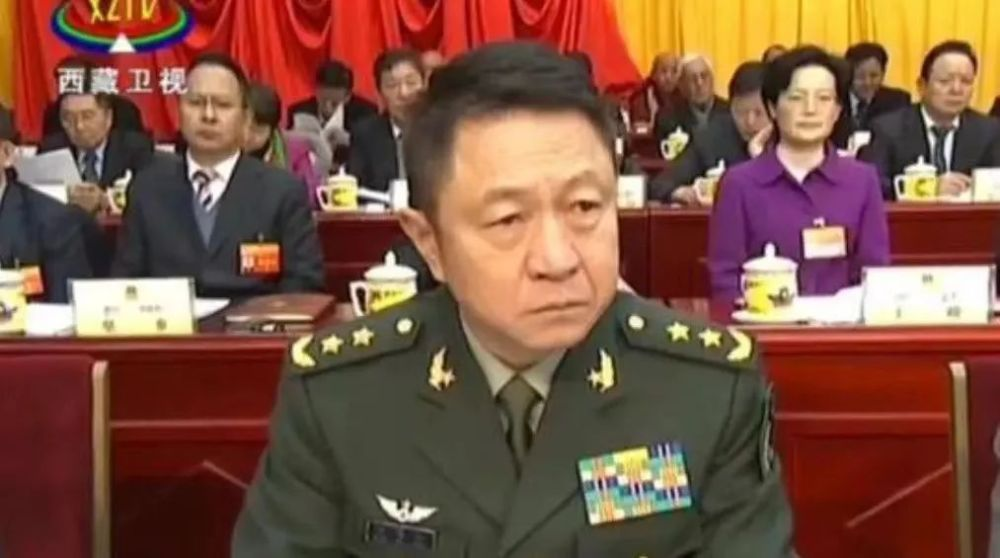
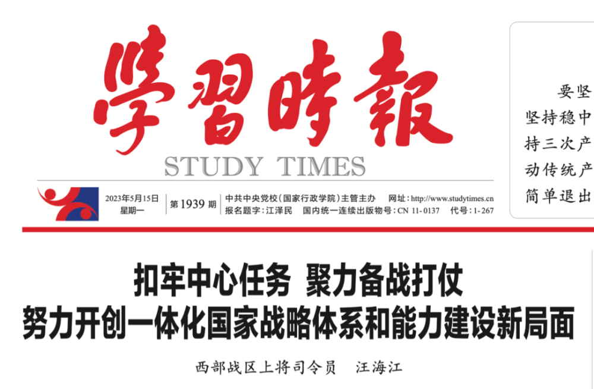
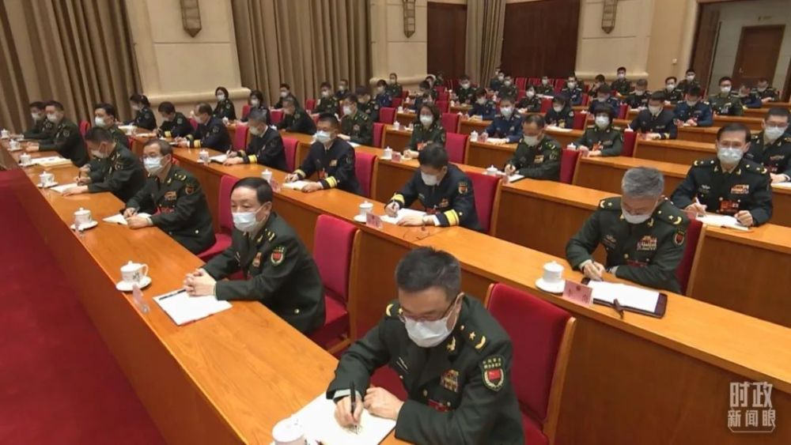

# 曾荣立一等战功的战区上将司令员发声，透露最新信号！

**撰文 | 李岩 余晖**

政知君注意到，最新一期的《学习时报》头版，刊发了西部战区上将司令员汪海江的署名文章《扣牢中心任务 聚力备战打仗努力开创一体化国家战略体系和能力建设新局面》。

上述文章字数超3700字，有不少细节值得关注。

西部战区司令员汪海江

简历显示，1963年出生的汪海江是四川安岳人，2021年被擢升上将军衔，同年他履职担任西部战区司令员。

_汪海江
资料图_

政知君注意到，这位曾亲赴一线作战的“战将”2018年接受《解放军报》采访曾自述：“我是1977年全国恢复高考后，第一批从地方参加高考考入军校的学员之一。毕业后不久，就参加了边境自卫反击作战，带领官兵多次抵近前沿阵地侦察，因作战英勇荣立一等功。”

《中国新闻周刊》此前曾撰文透露称，西藏和新疆作为中国的西部边陲，同时也是地缘安全的交界，面临着本地区极端主义和分裂势力的威胁，一直在中国的军事版图中拥有特殊地位。

政知君此前曾撰文介绍，军改后，我国绝大部分省级军区转隶军委国防动员部。但西藏军区、新疆军区隶属陆军，这意味着其是需要承担主要作战任务及跨区域作战的野战部队。

**回溯汪海江履历，他曾先后担任前述这两个特殊省级军区主官。**

公开报道披露，汪海江曾任某师师长、南疆军区副司令员，2016年任西藏军区副司令员，2020年任西藏军区司令员，2021年任新疆军区司令员。

党中央作出的一项重要战略部署

汪海江的署名文章共分为三部分，分别是：

深刻领悟巩固提高一体化国家战略体系和能力对强军胜战的重大意义；

准确把握人民军队支撑一体化国家战略体系和能力建设的着力点；

依托一体化国家战略体系和能力提升战区备战打仗水平。

在文章开头，汪海江写道，要“努力开创一体化国家战略体系和能力建设新局面”。

值得一提的是，巩固提高一体化国家战略体系和能力，是高层的要求。

3月8日，中共中央总书记、国家主席、中央军委主席习近平出席十四届全国人大一次会议解放军和武警部队代表团全体会议。

_2023年3月8日，解放军和武警部队代表团全体会议现场_

在这次会议上，习近平提到，巩固提高一体化国家战略体系和能力，是 **“着眼于更好统筹发展和安全、更好统筹经济建设和国防建设作出的战略部署”。**

需要说明的是，实现建军一百年奋斗目标，加快把我军建成世界一流军队，要抓的大事很多。

在解放军和武警部队代表团，习主席重点围绕一件事提出要求，可见这件大事足够重要。

到底如何认识这件大事？

在解放军和武警部队代表团全体会议上，习主席指出，巩固提高一体化国家战略体系和能力， **关键是要在一体化上下功夫，实现国家战略能力最大化。**

习近平强调，要坚持党中央集中统一领导，加强各领域战略布局 **一体融合** 、战略资源 **一体整合** 、战略力量 **一体运用**
，系统提升我国应对战略风险、维护战略利益、实现战略目的的整体实力。

另外，党的二十大报告学习辅导百问一书在提到“为什么要巩固提高一体化国家战略体系和能力？”这一问题时谈到：

从战争的维度看，战场上的对抗不仅是军事体系间的较量，而且集中表现为以国家整体实力为基础的体系对抗，
**谁能够最大限度实现国家整体实力系统整合，谁就能够赢得军事竞争优势。**

一些西方国家对我遏制、围堵、脱钩、打压和军事威胁

在文章中，汪海江谈到，巩固提高一体化国家战略体系和能力，是应对复杂安全形势的迫切需要、建设世界一流军队的重要支撑、掌握军事竞争主动的战略举措。

目前的形势究竟如何？汪海江谈到：

当前，我国发展进入战略机遇和风险挑战并存、不确定难预料因素增多的时期，各种“黑天鹅”“灰犀牛”事件随时可能发生，
**特别是一些西方国家对我遏制、围堵、脱钩、打压和军事威胁，带动我国各领域安全威胁突发性、联动性、多变性进一步增强，军事领域的全局性、敏感性、风险性凸显，易向政治、外交等领域传导，经济、科技、网络等其他领域风险向军事领域外溢压力也在增大。**

当前和今后一个时期，局部冲突和动荡频发，全球性问题加剧，世界进入新的动荡变革期，我国来自外部的打压遏制随时可能升级。

文章中还谈到了乌克兰危机。

“ **乌克兰危机爆发后，初步展现出‘混合战争’新形态**
，军事战与政治战、金融战、科技战、网络战、认知战相互交织，推动战争对抗从传统向非传统领域延伸，集中表现为冲突各方综合国力、战争潜力与军事实力的全面较量。”

他提到，只有抓紧巩固提高一体化国家战略体系和能力，最大限度整合各领域战略力量、资源和手段，打通国家经济、科技实力和综合国力向先进战斗力、体系对抗力的转化路径，全面做好军事斗争准备，才能在风高浪急甚至惊涛骇浪的重大考验中“稳坐钓鱼台”。

在涉及国家核心利益问题上寸步不让

官方资料显示，西部战区下辖领导和指挥 **四川、西藏、重庆、甘肃、宁夏、青海、新疆** 的所属武装力量。

在前述署名文章中，汪海江也多次提到周边形势和边疆地区等关键词——

“必须深入研究国际战略格局演变、周边安全形势发展、战争制胜机理特点，从军事需求侧推动一体化国家战略体系和能力建设。”

“紧盯周边安全形势发展，坚持从政治和战略全局筹划指导军事行动，有力开展斗争， **在涉及国家核心利益问题上寸步不让**
，以顽强的斗争精神、灵活的斗争策略、坚决的斗争行动赢得战略主动。”

“必须始终牢记人民军队的根本宗旨， **在履行卫国戍边职责使命的同时，积极支援地方经济社会建设，**
勇于承担急难险重任务，当好应急处突的‘生力军’、维护稳定的‘压舱石’。”

**资料｜新华社 人民网 央视 学习时报等**

**【版权声明】本文著作权归政知新媒体独家所有，未经授权，不得转载。**

