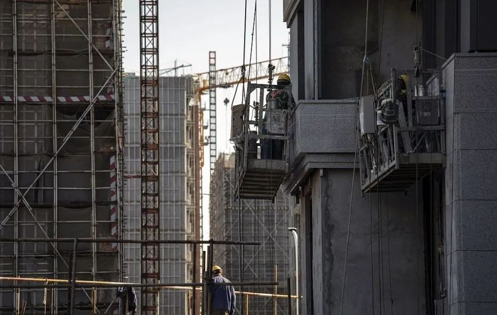

# 活下去！开发商抢做乙方靠代建活命：价格战下有房企没管理费也干

_来源：视觉中国_

作者 ｜ 郭一非

编辑 ｜ 杨布丁

出品 ｜ 棱镜·腾讯小满工作室

“我现在算是闲散人员，对吧。”赵磊（化名）自嘲式反问道。

身为一家TOP30民营房企某大区投拓总监，他也曾属于公司核心岗位，手下带领着十来个人，掌握十亿以上投资额度，四处撒钱找地。但随着债务违约暴雷，裁员潮到来，如今，他成了“光杆司令”，只能零星地做些前期项目的收尾工作。

没钱拿地后，为了寻求业务突破，2022年底，赵磊收到了来自集团的指令——发力代建业务，寻找有土地但无开发能力的金主，但前提是集团不出资不担保。

与之类似，从去年开始，华润、碧桂园、龙湖、华夏幸福等一大批开发商，都相继挤进了代建赛道。有趣的是，同为暴雷房企，华夏幸福甚至还在沈阳中标了恒大文旅城一处烂尾项目。

销售额难见复苏，资金压力下，大规模重启拿地也不现实。相较传统自投模式，代建业务拥有“轻资产、抗周期、高毛利”的属性，在眼下成了“全村的希望”。

中指院统计称，截至2022年底，发展代建业务的品牌房企已经超过60家，代建新签约建筑面积首次突破一亿大关，达到11073万平方米，同比增长11.3%。

不过，就在开发商们放低姿态，从传统拿地开发的甲方角色，开始转变为代建乙方时，一系列新的挑战也正在袭来。价格战横行、靠谱赚钱的项目难寻、不出钱只出力没人买单……代建也并非是一门更轻松的赚钱生意。

**没钱拿地，开发商靠代建活命**

早在十多年前，代建模式就已存在，为何现在却火了起来？

“入局房企增多，核心诉求是市场下行背景下的轻资产转型需求，与冗余开发能力的再利用需求。”
东吴证券一篇研报分析称，随着客户群体向国有资本演变，不具有专业操盘能力的投资方愈发增多，投资与开发资产分离趋势明显，持续增加的代建需求，促使房企涉足代建领域。

在赵磊看来，集团早在2018年即提出代建模式，彼时行业盛行高周转，自己投资拿地卖房，即可轻松赚钱，利润率远高于代建的管理费，代建只是补充型业务，为了冲规模、扩大品牌影响力，但实际到了城市执行层面，大家精力还是放在自投项目扩张上。

时过境迁，眼下已有中小房企开始放弃自投模式。4月，深圳民营房企勤诚达将旗下所有项目，都交由“代建第一股”绿城管理来托管。这是后者首个集团化批量托管业务，此前行业通常为单个项目的代建。

过去两年，相比于动辄亏损百亿的开发商，绿城管理的业绩令同行欣羡不已。其2022年收入增幅达18.4%，毛利率达到52.3%，归母净利润增幅均超30%，股价也在今年4月份创下历史新高。

“代管代建业务将是未来2-3年的市场机会点。”作为行业销售规模最大的房企，碧桂园总裁莫斌在年初业绩会上判断。

莫斌的观点颇具行业代表性，他的依据包括，2022年地方城投在公开市场拿地的占比，从往年的10%左右上升到40%，许多拿地的地方平台公司、主导保障性住房建设的地方政府，以及接管保交楼工作的纾困代建需求正在急剧增多。

传统自投模式投资回报主要依靠土地增值，以及卖房销售。但眼下，大多数开发商眼下仍旧过得艰难，尤其是暴雷的民营房企，一边库存土地正在消耗，另一边又没钱去拿新地。

克而瑞地产统计称，2023年前4月，土地成交规模同比下降31%，创下2010年以来的历史新低。这其中，近七成百强房企没有买地，剩下三成拿地方，仍以央国企老面孔为主。

反观代建，则不受到投资驱动，仅需输出自身品牌、管理操盘经验，负责从定位、设计、工程、成本、营销、物业等项目开发运营全过程，并按照销售额抽取一定比例的管理费。

按照土地持有方身份不同，代建包括政府代建（保障性住房、产业园、医院、学校等）、商业代建（国央企、城投或中小开发商）、资方代建（金融机构的不良资产项目）。目前市场主流为商业代建，包括纯代建（不出资不持股）、融资代建（只出资不入股）、小股操盘（仅出资占少量股份）三类。

这其中，寻求地方城投公司合作成为核心突破点，后者大多手中有地、却无开发能力。比如，绿城管理2022年的新增客户中，来自城投的新拓面积最高，占比46%。

另一家上市代建股中原建业，则依托于建业在中原地区的品牌力，新创了“城市合伙人”模式，目前已与河南省内的14家政府平台公司，以及8家国有企业签订战略合作协议。

**价格战来袭，没管理费也干**

“代建是好找，很多房企主动找上门来谈。“宋业（化名）告诉作者，“但我们是要找投资代建，不能出了地钱，还要再出开发阶段所需建设资金，但投资代建的就不好谈。”

作为一家北方省会城市区域城投平台负责人，由于市场销售不景气，宋业所在的地方政府已经一年多没卖地了。他手里现在还有3块闲置土地，等着找代建方接手。他的底线是代建方需要出资，不能空着手来，而且要保证项目盈利、不亏本，否则一旦做赔了就涉嫌国有资产流失。

宋业称，由于地价高，利润很薄，5年前囤的一块地至今未敢动工入市，绿城管理这些头部代建方有品牌溢价，很难瞧得上这类质量一般的土地，也有暴雷房企来洽谈做代建，但对方又没钱融资，也怕干赔了跑路，所以很难办。

克而瑞地产研究的一则数据显示，2021年城投拿地开工率仅有38%，在国央企、民企等各类型企业中最低，行业平均开工情况则为67%。2022年城投开工率进一步降至8%，行业平均开工率则为31%。

不过，想要拿下城投方的代建单子也并非易事。

上述投拓总监赵磊告诉作者，大家都知道，小股操盘这类代建模式是转型方向，但生意并不好做，一没多余资金投入，二没品牌和口碑，管理费降得再多，自己这类暴雷高周转房企也很难取得足够的信任度。“现在忙活了小半年，一个单子都没接到。”

中指研究院统计，2023年一季度新签规模TOP10代建方，几乎被蓝城、金地、绿城发展、中原建业等老牌包揽，新玩家仅有碧桂园、新城控股这两家，没有暴雷房企入围。

一位头部代建品牌区域负责人告诉作者，现在业务主力客户就是地方城投，他们对于利润现金流没有私人老板那么高，不犯错不亏本就行，三五个点的利润就满足了。有的在招投标前就主动找代建方洽谈合作条款，测算清楚货值、利润等核心指标后才会去兜底拿地，这类情况也比较普遍。

不过，这位负责人也坦言，由于前两年地价高，加上现在销售仍未回暖，市面上真正能赚钱的项目并不好找，城投或地方国资们会倾向于找品牌力强的代建方，希望做出产品溢价，放大项目总货值。

令人担忧的是，当众多玩家纷纷涌入代建赛道后，价格战不可避免地出现了。

作者获得的一家规模房企内部代建手册介绍称，按照货值不等，管理费在3.5%-4.5%之间，其中包括代建方团队薪酬福利，单项目管理费不得低于2000万元，而项目利润率不得低于3%。

上述代建负责人感慨称，现在大家竞争太激烈，原来管理费都不低于四五个点，现在2个点都能做。“前段时间谈了个城投项目，对方领导私下说已经谈了20多家代建方，一家比一家便宜，有的房企甚至提出不收管理费，能养活团队就行。”

**小心避坑，政府代建成新风口**

即便抢到了单，代建方也需要小心翼翼地去甄别风险。

一位品牌代建方区域项目操盘手告诉作者，有位在县级市场做文旅的私人老板找来谈代建，他们担心配套住宅项目不好卖，就派人去翻对方其他项目的财务数据，就是为了保证对方付得起管理费，“人家财务还反问我们，到底是甲方，还是乙方”。

这位操盘手还举例称，之前做的一个省会城市的纾困项目，开发商前些年拿地价格高，暴雷后认亏了4个亿出局，背后的信托方诉求是把成本和部分利息收回，所以作为代建方需要去协调被拖欠工程款的总包单位，还要去调整项目规划重新上市销售。这两年暴雷房企的不良资产项目比较多，代建方需要做好尽职调查，充分了解各方资金关系，隔离自身风险。

相较于商业和资方代建，以保障租赁住房和城市更新为核心的政府代建，风险系数相对较少。不过，按照东吴证券的研判，该模式盈利水平较低，代建费用一般为总投资额的0.4%-2%。

“政府代建是个稳定器，适合穿越市场的牛熊周期。”绿城管理CEO李军曾公开表示，未来这块会有微幅增长，但会有所控制，比例不能太大，否则会对毛利率产生影响。2022年，其来自政府代建的收入已占比29.4%。

这部分蛋糕也引来开发商们的竞相争夺。以中原建业为例，其2023至今正式新签约的17个项目中，政府代建就有3个，全部为股权交易模式。

中指院预测称，到2025 年，政府代建新签约建面预计为0.78亿平方米，年复合增长率为23.5%，政府代建规模将占到整体代建市场的34%。

