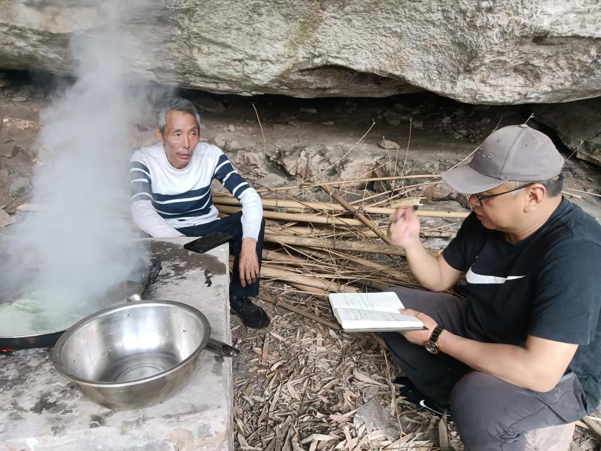
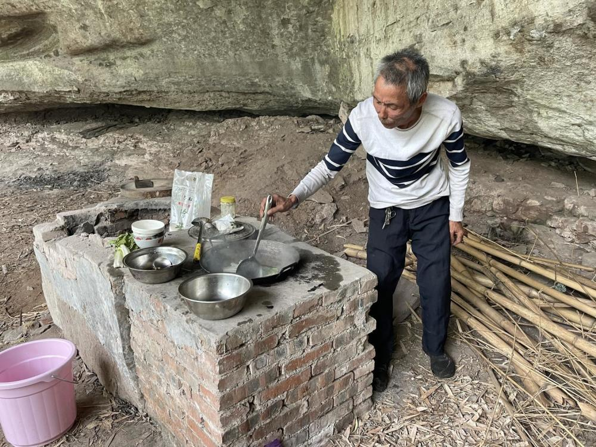
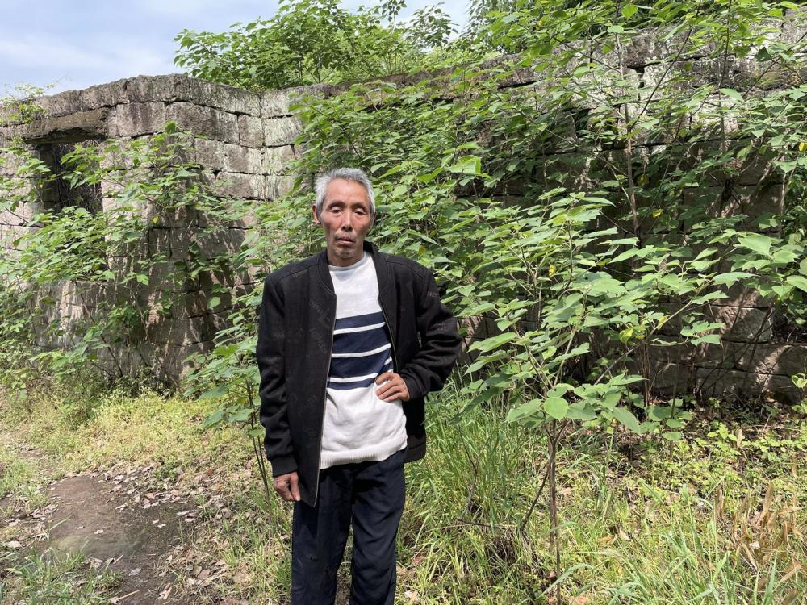

# 第一代农民工晚年岁月丨打工23年，他孤身回乡寄居洞穴 当地为其安排临时住房

2023年4月14日，四川泸州市合江县神臂城镇上大村，在当地“大岩洞”居住两个多月的冯必全，在上大村村委会帮助下，搬进村委会旁边的“新家”，结束了近两个月的“穴居”生活。

作为中国“第一代农民工”，62岁的冯必全在外打工20余年，如今孑然一身回到老家。家里老屋早已垮塌，他也从一个年富力强的中年男子变成逐渐衰老的6旬老人。因身无分文，只得寄居洞穴……5月13日，时隔一个月，红星新闻记者再访冯必全，他目前仍在村委会安排的房子居住，但没有收入来源。村委会介绍他就近务工，日薪80元，但他嫌工资低，拒绝了村委会的好意。在记者劝说下，冯必全表示“愿意去干活”……

上大村村委会负责人表示，冯必全一直关心的独生子女补助，目前正在按照有关程序办理。同时，村委会和镇政府也在摸排核实其有关情况，如果符合低保条件或其他救助条件，也将按政策办理。

实际上，步入晚年的“第一代农民工”已然成为一个群体。根据国家统计局网站发布的《2022年农民工监测调查报告》，2022年全国农民工总量2.9562亿人，其中50岁以上农民工所占比重为29.2%，约有8632.1万人。这也意味着，再过10年，这8600余万农民工，都将迈过60岁这个坎，进入晚年岁月。他们的晚年生活及养老问题，值得我们关注与观察……

**在外打工23年**

**孑然一身回乡**

1961年，冯必全出生在四川合江县焦滩乡小岩村，他在这里长大、打工、结婚、生子。后来，为了生计，年近40岁的他携妻儿出门打工，此后20多年里很少回家，他是典型的中国“第一代农民工”中的一员。

如今，在外打工23年，已年届62岁的他孑然一身地回到合江家乡时，生养他的老家已变成神臂城镇上大村，不再是当年的名字。而对于新的村子名字，他至今都记不熟。

冯必全是个石匠，家里兄弟姊妹多，他直到35岁才娶到媳妇。冯必全的媳妇肖某芬比他小13岁，今年才49岁。据当地村民介绍，婚后两人生了一个儿子。

冯必全向红星新闻记者回忆，当初家里分家时他只分到一间土房。后来在其他石匠同行帮助下，用条石垒墙建了一栋拥有3间正屋的瓦房。但由于经济条件困难，当时连水泥砂浆都没有，墙壁由条石直接重叠垒砌而成，最顶上的石头摇摇欲坠。

_↑冯必全接受红星新闻记者采访 热心网友 摄_

上世纪90年代末，为了改变一家人的生活窘境，冯必全带着妻子肖某芬和两三岁的儿子，一起外出到广东河源县打工。其堂兄弟冯必勇在河源县古竹镇乡下农村包工建房，冯必全干打地基的活。冯必勇在河源县古竹镇做了上门女婿，其岳父将一间偏房借给冯必全居住。“他们到了河源一年左右，肖某芬带着孩子离家出走了。”冯必勇告诉红星新闻记者。

“靠天吃饭，天气好就有活，下雨就耍。”冯必全说，打工的收入不稳定，以至于自己没有留下积蓄，甚至连回家的路费都没有。据冯必勇回忆，冯必全属于手艺比较粗的“毛石匠”，做不了精细的活，因此其石匠手艺逐渐没多大用处了。

“20多年前，河源农村修房子基本不用石头做地基，而是用混凝土，因此他实际上只能干小工。”冯必勇说，现在冯必全更难找到活了。后来，冯必勇在广东河源县当地成家，融入了当地社会。但有家有室的冯必全反而成了光棍，与当地人格格不入。

“我们做泥水匠的也只能进工地，冯必全也只能到工地干活。但工地管理很规范，对年龄有要求，满了60岁就没工地要了。”冯必勇说，从3年前开始，冯必全就几乎没有正常上过班，靠着在河源打工的亲友们接济，勉强维持生活。冯必勇提供的手机截图显示，他曾在2021年9月、10月分两次给冯必全各转账500元。“更多的时候是我妹妹在接济他，毕竟我也有一家人要生活。”

冯必全的四弟媳妇张女士向红星新闻记者介绍，去年过年前，冯必全在河源就已吃了上顿没下顿，人瘦得皮包骨头，想回老家却连路费都没有。本村老乡廖宗芳要开车回四川合江老家过年，见他生活困难，征求其意见后把他带回合江老家，路上吃饭、喝水都是廖宗芳买给冯必全的。“刚回来时，走路都站不稳，真是风都能吹倒。”当地村民杜先生说。

**老房早已垮塌**

**“寄居洞穴”的生活**

张女士向红星新闻记者介绍，冯必全回来时，其老房早已垮塌，没地方居住，于是暂住在四弟家里。当时，临近年关，周边乡亲见他生活困难，家里吃好的也都会好心地叫上他。“如此一个来月，他身上的肉才补起来。”多位邻里说。

张女士称，冯必全年轻时有点不顾家，脾气也不好，其媳妇离开可能也与此有关。因脾气不好，冯必全在弟弟家好景不长，过年后不久，两兄弟就闹翻了。张女士告诉红星新闻记者，冯必全两兄弟脾气都不好，经常为生活琐事争吵。情急之下，四弟让他搬出去住，冯必全也赌气，说搬就搬，搬到村里一个名叫“大岩洞”的洞穴中居住。

4月12日11时左右，红星新闻记者在当地村民带领下探访了冯必全居住的“大岩洞”。当时冯必全已在洞里煮好稀饭，正在煮厚皮菜。红星新闻记者看到，冯必全炒菜时没有油，直接把煮熟的厚皮菜倒进锅里加盐翻炒。他说自己最近都这样吃，因为没钱买油。

_↑冯必全的穴居生活_

红星新闻记者观察发现，岩洞里确实没有猪油或菜油，只有小半袋米和半袋盐。但岩洞里有灶台。据说很久以前这个洞里住过人，但已去世几十年；后来，还有人在洞里养鸡，岩洞里有两间像房子的构筑物，但是没有门。冯必全砍了几根竹子搭架做床，棉被褥子则是乡亲们不要的物件，他去要过来的。

岩洞里不热，甚至有点冷，冯必全穿了两件衣服。他告诉红星新闻记者，他的房子就在这个岩洞的上方，庄稼地就在岩洞下方，因此他对这个岩洞很熟悉，“冬暖夏凉，也不潮湿，其实比上面的房子更适合居住，但没有水、电。”冯必全说，他每天去四弟家里提水、充电，衣服就在附近水塘洗。

从“大岩洞”爬上一个陡坡，再走百多米小路，就是冯必全曾经的家。由于房子长期无人居住，房顶全没了，仅剩两米左右高、光秃秃的石头墙。屋里长起来的杂木，大的已经有小碗那么粗了。

_↑冯必全身后是其已垮塌的房子_

冯必全告诉红星新闻记者，自从他外出打工后，23年来他只回来过两次，一次是父亲去世、一次是母亲去世。附近的村邻和他的亲友也证实了他的说法。

在“大岩洞”左、右方，分别还有一个“小岩洞”和一个无名洞。“小岩洞”被村民堆满了干柴，无名洞则成为他的露天厕所。“洞里除了没得电和水，蚊子也很厉害，不点蚊香根本睡不着。”受访时冯必全向红星新闻记者表示，渴望得到有关部门和社会的帮助，能在老家附近盖两间房遮风避雨，并种点粮食和蔬菜。

**村委会安排临时住房**

**正核实其情况办低保**

4月14日，红星新闻记者与上大村村委会负责人陈国秀取得联系，并反映了冯必全的情况。陈国秀表示，此前没收到相关反映，马上安排人员调查核实。4月17日，红星新闻记者再次联系陈国秀时得知，村委会已在4月14日当天安排冯必全住进村委会办公室旁边安置孤寡人员的临时小屋。

_↑村委会为冯必全安排的住房_

冯必全告诉红星新闻记者，4月14日下午，当地村组干部朱某突然去岩洞，让他搬到村委会居住。因村委会距“大岩洞”太远，约2.5公里，因此他有些不愿去。朱某直接把他的被褥等搬到村委会临时房屋，他只能搬去。但生活两三天后，冯必全说自己非常不习惯，因为村委会附近一个熟人都没有，他感到很孤独。

当地热心网友拍摄的视频显示，安置冯必全的临时房分为卧室和厨房两个功能区，但面积不大。由于临时房没有灶台、没有气，冯必全说自己无奈之下去赊了一个电磁炉和一个电水壶。“大岩洞里有灶台，旁边柴禾多得是，不用烧电煮饭炒菜，夏天凉快也不用空调电扇。”冯必全告诉红星新闻记者。

4月17日，恰逢当地集市赶场，冯必全也赶场凑热闹。一个冯氏本家兄弟见他可怜，给了他一块猪肉。冯必全告诉红星新闻记者，自从他从四弟家搬出来后，至今已有两个月没吃肉了。“（临时）房子里实在太热了，根本住不了，我还是打算搬回大岩洞居住，那里至少晚上能睡得着。”冯必全说。

5月13日，红星新闻记者再次回访发现，冯必全目前仍在村委会安排的房子居住，但没有收入来源。上大村村委会负责人陈国秀向红星新闻记者表示，冯必全一直关心的独生子女补助，目前正在按照有关程序办理。同时，村委会和镇政府也在摸排核实其有关情况，如果其符合低保条件或其他救助条件，也将按政策办理。

在得知冯必全年龄不算太大，也没什么基础病后，陈国秀介绍他到附近的农场打工，日薪80元，但冯必全认为工资太低，不愿意去。对此，其弟媳妇张女士也表示不理解，“去做工，好歹有80元一天，不做工一点收入都没有。”她认为，冯必全还是应该去工作。

5月13日，经红星新闻记者劝说，为了生活，冯必全表示“愿意去干活”。

**▍延伸阅读**

**2022年农民工平均年龄42.3岁**

**50岁以上达8600万人**

**“第一代农民工”将迎来晚年**

2023年4月28日，国家统计局网站发布《2022年农民工监测调查报告》，报告显示，2022年全国农民工总量29562万人，比上年增加311万人，增长1.1%。农民工平均年龄42.3岁，比上年提高0.6岁。男性占63.4%，女性占36.6%。

从年龄结构看，40岁及以下农民工所占比重为47.0%，比上年下降1.2个百分点；41—50岁农民工所占比重为23.8%，比上年下降0.7个百分点；50岁以上农民工所占比重为29.2%，比上年提高1.9个百分点，约有8632.1万人。

专家指出，在上世纪70年代及以前出生，并在80年代初至90年代外出务工的人群，在学术界被称为“第一代农民工”，他们是生计型农民工，外出务工是为解决家庭生计问题。目前，“第一代农民工”的年龄都超过50岁，很多仍在打工。

再过10年，这8600余万农民工都将迈过60岁，成为超龄农民工。随着年龄增长务工受限，他们的晚年生活和养老问题值得关注。

实际上，好的政策也在到来。2023年中央一号文件明确提出“维护好超龄农民工就业权益”。而在2022年11月，人社部、国家发改委、财政部、农业农村部、国家乡村振兴局5部门联合发布《关于进一步支持农民工就业创业的实施意见》也明确提出，“做好大龄农民工就业扶持。收集适合大龄农民工的就业岗位、零工信息，在农民工专场招聘活动中持续发布。尊重大龄农民工就业需求和企业用工需要，指导企业根据农民工身体状况合理安排工作岗位，强化安全生产管理，定期开展职业健康体检，不得以年龄为由‘一刀切’清退。大龄农民工有就业需求的，可以到公共就业服务机构进行求职登记，享受免费公共就业服务。”

红星新闻记者 罗敏

编辑 彭疆 责编 冯玲玲

