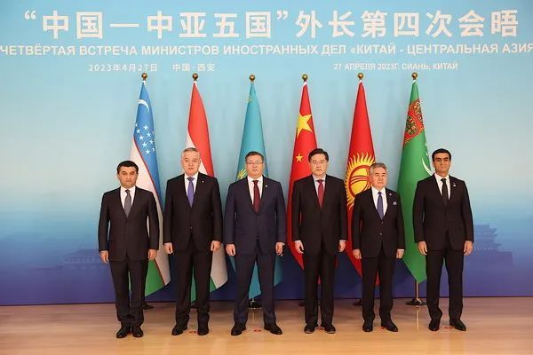

# 今日起四国总统访华，新一轮周边国家访华潮正式开启

今起，新一轮周边国家访华潮正式开启。

据外交部网站消息，哈萨克斯坦总统托卡耶夫、吉尔吉斯斯坦总统扎帕罗夫、塔吉克斯坦总统拉赫蒙、乌兹别克斯坦总统米尔济约耶夫将于5月16日至20日对中国进行国事访问。

_2023年4月27日，国务委员兼外长秦刚在西安主持中国—中亚外长第四次会晤，会后，秦刚宣布将于5月在西安举行中国—中亚峰会。图源：外交部_

而两天后，他们将共同参加在陕西省西安市举行的首届中国—中亚峰会。这是今年中国首场重大主场外交活动，也是中国同中亚五国建交31年来，六国元首首次以实体形式举办峰会。

据外交部发言人汪文斌介绍，各国元首将回顾中国—中亚关系发展历程，就中国—中亚机制建设各领域合作以及共同关心的重大国际和地区问题交换意见。各国元首还将共同签署重要政治文件，相信在各方共同努力下，此次峰会将擘画中国中亚关系新蓝图，开启双方合作新时代。

**从线上走向线下**

今年1月，中亚五国元首之一的土库曼斯坦总统谢尔达尔·别尔德穆哈梅多夫就已先行访华。

据新华社报道，两国元首在举行会谈时，再次强调了“中国+中亚五国”合作机制是中国同中亚国家开展合作的新机制。

长安街知事（Capitalnews）注意到，此次首届中国—中亚峰会，早在双方建交三十年之际就已开始酝酿。

2022年1月25日，在中国同中亚五国建交30周年视频峰会上，通过并发表了《中国同中亚五国领导人关于建交30周年的联合声明》。

声明中，各方共同宣布，中国同中亚五国关系进入新时代。六国决心在兼顾彼此利益的基础上继续合力构建内涵丰富、成果丰硕、友谊持久的战略伙伴关系，打造中国—中亚命运共同体。继续扩大各层级双多边对话交流，充分发挥政府间合作委员会、“中国+中亚五国”外长会晤机制和其他合作机制作用。

而如今从线上走向线下，合作再上台阶。

**中亚之于中国，中国之于中亚**

从地图上看，中亚西至里海，东到中国新疆，南抵阿富汗，北及俄罗斯，地域广袤。

五国面积约为400万平方公里，其中油气地质面积占全区总面积的四分之一，这也决定了该地区是一个“能源的宝库”。而油气开发不足，加之作为内陆国家没有合适的销路，使得中亚地区在很长一段时间内经济欠发达。

中国是全球最大的能源进口国之一，中亚地区丰富的资源，于我国能源安全的意义十分重大。

_中国－中亚天然气管道。图源：新华社_

作为“一带一路”的首倡之地，近年来，中国十分重视与中亚五国的能源合作，投资修建了大量与油气贸易相关的管道等基础设施。此外，中国同中亚五国已确定的产能合作重点项目有数十个，涵盖汽车、能源、冶金、化工、医药等众多领域，投资总金额超过200亿美元。

如今，中国同中亚五国已经实现了“三个全覆盖”，即全面战略伙伴关系全覆盖、双边层面践行人类命运共同体全覆盖、签署共建“一带一路”合作文件全覆盖。

据吉尔吉斯斯坦玛纳斯新闻网的报道，中国为中亚国家带来投资，为当地经济和创新发展提供机遇，中国坚定支持中亚国家维护国家主权、安全和领土完整，坚决反对任何外部势力干涉中亚国家内政，双方合作对于中亚国家的吸引力不断增大。

数据统计显示，建交30多年来，中国同中亚五国贸易额增长100多倍。2022年，中国与中亚五国贸易总额超过700亿美元，创下历史最高水平，年均增速在15%以上。2022年中国自中亚五国进口额达到279亿美元，达到2016年进口额的2.3倍以上。

吉尔吉斯斯坦外长库鲁巴耶夫日前在首都比什凯克表示，即将举行的中国—中亚峰会在中国同中亚国家关系发展史上具有里程碑意义，相信峰会将进一步深化中国和中亚国家之间的合作，并引领中吉关系取得新发展，推动构建中吉命运共同体。

2000多年前，张骞出使西域，开辟了陆上丝绸之路，加强了中亚、西亚，乃至地中海各国的贸易与交流。

眼下，首届峰会选址古都西安，或许也在于它的另一个身份——古代丝绸之路的起点。从这里开始，六国的关系将迈向新的未来。

参考资料：新华社、人民日报

