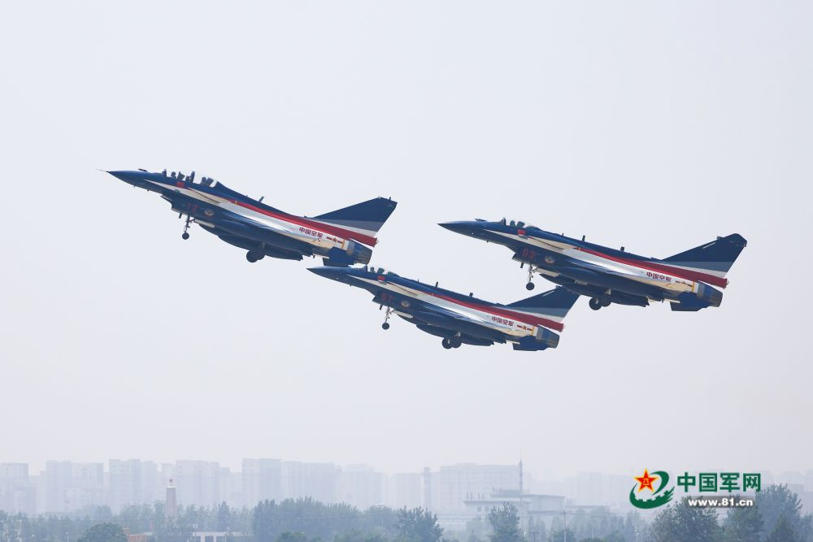
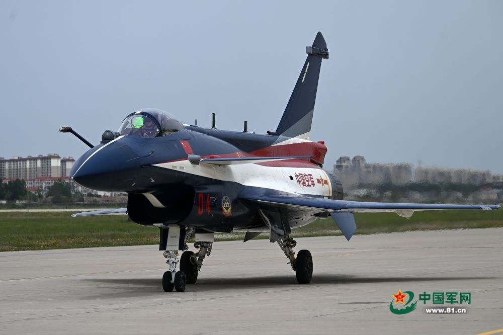
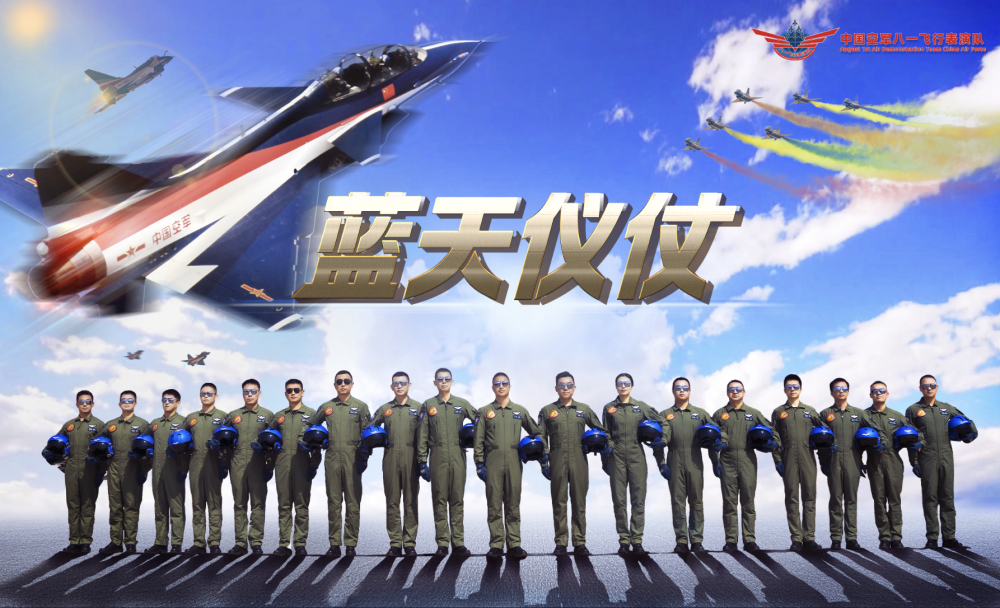
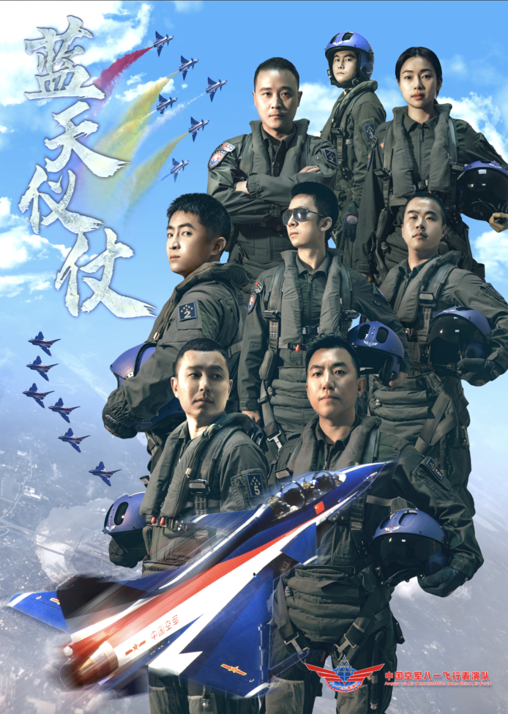

# 八一飞行表演队换装歼10C后将首出国门，参加兰卡威国际海事和航空展

中国军网北京5月16日电
朱姜海、记者李建文报道：中国空军新闻发言人谢鹏大校16日介绍，按照空军装备建设发展规划，空军八一飞行表演队换装歼-10C飞机，这是该表演队组建以来第7次换装。他们将参加于5月23日至27日举行的第十六届兰卡威国际海事和航空展，这是表演队此次换装后首次飞出国门。

_2023年5月15日，空军八一飞行表演队三机编队从华北某军用机场起飞
。_

组建以来，空军八一飞行表演队先后装备过7种机型，分别为歼-5、歼-6、歼教-5、歼-7EB、歼-7GB飞机，2009年换装歼-10A、歼-10S，2023年换装歼-10C。

60多年来，空军八一飞行表演队先后为170多个国家和地区的700多个代表团进行700余次飞行表演。5次参加阅兵，10次参加中国航展，7次走出国门飞赴俄罗斯、马来西亚、泰国、阿联酋、巴基斯坦、新加坡等6个国家执行飞行表演任务，在国际舞台上展示大国空军风采，传递中国自信。

_2023年5月6日，空军八一飞行表演队一架歼-10C表演机滑向起飞线，准备开展训练。余红春摄_

据介绍，歼-10C是我国自主研发的新型超音速多用途战斗机，配装先进航电系统及多型先进机载武器，具备中近距制空和对地面、海面目标精确打击能力。2017年7月，歼-10C在庆祝中国人民解放军建军90周年阅兵上首次公开亮相。

谢鹏表示，换装后，空军八一飞行表演队将驾驭新战鹰奋飞新航迹、展现新姿态，更好地展示中国空军锐意进取、追求卓越的形象风采，传递守望和平、开放交流的良好愿望。

来源：中国军网 作者：朱姜海 李建文 责任编辑：王韵

