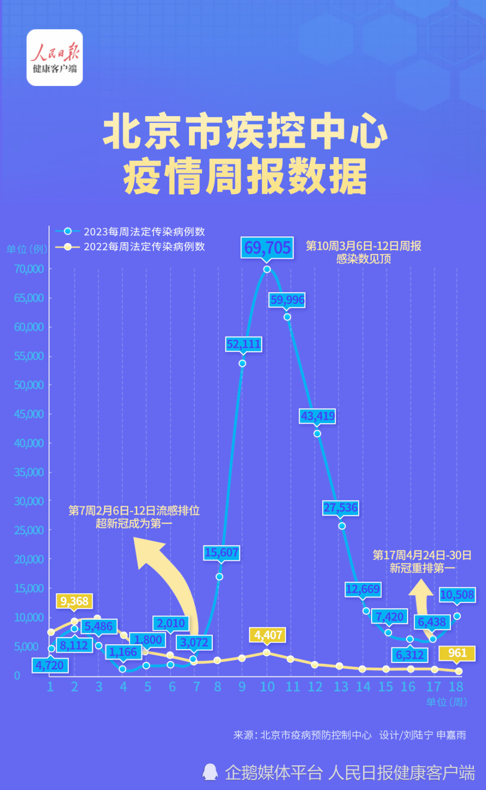

# 北京疾控疫情周报：新冠病例连续两周超流感，重回第一

近日，随着“二阳”的陆续出现，新冠感染相关话题再次引发关注。人民日报健康客户端梳理北京市疾病预防控制中心发布的疫情周报发现，2023年第17周（4月24日-30日）以来，新冠感染连续两周超越流感，重返法定传染病病种排名第一，且5月1日-7日北京市报告的法定传染病超过一万例。

北京疾控中心5月11日发布的2023年第18周疫情周报显示：2023年第18周（2023年5月1日至2023年5月7日）全市共报告法定传染病16种10508例。报告病例数居前5位的病种依次为:新型冠状病毒感染、流行性感冒、其它感染性腹泻病、肺结核和痢疾，共占法定传染病报告发病数的97.7%。

而第17周（2023年4月24日至2023年4月30日）全市共报告法定传染病16种6438例，报告病例数居前5位的病种依次为:新型冠状病毒感染、流行性感冒、其它感染性腹泻病、病毒性肝炎和肺结核，共占法定传染病报告发病数的96.0%。意味着一周时间增加了4070例。

_5月1日北京朝阳医院急诊抢救室内，医护人员正在分析患者病情。张赫摄_

人民日报健康客户端留意到，2023年第7周（2023年2月6日至2023年2月12日），流感病例数第一次超越新冠感染病例成为病例数第一的病种。而在第17周（2023年4月24日至2023年4月30日），新冠感染反超流感，重排第一。
**（李欣）**

