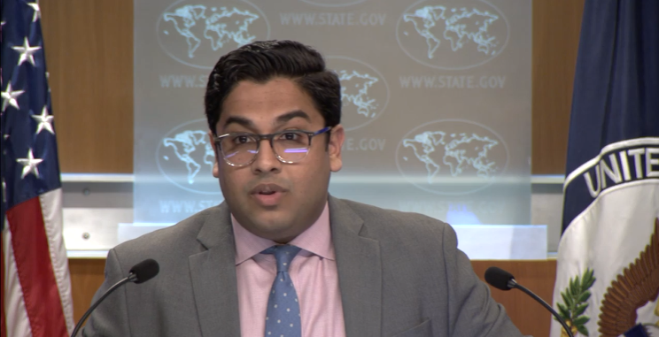

# 岸田泼完冷水后，美国务院也说没有讨论韩国加入G7的计划

【环球网报道 记者
朱嘉琪】七国集团峰会将于5月19日起在日本广岛举行。据俄罗斯卫星通讯社报道，美国国务院首席副发言人韦丹特·帕特尔当地时间15日在记者会上回答有关韩国成为G7成员国的问题时表示，G7领导人峰会没有谈论成员国变化的计划。针对韩国加入G7的可能性，日本首相岸田文雄11日也已明确表态“没有进行过相关讨论”。

_美国国务院首席副发言人韦丹特·帕特尔5月15日回答记者提问_

根据美国国务院官网实录，有记者提问帕特尔称，“是否有计划将G7扩大到包括韩国在内的G8? 你认为韩国有足够的资格吗?
”帕特尔回应称，“我不知道在即将举行的领导人峰会上有任何关于讨论成员国变化的计划，但当然我们会让峰会先举行。”

据媒体此前报道，俄罗斯自2014年因克里米亚半岛问题被西方国家踢出八国集团（G8）后，韩国争取成为G8的心思越发明显。特别是随着韩国积极改善对日关系、总统尹锡悦受邀参加5月即将举行的七国集团（G7）广岛峰会，韩国关于“即将加入G7”的讨论不绝于耳。但据韩国“NEWS1”网站15日报道，针对韩国加入G7的可能性，日本首相岸田文雄明确表态“没有进行过相关讨论”。

岸田文雄是本月11日在东京首相官邸与韩国《中央日报》前社长洪锡炫对答中作出上述表态的。韩国专家认为，韩国此前是因日本露骨反对而没能加入G7，现在韩日关系改善，韩国成为G8的可能性“正越来越高”。但岸田文雄表示，目前G7成员之间从未讨论扩容问题，也不存在美国赞成（韩国加入G7）而日本反对的问题。“NEWS1”报道称，岸田文雄没表示“欢迎”韩国加入G7的意思，也未表示会推动此事。

