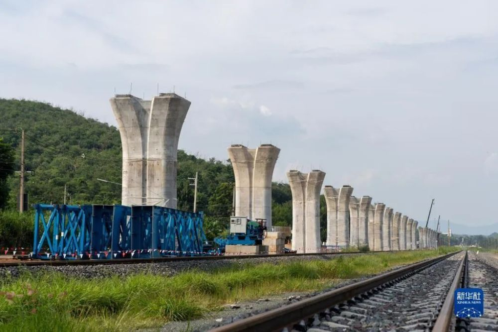

# 港媒：中国将向泰国转让高铁技术，帮助泰国自主建造高速铁路网

【环球时报驻泰国特约记者 李源欣】据《南华早报》5月15日报道，中国技术团队在昆明-
曼谷铁路谈判中透露，中国已同意将部分高铁技术传授给泰国，帮助泰国自主建造高速铁路网。

报道称，随着中泰高速铁路项目合作的深入，泰国自主设计和建设高铁的愿望日益强烈，也希望在未来的中泰合作中发挥更大的作用。在此基础上，中泰已原则上达成了在11个高铁建设领域进行技术转让的协议，包括轨道设计、隧道设计、桥梁建造、火车站设计、电力照明、信号系统等。技术知识将以培训、研讨会等形式进行分享传授。

_在泰国呵叻拍摄的中泰铁路建设现场。新华社记者
林昊 摄_

《南华早报》称，双方将在特定的专利共享授权上进一步协商细节。此外，中国向泰国转让的技术将使用中国的高速铁路标准，一方面在成本上更具优势，另一方面也与中国和东南亚其他国家现有的铁路基础设施实现更好的兼容性。

中国和泰国正在共同建设全长873公里的中泰铁路。中泰铁路未来连接中国昆明和泰国曼谷，是中泰高速铁路合作的重大项目，也是共建“一带一路”的标志性工程。泰国《曼谷邮报》称，这条铁路将让货物运输更加快速高效，为旅游业创造更多新的商业机会，帮助促进泰中贸易。作为连接中国和东南亚的关键一环，它将途经清迈、呵叻等泰国城市，并与中老铁路等区域内其他铁路网络相连。

中老铁路在通车一年多后，于今年4月13日正式开通国际旅客列车，迄今已发送跨境旅客超1.3万人次。中泰铁路的建设也正在加快步伐。据泰国中华网3月7日报道，泰国国家铁路局公布的中泰铁路最新进展显示，中泰首条高铁线路曼谷-
呵叻段已有1份合同完成施工，10份合同正在施工中，预计于2027年通车运营。而二期工程呵叻-
廊开段正在提前推进，预计于2024年开工。高铁建成后，从曼谷到廊开的行驶时间将由目前的11小时大幅缩短至3小时15分钟。

