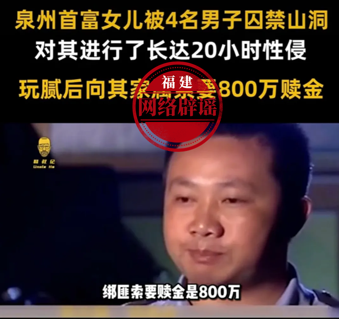

# 网传“泉州首富女儿被绑架”，官方辟谣：假的

福建辟谣官微5月16日消息，近日，一则“泉州首富女儿被绑架”的消息在社交平台上传播。消息称，泉州首富女儿被四名男子囚禁山洞，对其进行了长达20小时性侵后向其家属索要800万赎金。

_网传消息截图_

经泉州相关部门核查，网传消息截图实为2013年6月发生在贵州省福泉市的一起绑架学生案件。原视频被人附上不实标题及文字后进行传播。

福建辟谣平台提醒：虚构事实散布谣言属于违法行为，依法应当承担法律责任。请广大网民不信谣不传谣，共同维护良好的网络秩序。

（来源：福建辟谣官微）

