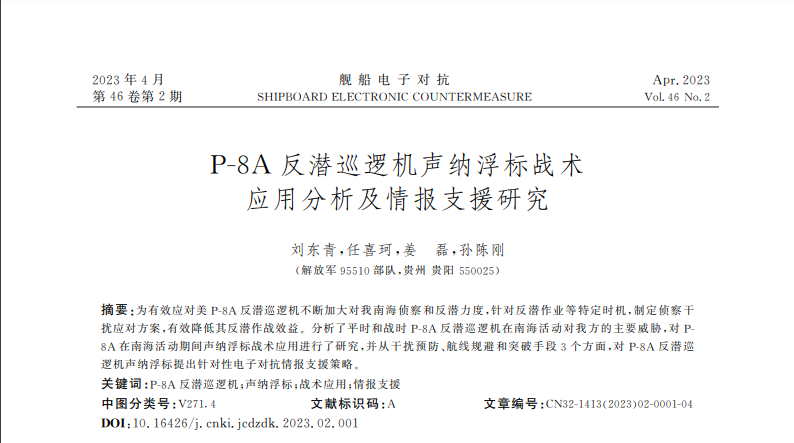
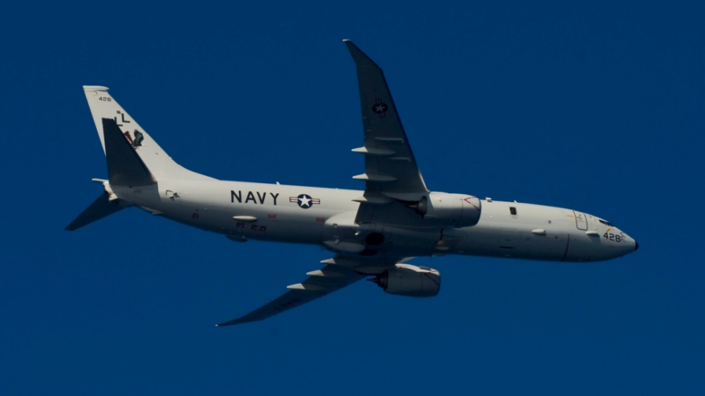

# 国家级期刊披露中美军机对峙：解放军迅速响应，美军反潜机自毁浮标

近期，国家级船舶工业期刊《舰船电子对抗》刊载了一篇论文，披露2021年的一起中美军机南中国海对峙事件，该论文称，美反潜机在解放军军机抵近后，立即自毁声呐浮标。论文的主要分析方向，是美军P-8A反潜机声呐浮标战术的应对方式。

_《舰船电子对抗》上刊载的论文_

据悉，该论文由第一作者、来自解放军某部的刘东青及其团队完成。该团队主要分析了平时和战时美军P-8A反潜巡逻机在南中国海活动对中国的主要威胁，对P-8A在南中国海活动期间声呐浮标战术应用进行了研究，并从干扰预防、航线规避和突破手段三个方面，对P-8A反潜巡逻机声呐浮标提出针对性电子对抗情报支援策略。

_美军P-8A反潜巡逻机
资料图_

解放军迅速响应 美军紧急自毁声呐

值得注意的是，该论文是在“P-8A
声呐浮标战术运用分析”章节中的“反潜作业流程管控严格”这一段落披露了该起对峙事件，其中写道：“2021年1月5日,我侦察力量进入有效侦获距离时,浮标上行信号陆续消失,当反潜任务完成后立即下传自毁控制指令,及时将浮标沉入海底自毁,意在防范我有效侦收,防止泄密或被我打捞。”

也就是说，美军的浮标使用流程就是任务结束立即关闭浮标，而当他国舰机接近，就立即让浮标自毁。而根据论文配图可以看出，当天是一架美军P-8A反潜巡逻机，靠近距香港约150公里的水面上空，解放军迅速派出部队响应，迫使该反潜巡逻机自毁声呐浮标，以防止敏感设备落入中国手中。该段落指出，P-8A
赴南海实施反潜作业期间,通常多架次、分时段协同完成侦察和反潜任务,频繁在我南海活动,以探测我水下目标活动情况。

声呐，是一种利用声波在水中的传播和反射来进行导航和测距的技术或设备，有主动式和被动式两种类型。军舰、潜艇、反潜飞机上安装声呐后，就可以确定敌方舰艇、鱼雷和水雷的方位。

该论文从理念、体系、性能以及协同作战方面对美军声呐进行了全方位的分析。其中值得注意的是，刘东青及其团队通过研究指出，由于美军不断不断充实改进声呐浮标装备体系，主被动探测能力平衡发展，其探测能力不仅覆盖深海、浅海，贯穿潜艇活动水层，还能够高效应对高噪声环境以及安静型目标。

也就是说，美军目前的声呐系统在不断对标“安静型潜艇”。而且，在主动声呐发射方面，美军目前使用采用垂直线列阵发射技术、发射水听器频率通用技术及高功率电池技术,这些技术可以提升主动声呐浮标的发射声源级、发射频率选择性和发射时长,能够对潜艇进行高精度快速定位。作战中，美军声呐浮标之间、浮标与不同平台之间也可实现协同信息共享。

刘东青团队指出，P-8A反潜巡逻机的常态化侦察，主要就是利用其声呐浮标获取解放军潜艇声纹特征。潜艇的声纹特征就像指纹一样，具有唯一性，相当于潜艇的身份信息，一旦掌握他国潜艇的声纹信息，不但可以侦测出潜艇，而且可以快速认出该潜艇属于哪国哪型号，能够快速做出应对措施。

美多次抵近侦察南海 巴士海峡成重点之一

从刘东青团队的论文披露的事件可以看出，此次侦察距离香港只有150公里，而实际上这已经不是美军机第一次如此距离进行侦察活动。2020年8月，美国空军一架E-8C“联合星”空地监视飞机再次现身南海，朝着广东方向飞行，一度飞行至距离广东沿岸领海基线59.27海里，约109.77公里的位置，而最近的一次，曾抵近距离广东海岸不到100公里的位置。该年度，仅仅上半年，美军的抵近侦察就达到了2000多次之多。而2022年1月到11月，美国大型侦察机赴南海侦察近600架次。分析认为，这一数字虽然比2021年的统计数字有所降低，但美军仍是南海最大的不稳定因素。

值得注意的是，美军反潜巡逻机大多是从巴士海峡附近空域，朝着南海方向飞行。而巴士海峡的地理位置又极为特殊，解放军南部战区舰机前出西太平洋，基本要经由该通道。美军侦察机基本是从巴士海峡附近空域，朝着南海方向飞行。同时，巴士海峡以及与我国南海东北部东沙水域共同组成的大深度、大范围水体，非常利于潜艇作战，充分利用这里的海洋环境要素，则能在未来把握战场主动权。因此，美军舰机不断抵近侦察的用意，不言而喻。而美军自毁声呐浮标，也说明美军自知在该地的“偷鸡摸狗”行为是见不得光的，以及该地区似乎已经成为南海局势的重点关注区域之一。

今年2月，美菲两国同意重启南海联合巡航，菲国防部同意向美军再开放4个军事基地的使用权限；上周，菲律宾宣布新设立的4个军事基地的具体位置，允许美军轮换驻扎、使用跑道和燃料库等设施。根据美菲于2014年签署的《加强防务合作协议》，美军原本可进入菲律宾的5个军事基地。如今，加上新开放的4个，美军可在菲律宾拥有9个军事基地。按照菲防长加尔维斯的说法，4个新基地“具有高度战略意义”。地理位置上，其中2个位于吕宋岛北部，与台湾仅隔一个巴士海峡；1个位于巴拉望岛西南端，毗邻南沙群岛。其中，菲律宾横跨中美关系的多个潜在爆发点，不但是南海主权声索国之一，其最北端的海军设施距离台湾仅100多海里。日菲美联盟的组建对于美国增强“第一岛链”应对能力方面具有重要意义。

对此，中方已多次摆明立场。外交部此前表示，中方对地区国家间的防务安全合作持开放态度，但应当有利于地区和平稳定，不应针对第三方或损害第三方利益。美方出于一己私利，抱持零和思维，不断在本地区加强军事部署，是在加剧局势紧张，危害地区和平稳定。地区国家应当对此保持警惕，避免被美裹挟利用。“地区国家应该深入地想一想，到底什么才是合适的、什么才是互利的，从而作出真正有利于自身利益、有利于地区和平稳定的选择。”

作者丨牛玉龙，深圳卫视直新闻编辑

编辑丨陈淼松，深圳卫视直新闻主编

