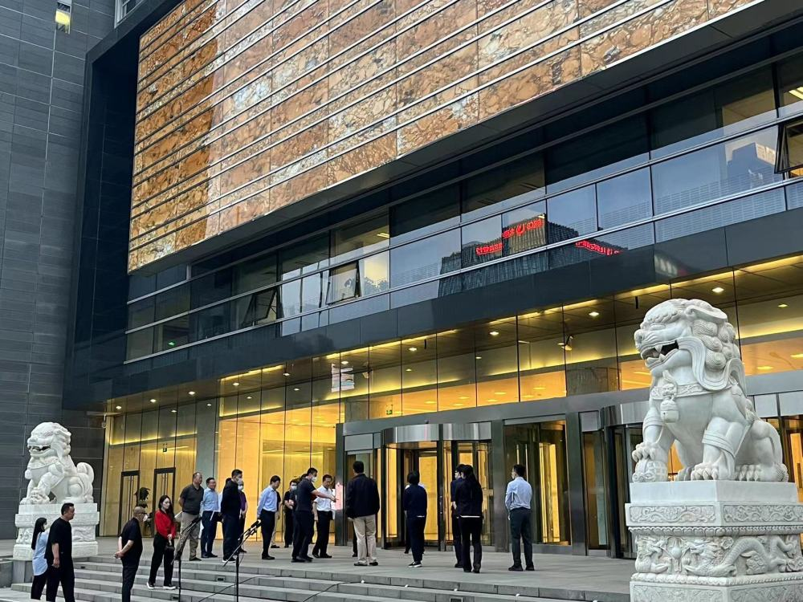

# 国家金融监管总局揭牌在即，北京金融街15号彩排引发民众围观

界面新闻记者 | 曾仰琳

国家金融监管总局亮相在即。

5月17日19时许，界面新闻记者在北京金融街15号鑫茂大厦南门现场看到，国家金融监管总局相关领导正在进行彩排，现场进行了升旗仪式，时不时有民众路过围观拍照。

界面新闻记者了解到，国家金融监管总局或将于5月18日举行揭牌仪式。

7天前，国家金融监管总局首任党委书记任命公布。5月10日下午，国家金融监督管理总局召开领导干部会议。中央组织部有关负责同志宣布了中央决定：李云泽同志任国家金融监督管理总局党委书记。

