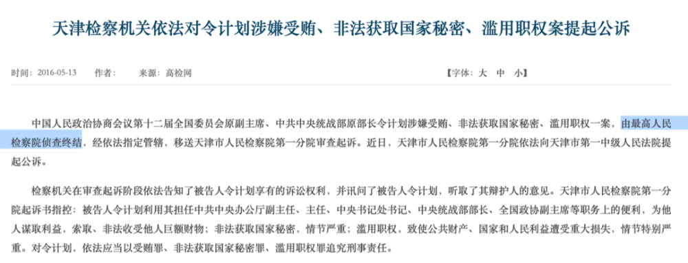
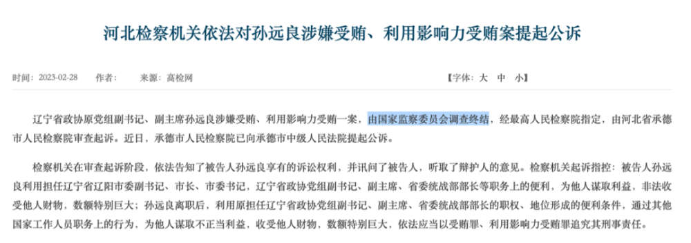
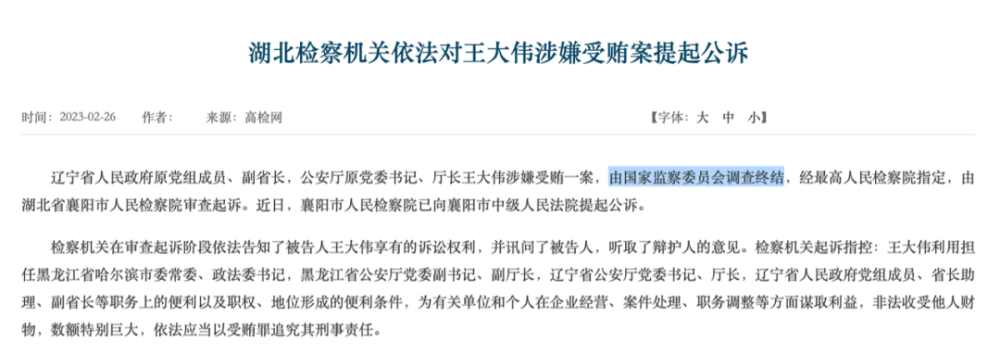

# 年近70岁的落马正厅被移送审查起诉，曾多次在公开场合强调反腐

**撰文 | 余晖 熊颖琪**

最高检5月17日消息，西藏自治区公安厅原党委副书记、常务副厅长，西藏自治区政协社会法制外事委员会原副主任杨光明（正厅级）涉嫌徇私枉法、受贿、非法持有枪支案移送西藏检察机关审查起诉。

这是杨光明自去年5月落马后，官方公布其处理最新进展。

年近70岁

杨光明，汉族，出生于1954年10月，今年69岁，四川仁寿人，1972年12月参加工作，1975年6月加入中国共产党，大学本科学历。

杨光明在政法系统工作了36年。

简历显示，杨光明早年曾当过解放军五十三师战士、军械员、文书。1976年3月，22岁的杨光明进入西藏自治区拉萨市公安局交警大队工作，两年后到了西藏自治区米林县公安局，历任秘书股股长、副局长，教导员，局长等职务。

1993年6月，杨光明成为波密县副县长，3年后成为林芝地区公安处副处长、正县级侦察员，之后历任林芝地区公安处处长，林芝地区公安处党委书记、处长等。

2000年3月，杨光明履新西藏自治区昌都地委委员、政法委书记，地区公安处党委书记、处长，3年后（2003年8月）履新西藏自治区公安厅党委委员、副厅长，3年后任党委副书记、副厅长，2007年9月任党委副书记、常务副厅长（正厅级）。

2012年12月，杨光明成为西藏自治区政协社会法制外事委员会副主任人选，2013年1月任西藏自治区政协社会法制外事委员会副主任（正厅级）。

2018年2月，杨光明退休。退休4年后，2022年5月，杨光明被查。

曾多次强调反腐

杨光明曾多次在公开场合强调反腐。

2001年，时任昌都地委委员、政法委书记，公安处党委书记、处长的杨光明接受《西藏日报》采访时，曾信誓旦旦地表示，“努力建设一支政治合格纪律严明作风过硬业务精通执法如山的钢铁队伍
”“进一步改进工作作风，全心全意为人民群众服务 ”。

杨光明履新西藏自治区公安厅常务副厅长1年后，2008年10月，西藏曾召开全区公安机关纪检监察工作会议。

当时，杨光明在会上表示，“当前全区的维护稳定工作形势还依然严峻，越是在这样的环境下，越是要求我们要毫不放松地开展反腐败斗争”。

杨光明说，反腐倡廉建设好了，党和政府在群众中的威信就会更高，党员干部队伍在群众中的凝聚力、号召力就会更强。

“最高检直接侦查”

政知君注意到，这次最高检的通报，有特别之处。

最高检的通报是这么说的：

杨光明涉嫌徇私枉法一案， **由最高人民检察院侦查终结** ，移送西藏自治区人民检察院审查起诉。

同时，由西藏自治区监察委员会调查的杨光明涉嫌受贿案、西藏自治区公安厅侦查的杨光明涉嫌非法持有枪支案也移送西藏自治区人民检察院一并审查起诉。

换句话说，杨光明涉嫌徇私枉法、受贿和非法持有枪支，由 **最高检、西藏自治区监察委员会、西藏自治区公安厅** 三家分别查的。

政知君注意到，公开报道中，这样的情况并不常见。

两个细节值得一提。

第一，在国家监察委成立之前，有不少落马“老虎”都是由最高人民检察院侦查终结的。

比如第十八届中共中央政治局原委员、重庆市委原书记孙政才，最高人民法院原副院长奚晓明，河北省委原书记、河北省人大常委会原主任周本顺，中共中央统战部原部长令计划，国家环保部原副部长张力军案件等。

2018年3月，监察法通过，国家监察委员正式成立。之后落马的“老虎”不少都是“国家监察委员会调查终结”。

比如，比如辽宁省政协原党组副书记、副主席孙远良，辽宁省原副省长，公安厅原厅长王大伟，广东省人大常委会原党组成员、副主任陈如桂，内蒙古自治区高级人民法院原党组书记、院长胡毅峰等案子，都是国家监察委员会调查终结。

第二，2018年修改后的《刑事诉讼法》，规定了人民检察院对部分职务犯罪“可以”行使侦查权。

2018年10月，修改后的刑事诉讼法确立了检察机关对司法工作人员相关职务犯罪直接立案侦查的制度——

“在对诉讼活动实行法律监督中发现的司法工作人员利用职权实施的 **徇私枉法、滥用职权、刑讯逼供等侵犯公民权利、损害司法公正的犯罪** ， **可以**
由人民检察院立案侦查”。

2020年11月，《检察日报》曾发布了《留置人员立案后如何采取强制措施》一文。

专家介绍，对于司法工作人员利用职务实施的14种犯罪，人民检察院发现的可以立案侦查，监察委发现的也可以立案侦查，形成两机构并行调查、侦查的机制，实践中还可能并案调查、侦查。

如果是并行调查、侦查，一个机构已经采取措施，那么另一机构不必采取。监察委已经采取留置措施，检察机关立案后，需要讯问犯罪嫌疑人，可与监察委协商，在留置场所进行讯问。如果监察委调查终结移送审查起诉，而检察机关自侦尚未终结，可以采取相关强制措施进行侦查，侦查终结后合并起诉。

**资料｜新华社 人民网 最高人民检察院等**

**【版权声明】本文著作权归政知新媒体独家所有，未经授权，不得转载。**

