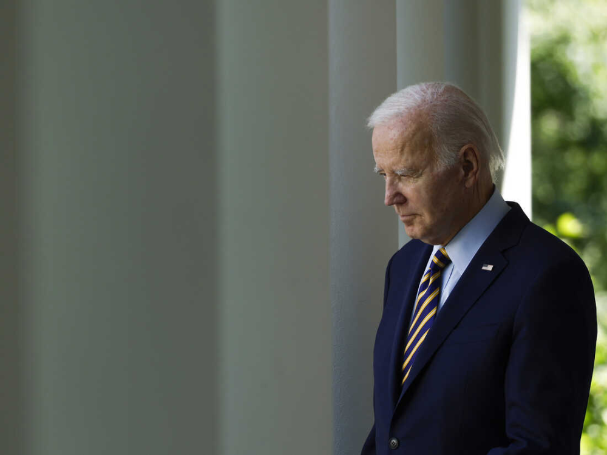

# 拜登否决美国结束对东南亚四国太阳能产品关税豁免的法案，专家解读

【环球时报-环球网报道
记者倪浩】美国总统拜登于当地时间16日发布声明，否决了参众两院要求美国政府结束对东南亚四国（柬埔寨、马来西亚、泰国和越南）太阳能产品关税豁免的新法案。

拜登在白宫网站发布的声明中说，他之所以对法案进行否决，是因为美国承担不起由此为太阳能行业的美国企业和工人所带来的新的不确定性。拜登表示，美国将继续专注于扩大美国的产能来强化美国的能源安全。

_美国总统拜登 资料图_

美国广播公司网站在16日的报道中说，拜登否决的结果意味着，对东南亚四国太阳能产品关税豁免将至少持续到 2024 年 6
月。不过，这同时也意味着美国太阳能相关产业也将继续暴露在与中国太阳能的直面竞争中。受此影响，美国太阳能概念板块周二出现集体下跌。其中，第一太阳能下跌-3.97%，FTC
Solar下跌5.88%，Sunworks下跌5.66%，晶科能源下跌1.18%。

接受《环球时报》记者采访的中国世界贸易组织研究会副会长霍建国认为，拜登再一次维持了对东南亚四国太阳能关税豁免，是出于对美国无法与中国太阳能“脱钩断链”的清醒认识，是对美国工商界做出的妥协，客观上也是对中国太阳能产业的“妥协”。

自2022年开始，在是否对东南亚四国太阳能产品加征关税，以阻止中国太阳能借道规避美国关税并对美国太阳能产业形成冲击的问题上，拜登政府与美国参众两院发生了激烈的意见冲突。

当年的3月，美国企业奥克辛太阳能向拜登政府请求调查中国太阳能企业在东南亚设立生产基地用来规避美国的关税。但调查程序或使高度依赖东南亚的美国太阳能行业受到严重冲击，拜登于是在6月6日决定实行为期两年的关税豁免。当年12月底，美国商务部的调查结果认为，部分中国太阳能企业为规避美国对中国产品加征的关税，把产品转向东南亚四国生产，这些相关产品占了美国进口总量的八成。美国商务部的调查支持对东南亚四国产品加征关税，但拜登政府仍然维持了关税豁免的决定。

拜登的强硬立场引发了美国国会的强烈不满，决定通过立法来推翻拜登的决定。4月底和5月初美国参众两院分别投票通过了终止东南亚四国太阳能关税豁免法案。但当法案递交到拜登案头后，如其所言，拜登果断地行使了总统否决权，继续对东南亚进行关税豁免。拜登在16日的声明中解释说，自其上任以来，已经宣布新建和扩建太阳能设备制造厂51家，美国现在有望将国内太阳能电池板制造能力提高8倍。拜登称，事实上，这些产业刺激政策正在起效。

作为国会新法案发起人之一的民主党众议员丹·基尔迪（Dan
Kildee）表示，他对拜登动用否决权感到失望。据美国广播公司网站16日的报道，美国佛罗里达州共和党籍参议员里克·斯科特 (Rick Scott)
也表示，“令人厌恶的是，拜登的行为会保护中国太阳能公司，并允许它们规避美国贸易法。”

但美国工业界对拜登的做法表示了赞赏，认为太阳能安装和应用的推广和扩大可满足美国日益增长的对新能源的需求，因此太能阳产品的进口至关重要。美国太阳能产业协会总裁兼首席执行官阿比盖尔·罗斯·霍珀表示，参众两院要求加征关税的立法威胁到多达
30000 个美国就业机会，同时削弱了美国的能源安全。霍珀说。“在这个关键时刻限制太阳能产品的供应会伤害美国企业，并阻止我们在短期内部署清洁、可靠的能源。”

根据外媒的报道，被否决的新法案预计将回到美国会两院再度进行投票，并且需要三分之二以上通过才能推翻拜登的否决权，进行立法。由于通过门槛过高，外界预期，美国将延续给予东南亚四国关税豁免直到2024年6月。

中国国际贸易学会常务理事及专家委员会首席专家何伟文接受《环球时报》记者采访时表示，太阳能产业发迹于美国，但时过境迁，在生产成本、生产效率和技术创新上，中国都已遥遥领先，相比之下美国则明显落后。何伟文表示，从钢铁到汽车等产品，都经历了一个从美国再到全球分工，多国协作的发展规律。对于太阳能产业，美国也应该尊重这个规律，而不是以国家安全为由肆意破坏全球产供链的稳定与安全，任意违反世界贸易规则。

