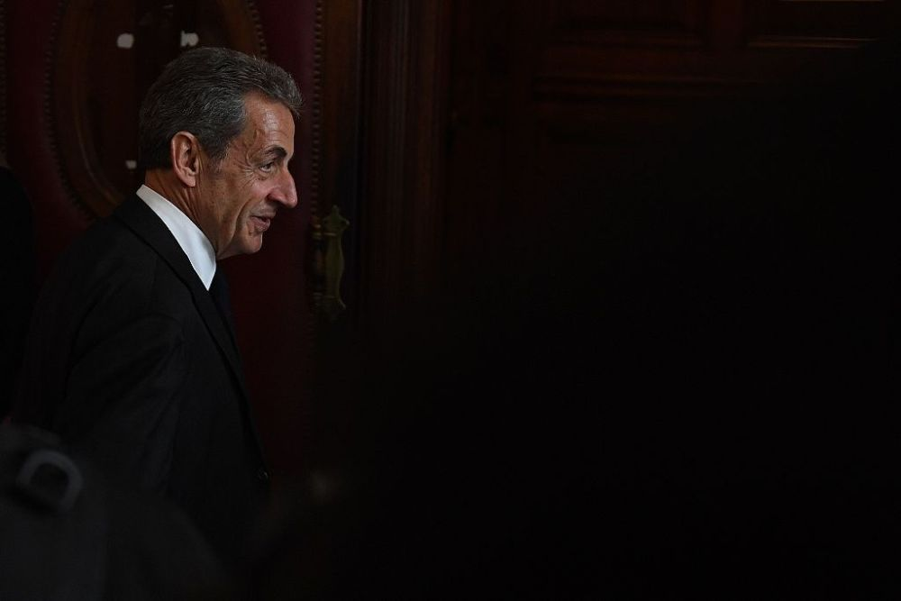

# 法国前总统萨科齐上诉失败，法院维持对其三年有期徒刑判决

法国前总统萨科齐因“腐败”和“以权谋私”罪名，于2021年3月被判处3年有期徒刑，包括1年实刑、2年缓刑。随后，萨科齐对此项判决提起上诉。5月17日，法国巴黎上诉法院对萨科齐案维持原有判决。

_法国前总统萨科齐
视觉中国 资料图_

据法国24新闻台报道，法国巴黎上诉法院17日对萨科齐“腐败”和“以权谋私”罪名维持原判，判处有期徒刑3年，其中缓刑2年，他可佩戴电子手环代替入狱。在去年12月举行的上诉听证会上，萨科齐声称，他从未与任何人进行过贪腐行为。

萨科齐2007年至2012年间担任法国总统。2013年3月，萨科齐被指控涉嫌在2007年竞选总统时从欧莱雅集团女继承人利利亚纳·贝当古那里获取大量现金。2013年10月，法院裁定撤销指控。但是调查过程中发现其他线索。案件进一步调查结果显示，埃尔佐格曾与时任高级法官阿齐贝尔多次对话，谈及贝当古案件，而这些对话被录音留存。检方从录音证据中推断，萨科齐方面承诺帮助阿齐贝尔获得晋升，条件是后者提供贝当古案的“内幕消息”。

