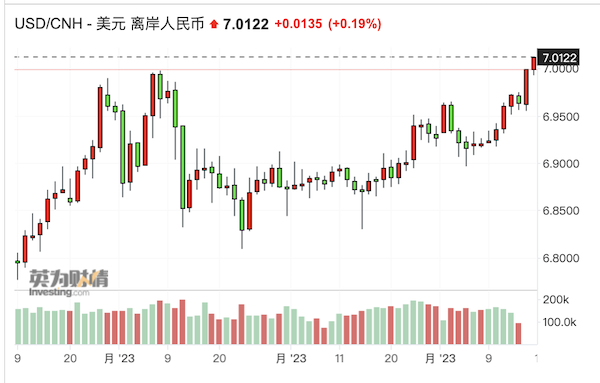
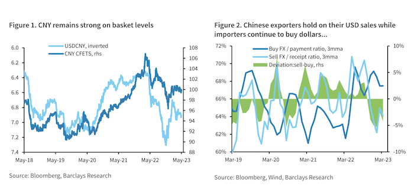
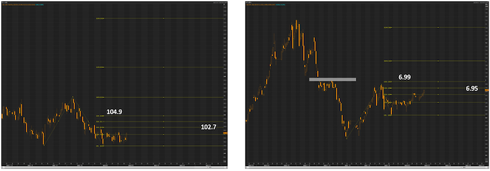

# 离岸、在岸人民币齐破7！美元反扑，出口商结汇意愿仍是关键

5月17日，离岸人民币时隔近8个月再度对美元跌破7关口。截至北京时间同日13:30，美元/离岸人民币报7.0144，美元/人民币报6.9978。16时左右，在岸人民币也跌破7关口，报7.0017，
美元/离岸人民币维持在7.0168附近。

一方面，美国违约竟然变得可以想象，唯一原因是该国及其国会内部存在深层次分歧，分裂的国会导致债务上限谈判一波三折，加剧了市场避险情绪，美元指数过去一周持续反弹，回到102.5上方；另一方面，中国经济数据走弱，16日公布的中国4月规模以上工业增加值同比增长5.6%，大幅低于预期的11%，当日人民币已经显著走弱。

某股份行外汇交易员对记者表示，“结售汇的意愿可能是对近期人民币汇率走势影响较大的一个因素，美元存款利率高位运行使企业增加了观望的意愿。6.99上方有一个去年末遗留的下行跳空缺口，极端情况下，不排除回补缺口的可能性。”不过，巴克莱提及，压力因素可能会在下半年缓和，随着中美利差收敛，预计下半年人民币有望回升。

**经济数据走弱引发关注**

周二公布的一系列中国经济数据引发市场关注。数据显示，中国固定资产投资同比增长4.7%，低于前值5.1%和预期的5.5%；中国规模以上工业增加值同比增长5.6%，前值3.9%，预期为10.9%；中国社会消费品零售总额同比增长18.4%，高于前值10.6%但低于预期的21%。

此外，中国国家统计局发布的数据显示，虽然4月城镇调查失业率降至5.2%，但16-24岁青年调查失业率从3月的19.6%上升至20.4%。

更早前公布的4月制造业PMI环比下滑，并来到了50荣枯线以下的位置，4月外贸数据、信贷数据多数大幅不及预期，市场对于降息的预期再次被点燃。

景顺亚太区（日本除外）全球市场策略师赵耀庭对记者表示，工业生产未达预期是全球宏观需求疲软的明确迹象。工业生产是中国过去几年经济增长的一项主要动力，而由于西方经济体在今年余下时间面临更大的增长阻力，这一引擎可能开始放缓。早些时候的贸易数据显示，中国对主要贸易合作伙伴的出口额连续下降，表明工业生产的势头很可能进一步放缓。

“我们认为，由于4月份信贷增长放缓，通胀温和，中国央行预计将很快下调存款准备金率。考虑到年轻人口失业率，中国央行不太可能下调贷款利率，但降准概率相对更高。”他称。

16日开始，经济数据和政策宽松的预期同时推动人民币再度走弱，逼近7关口。此前人民币在几周内一直盘踞在6.9附近。

**出口商结汇意愿低拖累汇率**

影响汇率的最关键因素永远是“真金白银”。尽管中国的出口数据仍强于预期，但出口商结汇意愿低下，这导致人民币的走势有所脱节。

“这个数据（出口商结汇）较为滞后，4月数据暂未披露，但我们认为可能与3月类似，出现较明显的逆差。一方面掉期点倒挂使企业远期结汇的价格较差；另一方面，美元存款利率高位运行使企业增加了观望的意愿。尽管许多企业也预计后续人民币升值概率较高，但出于现时短期利益的考虑，也不愿意很快平掉手中的美元存款。”某大行国际业务专家朱延桦告诉记者。

无独有偶，此前巴克莱外汇、宏观策略师张蒙也对记者表示，中国出口商囤积美元应收款项的迹象明显，而不将其兑换成人民币。这种行为是受到内地美元存款利率提高的影响。“出口商只兑换足够支付必要开支（如物流和工资）的部分金额。据企业反馈，剩余的金额被存入银行。这一情况在外汇结算数据中得到了反映。”

张蒙此前在报告中也提及，外管局的数据显示，按美元计值，2023年3月，银行代客涉外收入5691亿美元，对外付款5663亿美元。在上述银行代客涉外收入中，非人民币币种的收入已达2980亿美元，这略高于其12个月移动平均水平（2940亿美元），远高于2019年的月均水平（2230亿美元）。中国企业的外汇售出/收款比率降至60.5%，是过去一年中最低的水平。

“我们认为6.95是美元/人民币的首个阻力水平，因为出口商可能会在这个水平上出售其美元持仓。”她称，“实际上，我们的外汇存款敏感性分析表明，人民币因素往往比利率差异具有更强的解释力。美元/人民币汇率下降1个百分点，可能会导致外汇存款在一个月内下降80亿美元。我们认为这更可能是下半年的故事，更强的经济和更高的收益率或推动人民币重新走强。”

短期来看，有外汇交易员对记者提及，人民币在6.99上方有一个去年末遗留的下行跳空缺口，极端情况下，不排除回补缺口的可能性。

**“美元走弱”共识的实现需要时间**

未来，美元指数的变化也将对人民币汇率产生影响。

5月10日发布的美国CPI数据略低于预期(同比4.9%，预期5.0%)，核心数据符合预期(同比5.5%)，导致当日美元出现了惊人的抛售压力，不过美元此后又收复了失地，华尔街对于“美元走弱”共识的实现之路可能并不平坦。

“上周四美元指数录得3月以来最大单日涨幅。6月加息依然是非常小概率事件，但对于过于激进的降息预期的修正近期或将利好于美元的反弹。”嘉盛集团资深分析师Jerry
Chen告诉记者。

此外，一些避险资金流入美元，也导致美元暂时难以走弱——对美国债务上限的担忧正在上升。最新消息显示，拜登可能缩短参加G7峰会的行程，从而在有限的时间内（6月1日前）继续与国会的谈判。

目前，看多和看空美国经济增长的人正在激烈辩论，这也导致美元区间震荡。货币增长已经崩溃，信贷冲动是负的，银行接连倒闭，但劳动力市场过于紧俏。法兴银行外汇策略师Kit
Juckes表示，经济增长停滞需要多长时间是很难量化的，这意味着，尽管美元的下行趋势是具有确定性的，目前它将继续是一个“下降4步，然后再上升3步”的故事。

朱延桦告诉记者，自2022年10月美元指数见顶以来，人民币追随美元下跌的路径被动升值，但升值的幅度相对于美元的贬值幅度落后较多，且时间线上也有滞后。这一现象在3月中下旬更加明显一些。从历史走势来看，这种现象在美元贬值初期是较为常见的。他表示，从技术面看，102.7与104.9为细分级别阻力位，而美元指数的前期高点105.8为后续大阻力位。

