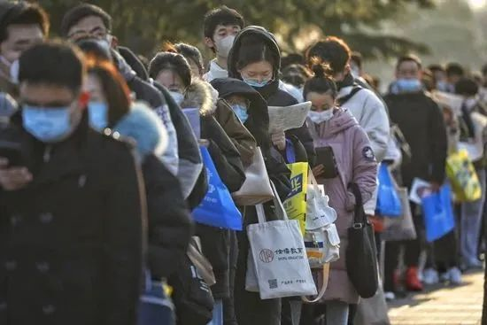
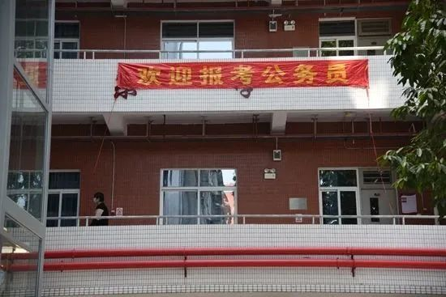

# 那些巡回考编的年轻人

_2月25日，山东泰安御碑楼中学考点，考生排队进入考场。视觉中国供图_

**作者 | 龚阿媛**

**编辑 | 陈 卓**

**赶场**

在过去几个月里，刘晓豪都无法准确地知道自己的目的地。为了获得一份有编制的工作，这位应届毕业生从去年12月开始参加了7场考试。他总是临时接到考试通知，才知道下一站要去哪里，因此习惯了只购买出发前往考场的车票，先不考虑后面的行程。

最紧张的时候是在今年2月中下旬，刘晓豪在两周的时间里，乘坐高铁和飞机辗转于武汉、郑州、北京，参加4场考试。还有3场考试，因为时间冲突，他只能放弃。

2月25日那天，他报名的河南、广东、山东的公务员招录和浙江省烟草公司招聘都安排了考试。最终他选择了家乡河南的省考。

近年来，对于很多毕业生来说，一份有编制的工作吸引力不言而喻。不少人会在全省甚至全国“巡回”参加公务员考试和各种事业编制考试。

他们被称为“巡考”者，成功被录取才算“上岸”。一名考生说，他在半年时间里，在湖南省内报考了26个事业编岗位。

很多考试因为报名者众多，考试前考场周围酒店价格会成倍上涨。平日里刚过百元的房间，价格会变成两三百元。

为了省钱，考生们需要尽早预订酒店。有人甚至在考试安排出来前，根据以往的经验预测考场范围，并在附近选取不同的地方，预订几个房间。如果最终安排有变化，再把不需要的房间退订或转让出去。

真遇到酒店价格上涨，有人会去七八十元一晚的招待所将就一下。考生胡舒有一次选择一家招待所。入住后才发现，房间陈旧木门上的密码锁已经轻微破损。她不敢熟睡，将卫生间的灯开了整整一夜。外出买晚饭的途中，她还被陌生的男人尾随。

在10万人加入的豆瓣“国考省考公务员上岸吧”小组里，有网友发帖问第一次巡考应该选择什么交通工具，一位去浙江巡考的考生留言，“巡考党做好一次考试至少消费五百，三千也得去的心理准备”。

胡舒去年从山东一所沿海城市的大学毕业，已经参加了十几场公务员和事业单位的考试。其中，有3场考试的笔试部分、资格复审部分、面试部分交叉进行。刚参加完第一场考试的资格复审，她就接到了第三场笔试和第二场的线上面试通知。为此她不得不从山东的东北到西南，在两个相距300公里的城市之间奔波。

为了控制成本，她只乘坐火车。有时，七八个小时的卧铺也有好处，可以省去一晚上的住宿费。

某培训机构的一位老师曾在课堂上提及，他看到有巡考大军，尽可能多的参加全国公务员和事业单位的招聘考试，每年，苏浙沪的省考都成为他们“考前模拟”，为了最后参加家乡的省考作准备。

2023年，有超过250万人参加国考，创近10年报考人数的纪录。对于应届生刘晓豪而言，考公务员只是他求职路上的一环，除此之外，他还要参加事业单位考试。

数据显示，2023届高校毕业生规模预计1158万人。作为即将毕业于北京一所211院校的经济类专业硕士研究生，刘晓豪在大学的最后一个暑假开始了公务员考试的基础复习阶段，开始了自己的求职路。

他每天至少保证12个小时的备考时间。身边很多人从三四月开始上的考公网课，他为了节约时间，用两倍速学完课程。

然而，他参加的7场公务员考试，都没有成功上岸。

他没有停止巡考的脚步，目前他重心都放在了中国烟草各地分公司的巡考之中，为此他又去了浙江、陕西、云南、湖南参加招聘考试。

同时，其他的事业编制考试他也没有放弃。上个月10号，他临时接到两天后的一个郑州的考试通知，当时他在杭州刚刚结束一场面试。路途中，他又在线上完成了一场银行的面试，利用打印准考证的间隙做了两套真题模拟，之后，他又飞去了云南的考场。

他准备努力到今年6月。遇到好的工作机会还要继续争取，他不想走上工作岗位之后，后悔因为自己没有尝试而错失发展更好、工资待遇更好的机会。

密集的考试安排对他而言，已经麻木，“从小到大的考试太多了”。在2016年刘晓豪参加高考那年，河南有82万人和他一起考试。“对这些（报考）人数、竞争其实已经司空见惯了”。

_2月25日，广东省公务员考试开考，广州市财经商贸职业技术学校考场。视觉中国供图_

**在考场上崩溃的人**

对于巡考者来说，安排行程只是第一步，上了考场，考验才是真正的开始。争分夺秒的笔试中，考生孙意静会把难题留到最后。但在参加江苏的一次省考时，等她把一道道题目跳过，发现自己已经无题可做。之后在家乡山东的一次考试中，她紧张到看试卷都出现了重影，身上一直冒冷汗。结果，那是她求职中考试成绩最差的一次。

她从本科毕业就开始了考公，第一次考试她早上6点和家人们出发，开车去连云港考试。上次去这里，她和一家人开车是去看海。

那一年，她刚刚通过了司法考试，正等待研究生考试的结果，并没有把这场公务员考试放在心上。在考场上，她才第一次知道了公务员考试的具体题型。

但这时，她已坚定了考公的决心。那年7月，她去律所实习，见识了那里的繁忙，还有同事之间的竞争和压力。而且，她的工作需要不停地跑法院、检察院这些地方，配合别人的时间。

那种繁忙让她想起了自己的父母。从她上学以来，妈妈只参加过一次家长会，“妈妈怎么还不回来”这个问题，贯穿了她整个童年。

去一个工作节奏稳定的地方，是她职业规划当中非常重要的考虑因素。她羡慕本科毕业后第一次参加国考就进入面试、第二次省考就上岸的姐姐，也听说过身边放弃工作专心参加公务员招聘考试的哥哥，五六年了都没有上岸。身边亲戚家的小孩，甚至在高考填报志愿时，就开始考虑哪个专业更有利于考公务员。

那场成绩最差的考试，是要考她非常心仪的岗位，就在家乡那个地级市工作。她的身体比内心提前感知到了压力。备考前一个月，她在安静的环境中，突然听到了嘈杂的“咚咚咚”声，和心跳声差不多。一开始，她只是以为是耳朵出了问题，直到检查后才被医生诊断为“神经性耳鸣”。

相比于研究生考试，秦雪原本以为考公容易得多。

去年7月，第二次考研失败之后，她选择了新的“赛道”。她第一次考公就进入了面试。

在面试名单上，她是最后一名，还没进入考场，她就崩溃了。之前考研的时候，她爸爸会专程到学校，陪她考试，她既不用担心睡过头，也不会因为粗心忘带准考证。考公是她一个人参加的。抵达考场城市的第一天晚上，她就哭着给家里打电话，把酒店房间的纸巾都用光了。

考试当天，由于太紧张，秦雪在化妆时把早餐吃的馄饨吐了出来。而考场的任何风吹草动都会让她多想，甚至同考场男生洪亮的嗓音，都会让她愈发慌张。

最后一个问题，是她从未准备过的题目，走出考场还没等到面试分数张贴出来，她就从门口等候的人群中逃走了。她没有通过面试，这次失败让她在家颓废了半个月。

**寻找最优解**

对于巡考者来说，热门并不一定是最好的选择。一些人把家乡或回家方便的城市定为巡考的目的地，他们已经不再盲目追求一线城市。

孙意静不想离家太远。她巡考中去过很多城市，但那些地方几乎没有带给她新鲜感。如今，线上购物已经可以满足她大多数的生活需求，而城市建筑物大同小异，“看上去都差不多”“每个地方都有肯德基”。

她也参加了北京的考试，但她并没有见证首都的繁华。前往酒店的路上，她看见的是管道还在滴水、破烂的旧楼房。

刘晓豪在今年年初放弃了北京一个不错的工作，重点在郑州和发展潜力不错的二线城市中巡考。他放弃的那份工作年薪20万元，还有北京户口，但他明确地知道自身能力和家庭条件都无法支持他在北京安家立业。

秦雪还是会重点关注一线城市的岗位。她想要继续深造，当地的高校教育资源是她重要的考虑因素。

大二暑假之前，秦雪一直都是想当律师的。一个参观当地的律所、法院、检察院的夏令营让她改变了求职的方向。在一家知名律所她发现，电视剧里能看到高楼大厦，江河美景的豪华办公室，不是普通人能轻易拥有的。更多律师只有一张桌子，一排排绿植给格子间增加一些生活气息。她想着，在繁华的大都市里，那个小桌子上的自己太微不足道了。

毕业于一个法学领域著名高校的她，只有本科文凭，也没有丰富的律所和公司的实习经历。她对自己的竞争力并没有信心，“反而一直考试能给我一点安稳感”。

秦雪偶尔也会想，如果考研成功了，是不是可以更好地规划社会实践和实习，弥补以前的遗憾，也许在就业上有更多的选择。但目前，对她而言，“考公是个最优解”。

**一场胜仗**

公务员考试中，没有绝对上岸的方法论。

在秦雪巡考中参加的最后一场无领导小组面试中，她打了一场“守擂战”。

这种面试形式，需要考生们同时对特定情景下，通过与他人讨论、合作，最终做出处理事件的最优方案。谁能在一群人里充分展现个人才能和人格特征，往往就会脱颖而出。

笔试成绩排名第一的她，为了保险起见，并没有表现得过于积极，她担心那样会引起考官的不满。而和秦雪一个面试班的同学，则遇到了另一种复杂的局面，组里出现了被他们看来是“杠精”的角色，而她的同学则作为调和者的身份出现，好几次站出来解决组内矛盾，最终取得了面试第一名的成绩。

第四次进入面试之后，相比第一次的落荒而逃，秦雪已经不再害怕紧张。每一次参加考试真实的紧张感，她都清楚地记得。只有记得这种感觉，她才可以学会如何去克服它。

当把上岸作为目的地之后，考生们只能不断地提升自己的能力，去无限接近。

孙意静的13场公务员巡考历经5年，贯穿了她的本科和研究生生涯。读研期间，她也会强迫自己参加一些比赛，锻炼自己的面试能力。最后几次面试中，她的分数都在稳定上升。

通过一次次巡考，她会在备忘录里记着每次的反思：语速慢一点，回答多联系基层的工作，说“第一、第二、第三”会比“首先、其次、最后”显得更有逻辑……她不再是刚开始面试时，被培训班老师称为“胆小如鼠”的人。

胡舒还在继续巡考，她把对考公、求职的困惑发在豆瓣的“考试失败垂头丧气互相安慰联合会”和“大学后悔学会计专业”小组里。10多场考试下来，她不再盲目地考试了，也明确了一些地方是她不会选择的。

上个月，巡考一年后，秦雪终于如愿在广东省上岸了。回想起第一次报名的考公面试班，是她毕业之后难得的快乐时光。

两年的备考研究生考试期间，她曾关闭了朋友圈，与外界切除了不必要的联系。在面试班上，她遇到了工作几年之后辞职来考公的人。和她一样考研失败的人。

因为考研一直待业，秦雪时常会有年龄焦虑，不知道还有这样一群人，看着那些比自己年长、经历过更多社会历练的人，看上去既云淡风轻，又格外认真。她觉得自己眼界开阔了，自己也还年轻，生活不该被一场场考试困住。

当时和她住一个房间的女孩，准备出国留学提高学历，回来之后继续考公务员。秦雪想着，如果大家最后都选择这条路，那自己先走走也没什么不好。

（应采访对象要求，胡舒、秦雪、孙意静为化名）

**中国青年报·中国青年网出品**

