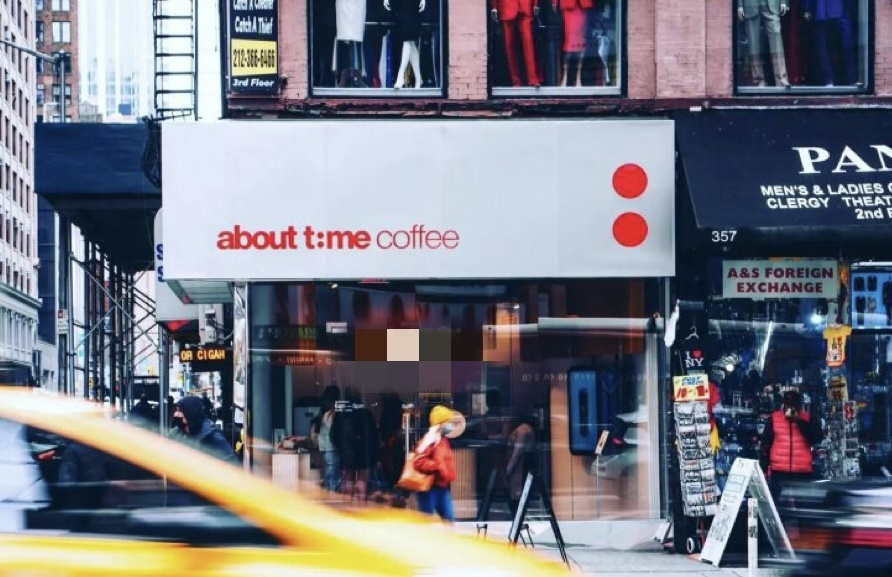

# 90后创业者成垮掉的一代？“马云门徒”滞留海外，“小黄车之父”跑路美国

作者｜叶蓁

编辑｜康晓

出品｜深网·小满工作室

曾经中国90后创业者的代表人物，ofo创始人戴威，近日被海外媒体曝出已在美国开启新的事业。

据报道，戴威疫情几年一直穿梭于中美两地，并在纽约开了一家咖啡连锁店品牌About
TimeCoffee，投资方包括IDG、真格基金和唯猎资本（戴威持有2.12%股份）。About Time CEO Marian Chen
表示，目前已以4000万美元的估值筹措了1000多万美元的资金。

对于上述消息的真实性，真格基金官方婉拒了《深网》的求证。

**一位接近戴威的知情人士向《深网》确认，戴威确实参与了朋友的咖啡创业项目。Marian Chen此前透露，戴威是公司的小股东，但不负责About
Time的日常运营，他协助建立了团队，并安排与投资者的会面。**

About
Time照搬了已在中国被证明行之有效的商业模式：价格比星巴克更便宜、在线订单模式、技术驱动，定位年轻消费群体，主打冷萃、珍珠咖啡、芋头咖啡等产品。

不过，戴威赴美再创业的消息，在国内网络平台又引发巨大争议。公开资料显示，ofo目前仍欠2000万用户总价超过10亿元的押金，戴威本人也因供应商欠款成了被法院执行的“老赖”，共收到40条消费限制令，包括不得乘坐飞机等等。

作为国内共享单车鼻祖，ofo曾经在短短三年就成为估值40亿美元的独角兽企业，登上财富榜的戴威一时风光无限，但最后的结局是，他再次沦为90后创业者们命运的一个缩影
**。**

**在移动互联网时代，90后创业者未能成为商业规则的制定者和标志性人物，也未诞生能媲美80后的商业领袖。和戴威一样，那些曾暴得大名的90后创业者，大多数要么泯然众人，要么深陷舆论漩涡。**

“90后创业者与70后和80后比，毋庸置疑，他们成为了垮掉的一代。当下90后创业者中，最成功的代表仅剩喜茶创始人聂云宸。”一位90后连续创业者告诉《深网》。

90后大学毕业走出校门的时候，是2014年。那一年，锁定“90后”成为一些投资机构的共识。马佳佳，2012年创办情趣用品店泡否，高考状元、90后、美女与性，这些元素使得马佳佳备受媒体和创投市场关注，但如今已难觅踪影；还有一直以“马云门徒”自居、后因拍下巴菲特午餐被热议的孙宇晨，如今只能滞留海外，今年3月还被美国证券交易委员会（SEC）指控欺诈和违反其他证券法。

当然，90后创业者确实曾面临窘境，中国互联网经过二十年高速发展，所有低垂的果实都被70后和80后摘光了。但这，仍不足以解释90后创业者的集体遭遇。

“我还没毕业的时候，北大方正如日中天，那会蔚来汽车创始人李斌才上大一，他说北大方正这么牛，我们今后要创业没机会超越方正了。”当当网创始人李国庆告诉《深网》，“我认为永远有新型的颠覆性的科技革命，除了科技革命，代际更替都会产生新的赛道。”

在当下最火的AIGC大模型创业赛道，依然是王慧文、王小川等互联网老兵活跃着，同样缺乏90后创业者的声量。

90后创业者成为垮掉的一代，更多是因为赶在了那个喧嚣浮躁、功利主义开始盛行的年代。他们踏入社会的时候，资本已经在网红创业者的身上尝到了甜头，他们也有了得以效仿的样板。但创业维艰，当时代大潮退去，功利主义被淘尽洗涤，舞台最终将留给那些长期主义价值的坚守者。

**错打的“网红”标签**

“创业者如果没有当网红的能力，就不要创业了。”当年，真格基金创始人徐小平的这句话成为了90后创业者的圣经。

2012年，马佳佳毕业的那天，在学校门口开了情趣用品店泡否。马佳佳本来想做一个营销公司，去找投资人融200万。对方问，你为什么要创业？她脱口而出：“我聪明呗。”这次融资失败了，马佳佳把失败归结为自己还不够红。

此后，马佳佳在网红的路上愈走愈远，2013年，马佳佳的泡否将店开进了三里屯，店门口牌子充满挑衅：不好意思的不准进、长得不好看的不准进……那一年，马佳佳频频被各个商学院请去演讲，成为《非诚勿扰》的女嘉宾。

2013年底，1990年出生的孙宇晨加入位于硅谷的互联网金融公司Ripple
Labs。2014年，孙宇晨头上顶着北大本科、宾大硕士，加上Ripple大中华区首席代表的身份回国了，之后他创立了自己的锐波科技。

2015年，孙宇晨成为马云湖畔大学第一期学员。从此，他以“马云最年轻门徒”自居。而孙宇晨的创业项目一直不温不火。面对“炒作自己”的质疑，孙宇晨的解释是：“我们这种初创公司，只能靠老板狂出台，狂做PR，才能吸引投资者注意。”

**90后是生于互联网蓬勃发展的一代人，崇尚个性和自由，被打上“非主流”、“叛逆”、“玩世不恭”等标签。的确，与70后和80后相比，90后创业者是更善于制造话题的那一拨。**

90后创业之初的路径就是网红打造的路径，并非无迹可寻。2010年，徐小平投资了陈欧18万美金，他创立了聚美优品。2011年，陈欧“为自己代言”的广告词深入人心。那一时期，陈欧体火的如火如荼，陈欧也成为年轻人励志的偶像。

陈欧后来接受采访时表示，天使投资人徐小平希望他站出来。2014年，伴随着聚美优品上市，31岁的陈欧成为纽交所IPO 200多年来最年轻的CEO。

成为网红的确给90后创业者带来了甜头。2014年元旦，徐小平和马佳佳共进晚餐。“我投了马佳佳，我给30万人民币，拿了一个点。”徐小平后来在创投极客论坛上，讲述了他投资马佳佳的过程，整个基金内部，是完全反对他投资马佳佳的。“我告诉大家我投她了，而且我以此为骄傲。别人对马佳佳的指责是，你什么都没有，为何暴得大名？我反过来问大家，你什么都有，为什么你不出名？”徐小平回忆。

2014年，中国大地掀起创业风潮，创业公司如雨后春笋破土而出。数据显示：2014年中国创业公司的数量达到365万个，这意味着每天都有10000个公司成立。

在这波创业潮阳中，90后们无疑是最醒目的存在。2014年初，戴威和四位北大校友在青海大通县一个小房间里，创立北京拜克洛克公司，方向为骑行旅游。同年10月，23岁的戴威回京，返校攻读研究生。一次创业交流营上，他认识了徐小平。

毋庸置疑，在这场90后网红创业的盛宴里，资本是最重要的幕后推手。

**赶上了一个最浮躁的年代**

对90后创业者来说，似乎赶上了一个最好的时代。

那一时期，市面上最不缺的就是钱了。据清科集团旗下私募通统计，2014年VC/PE机构共新募集745支可投资于中国大陆的基金，较十年前市场规模增长近10倍。

当年8月14日，IDG正式对外宣布设立IDG90s基金。市场上最早关注90后创业者的人是IDG曾经的投资人、峰瑞资本创始人李丰。

2012年李丰投资了尹桑和他的K歌软件“一起唱”，尹桑当时只有20岁，这是中国第一笔对90后创业者的投资。

在IDG内部，李丰带领团队开始对90后互联网习惯、消费与生存状况进行全盘调研。他们在两个月内做了1000多个访谈，最终制成《90后互联网生存状况报告》，并得出结论：

**当90后逐步进入社会，成为工作人群，只有同时代创业者知道他们究竟有什么需求。**

时代给了90后机会。李丰认为，过去10多年PC互联网商业模式的进化或者演进，基本以84年、85年左右的一代人的需求为主，包括游戏、社交、招聘、电商等各个领域，而接下来移动互联网中的很多商业模式，会是90后去驱动。

生于1998年的王凯歆，建立了针对青少年学生的垂直电商平台神奇百货。2015年王凯歆报名了BTV
的创业真人秀《我是独角兽》，节目中她坦陈，“我高二休学，15岁创业，17岁就有自己的公司了。神奇百货自上线两个月以来，用户已经突破20万，每天订单上千单。”

站在王凯歆对面的是：经纬中国合伙人万浩基，GGV纪源资本管理合伙人童士豪，猎豹CEO傅盛，真格基金CEO兼合伙人方爱之，天神娱乐董事长朱晔。现场她被五个大佬争抢投资。2016年1月，神奇百货获得由经纬中国领投、真格基金与创新谷跟投的千万级别A轮融资。

亢奋的情绪一直笼罩着中国创投市场。早在2014年9月，经纬创投合伙人张颖发布了致经纬系内部信，预警泡沫的产生。张颖说，“很多基金融到钱了，大家拼命做案子，包括我们在内的几家主流的基金，今年的案子数量都比去年的2倍还多。这样的态势能延续多久呢？”

**这种被资本争抢的荣光只属于网红创业者。**
2015年1月，泡否创业失败的马佳佳创办了大尺度女性社区“High”，拿到了高榕资本的千万天使投资。2015年4月，孙宇晨获得了信中利资本领投，IDG、中科资本、清控科创等多家机构跟投的千万美金级别A轮融资。

“2015年上半年，是中国A股的风口期，VC圈也疯了，随便一个天使轮都能融一两千万”，戴威曾透露，即便这样，他也只有灰头土脸吃闭门羹的份儿，唯一的一个口头协议最后还被资方放了鸽子。

戴威的落寞只是暂时的，遭遇困境的戴威最终想到了共享的方向上去了。2016年1月，ofo客服接到了金沙江创投的电话。第二天，戴威见到了金沙江负责人朱啸虎，对方开价1000万美金。那时朱啸虎因投资滴滴一战成名。

戴威赶上了共享单车的风口。ofo成为了那几年资本进入密集度最高、融资速度最快的项目。到2017年E轮融资，ofo估值已达30亿美金（约193亿人民币）——而2016年4月，ofo的估值仅为1亿人民币——在极短时间内，众多资本参与下，ofo的估值翻了近200倍。

2017年，《胡润百富榜》上，35亿元身价的戴威成为首个上榜的白手起家90后创业者。

**用大资金投入砸出用户规模和市场需求，用并购拼凑出上市前最后一块拼图，这是当时资本无往不胜的操作模式，但是当复杂的股东关系、竞争关系导致的矛盾不可调和，ofo的故事便戛然而止。**

一票否决权的存在，使得戴威和股东阿里、滴滴之间难以达成一致，失去了与摩拜合并的机会，而不断恶化的财务状况、没有前景的商业模式也吓退了接盘的投资人。

戴威和ofo的命运就此注定。

**币圈打开快速财富自由之路**

“站在风口上，猪也能飞。”或许让雷军没想到的是，他的话语开启了中国风险投资行业的风口论，VR、O2O、共享经济、区块链……

2017，戴威成为90后创业明星的那年，比特币价格超过了1万美元一枚，在比特币的带动下，区块链和其他类似的虚拟币也被开发出来了。

**加密数字货币和区块链的热潮迎面而来，最先引爆的是VC圈，徐小平在内部微信群发布的拥抱区块链革命的言论刷爆朋友圈。**

**在这波区块链和虚拟币的浪潮中，诸多“优秀的90后人才”被卷入。**

2017年8月，孙宇晨发行了网络加密货币——波场币，售出数量1000亿枚，价格0.0015美元。该币发行当天，就融资6个亿。仅仅一个月后，2017年9月4日，央行等七部委下发公告禁止ICO（首次公开发币），并且要求已发行虚拟货币做清退安排。

退钱收币之后，孙宇晨成为波场币最大的持有人。2017年12月底到2018年年初，波场币价格从两分暴涨到两元。随后孙宇晨抛售60亿个波场币，成功套现3亿美元。次日波场币价格暴跌20%，导致无数人被割韭菜。

孙宇晨赚的盆满钵满，但被贴上了“骗子”的标签。

进入区块链领域给VC机构带来了不小的争议，区块链领域是一个枭雄和骗子随时可以互换角色的行业。

徐小平的区块链宣言发布20天后，就被推上了风口浪尖。一篇《顶级VC背书，IOST币圈吸血40亿，同一个团队竟然还开着另一个项目？》文章称，IOST项目实为“多拉打印”公司的同一团队操盘，发虚拟币转移资金输血母公司。IOST的豪华投资机构阵容中，包括真格基金、红杉中国、经纬中国等。

根据白皮书显示，IOST总发行量210亿，流通占比40%。2018年1月15日开始交易后，IOST大盘即被强势拉升，相比于众筹时的0.01美元，在两个星期内被拉到了0.12美元，涨了10多倍。不过随后该币的币价就出现断崖式下跌，价值40多亿的代币蒸发不见。

IOST创始人钟家鸣一夜暴富，喜提了一辆上千万的法拉利。钟家鸣，1993年出生，经常出现在北京最顶级的酒吧One Third，喜欢用顶级香槟来招待朋友。

区块链成为风口持续不到一年。公开资料显示，真格基金投资的区块链项目除了IOST外，DATA、EDU、YEE、MDT等代币最大跌幅达99%，币价近乎归零。

**80后的历史并未轮回**

2018年年中，易凯资本CEO王冉发出警告，国内一级市场的资本寒冬来临。

“2018年第二季度和去年同期相比，融资量跌了80%。2018年是VC行业整合的一年，”
汉能资本创始人陈宏曾告诉《深网》。“2017年颁布的资管新规，银行不给母基金出资了，突然间很多LP不见了，基金就停摆了。”

资本握紧了钱袋子后，一群张扬的90后创业者，很快就遭遇了困境。

2018年年末，ofo因退费难被送上热搜。面临困境的不仅仅是戴威，2018年，区块链和共享单车等行业经历了大起大落，被风口吹上天的猪也落到了地上。

不可否认，失败是悬在创业者头顶的达摩克利斯之剑。对于创业的残酷性，经纬中国创始管理合伙人张颖如此说，“创业3年的公司，93%会死掉，活下来的只有7%。”

90后创业者所面临的，80后创业者也经历过，每一代的创业者初登历史舞台都会引起争议。

2006年，李想、茅侃侃、戴志康和高燃等作为80后创业代表，登上了历史舞台。他们是泡泡网、Majoy、Discuz、Mysee的创始人，“80后创业新贵”等名词在此后数年被媒体反复提及。在经历一系列波折后，当时的80后由颠覆者变成了失败者。

当时主流舆论的论断是80后创业者在这一波新兴潮流里，基本失语。

2010年，iPhone
4诞生，世界进入了移动互联网时代，在这波创业潮中，站在浪潮之巅的也是70后和80后创业者。美团的创始人王兴生于1979年，1985年出生的张旭豪在2008年创立饿了么，滴滴创始人程维生于1983年，今日头条创始人张一鸣生于1983年。

**可见，80后创业者并未失语，只是舆论筛选出来的创业代表与时代筛选出来的代表不是一拨人。移动互联网时期脱颖而出的这波80后创业者，成长为中国互联网中坚力量。**

**时代的故事写到90后创业者这里的时候，打上网红标签的他们，在踏上创业舞台之初，更多呈现的是急功近利。**

马佳佳、孙宇晨，王凯歆，这些人创业的赛道与移动互联网关系不大。只有戴威是在移动互联网的赛道里，但他只抓住了移动互联网的尾巴。

**2018年，传统互联网的造富时代结束了。这一年，经历了中美贸易摩擦、资本寒冬，大厂转向产业互联网。一位投资人告诉《深网》：中国互联网的模式投资也走到了尽头。**

互联网模式投资的泡沫散去后，大部分90后创业者都已经淡出公众视野。“经过了PC互联网和移动互联网，信息撮合匹配这种创新的机会今天已经特别少了，”万物资本和浅石创投合伙人郑毅告诉《深网》。

一年后，资本就找到了新赛道。2020年被称为“新消费时代”元年，万亿资本涌入，打造新消费品牌盛宴。也正是这一时期，喜茶创始人聂云宸才被媒体置于了聚光灯下。

2020年11月，29岁的聂云宸以45亿人民币登上《2020胡润80后白手起家富豪榜》，并成为其中唯一一个90后。2021年，喜茶的估值达到了600亿元。

聂云宸当下的成功，称得上的是长期主义的胜利。

2010年，聂云宸从广东科学技术职业学院的人文学院行政管理专业毕业，他开了一家手机店，2年时间他赚到了20万。2012年，聂云宸在江门一条名为江边里的小巷上，开了一家名为皇茶（后改名为喜茶）的奶茶店。

身边有人劝聂云宸，奶茶创业最好的时间已过。但聂云宸认为做事情不需要风口，“就算这个行业已过时，但有了我们的加入，就会有不一样的东西。”

起初的喜茶也无人问津，不过他坚持了下来。

对创业者而言，欲戴王冠，必承其重。在最特斯拉困难的时期，面临资金短缺、员工离职、美国次贷危机等等危机，马斯克一度精神崩溃。多年以后，马斯克把这段九死一生的经历形容为“一边嚼着玻璃，一边凝视死亡的深渊”。

新消费创业浪潮一路高歌猛进的时候，戴威时不时由于ofo押金问题被送上热搜。

“戴威最后的惜败，对所有年轻的创业者都是一个很大的触动，对年轻人的影响可能超越我们对这个事情本身的想象。”95后创业者、bosie创始人刘光耀告诉《深网》。

戴威是刘光耀的学长，刘光耀曾以山东省文科第二名的成绩考入北大光华管理学院，本科期间曾任北京大学学生会副主席，后被保送至清华读硕士。2017年，刘光耀读研一时休学创业，创办了“无性别主义”的时装品牌bosie。2020年，bosie完成2亿元A+轮和B轮融资，由钟鼎资本和元生资本领投，金沙江创投跟投。

刘光耀的90后北大同学中，创业似乎已经褪去了光环。他的研究生同学中是没有创业的，大部分同学毕业选择了进投行，北大本科同年级和整个学院的创业者也很少。

现如今，戴威重新出发进入新消费赛道创业，不仅关乎对ofo和自我的救赎，某种程度上，也关乎更多90后一代创业者是否有机会和勇气为自己正名。

