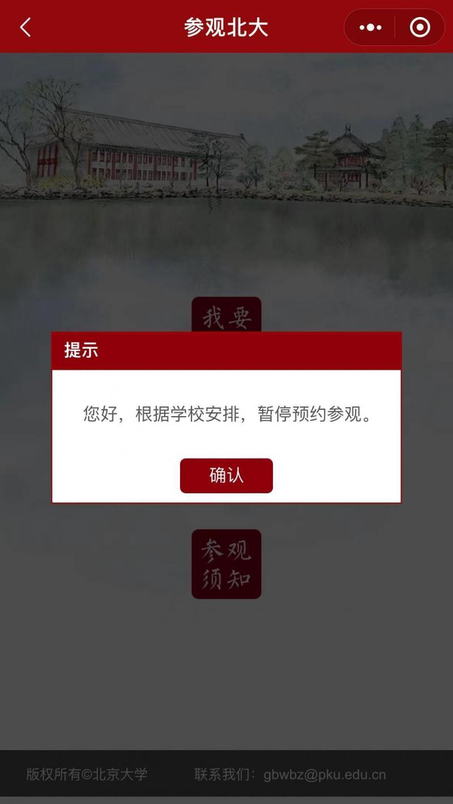
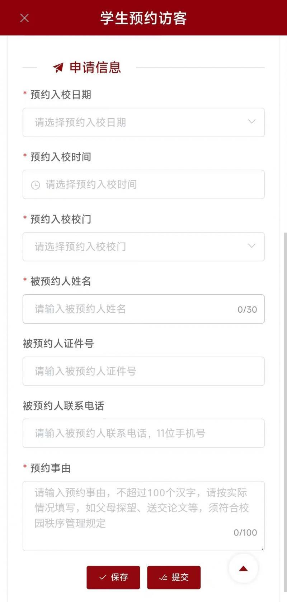
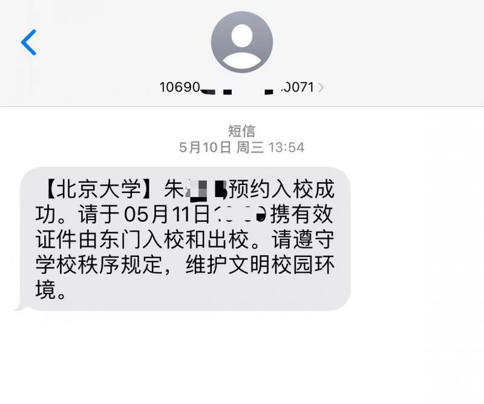
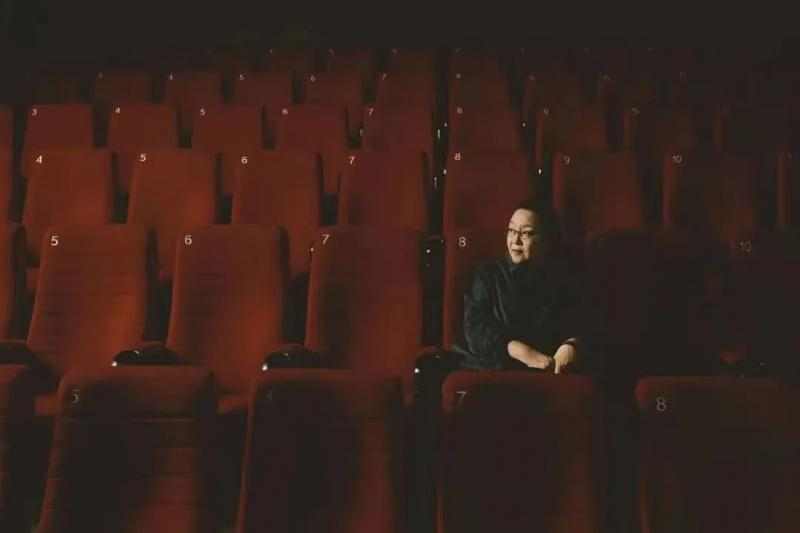
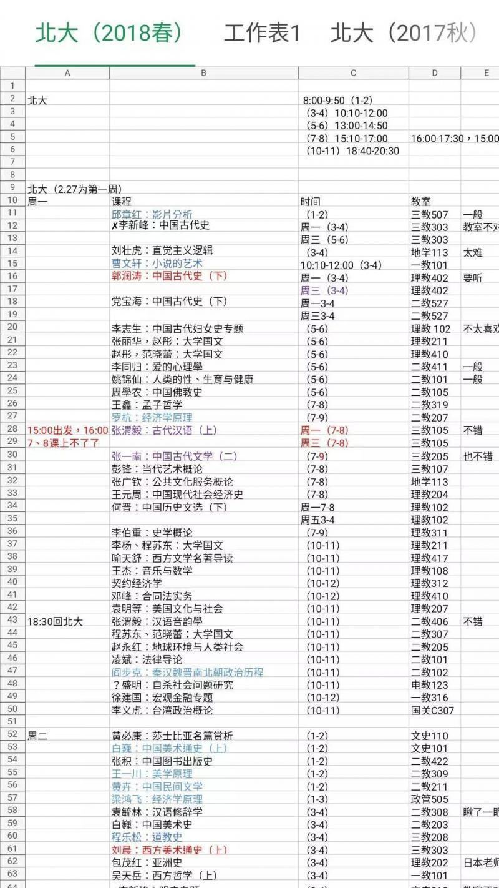
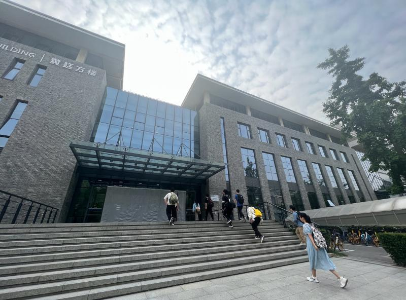

# “付费入校”，记者花100元进入北大校园

“你再想想办法吧！”北京大学东门前，保安略显无奈地跟前来“蹭课”的孟源说着。和目前很多高校的开放状态一样，北大校园只准许校友、师生亲友及公务往来人士等入内。

随着世卫组织宣布新冠不再构成“国际关注的突发公共卫生事件”，大学校门何时开放成为公众关注的话题。在这样的背景下，一些人从中发现“商机”，“付费入校”成了一种“商业模式”。

而当北京青年报记者通过付费方式进入北大校园后发现，北大“旁听生”这一特殊群体几乎“消失”了。

**限制入校，**

**记者花100元进入北大校园**

今年春季开学以来，随着相关政策的调整，一些大学陆续开放了校园。本想去北大“蹭课”的孟源，却吃了闭门羹。“北大官网显示暂停预约参观了，我就带着身份证直接去了。”孟源一到北大的东门门口就被保安拦了下来，“师生刷校园卡进校，其他人员没有预约不能进。”

_北大官网上公众参观预约已暂停_

第二种方式是“学生预约访客”。北大学生信息服务栏目显示，北大在校生每个月有8人次的亲友预约名额（每日限额2人次），可帮助他人预约入校。在校生在系统里填报好相关信息后，访客可在预约时间点前后2小时内，从特定校门刷身份证入校。毕业的北大校友回校也可为3位同行人员预约进校。

第三种方式是成为北大教务处登记的“旁听生”。申请者须是高等院校及科研机构的在职工作人员，具有大学文化程度，身心健康，经所在单位介绍，提供有效身份证明、证件者，旁听费按所听课程的学分收取，每学分听课费及考试费500元。

由于大学只向特定关系人员开放，对于普通大众来说，没有“熟人”则意味着校门难进。而北青报记者发现，在旺盛的入校需求下，网络平台上出现了提供“付费入校”服务的卖家。

经过私信联系，一名卖家添加了北青报记者的微信。这位卖家表示，约不到不收费。说着他向北青报记者发送了一张北大“学生预约访客”的截图，称该页面只有在校生才能点进去。

_在校生预约访客页面_

随后，北青报记者按对方要求发去了预约入校时间、姓名、身份证号、联系电话和事由，同时发送了100元红包。卖家很快便发来了访客预约“审核通过”的页面截图。紧接着记者这边也收到了北大发来的短信：预约入校成功。

该名卖家告诉北青报记者，预约名额供不应求，自己手中的名额一小会儿就约没了。他还“友情提醒”：由于学校只允许学生预约家属或者亲友入校，所以进去了要文明参观，不要乱丢垃圾，也别去投喂未名湖的鸭子。

第二天，北青报记者按照预约时间段，在北京大学东门闸机刷身份证后顺利入校。几天后，另一位同学也通过同样的方式进入了北大校园。

_北大发来的预约成功的短信通知_

**校门不好进，**

**北大“蹭课”困难重重**

2019年夏天，正在北京准备考研的火火，看到北大新媒体讲堂的系列讲座，果断报了名，希望近距离感受这所顶尖学府的课堂氛围。当时，北大入校并无多少限制，火火出示身份证便顺利入校。

“那真是一场迸发着多元的、交互的思维碰撞课堂”。时隔多年，回忆起当年的那场讲座，火火仍记忆犹新，学生们提出有价值的问题，老师都稳稳接住，像一阵春风包裹住锋芒毕露的嫩芽，“当时讲座讲了什么、具体的知识都记不清了，但我记得那是一个洒满阳光的午后，教室讲台上反射出细碎的微光，窗外的鸣蝉和教室里思想争鸣的场景在我脑中记忆犹新，这些都是线上很难实现的。”

_北大公共课大教室_

匆匆几年过去了，如今北大实行的是“半开放”政策。北京某985高校的研究生林川，为了旁听一场北大的“大咖”讲座，他拜托一位北大同学帮他预约入校，“北大预约亲友进校有次数限制，我也不好意思总是麻烦同学，所以那种常规性、连续性的课程我就没法去。”

今年春天，正在北京另一所高校读研的陈浩，也是在同学的邀请下，第一次进入北大。

“之前看觉醒年代对北大很向往，我和同学在大学就是学韩语的，刚好戴锦华老师那天的电影赏析课播放的是韩国电影，所以我们就去看了。”陈浩介绍，当天的课程安排是同学先看电影，戴老师再进行电影赏析，“这种寓教于乐的方式很适合我这种很难安稳坐在教室上课的学生。”

谈及旁听北大课程的感受，陈浩说：“印象很深的一点是大家在电影结束后，自发鼓掌了好长一段时间。”除了台下同学对电影的反应，老师那些鞭辟入里的洞见让他觉得这场电影看得值。

“其实戴锦华老师的电影赏析课在每周三都会有，我也很想每周都去，但入校不方便。”陈浩的北大旁听之路就此中断。

_戴锦华教授_

同样因为不好意思麻烦同学又想旁听北大课程的喵宝，在某App发布了北大入校预约互换的帖子，希望有北大的同学能帮助她预约入校，她则表示会请吃饭，并以实习内推和介绍面试经验的方式“回报”。

喵宝目前被保研到其他城市的院校，她觉得离开北京这个资源丰富的地方很可惜，所以想利用这学期的时间，到北大、清华旁听一些自己感兴趣的课程。

“真有一位热心善良的北大小姐妹看到帖子后，说可以帮我预约，而且到目前为止，她没有要求我帮她做任何事，我心里还挺过意不去的。”喵宝说。

**北大一个**

**特殊群体“消失”了**

逛燕园古建、赏“一塔湖图”、听大师讲座，是很多求学者梦寐以求的。“兼容并包，思想自由”的北大吸引了来自天南海北的校外学习者，其中不乏长期寄居于学校周边、如在校生一般早出晚归的特殊群体——北大“旁听生”。

旁听生们虽无“名分”，其中却也出了不少通过自身努力，成为国家有用之才，甚至一代大师的。北大也以不拒绝校外人士旁听而美名远扬。

北京大学招生办官方公号曾刊发一篇《扒一扒那些北大旁听生》，其中介绍了早在蔡元培执校之前，就已有大量旁听生出现在北大教室。

改革开放后，到北大旁听的青年学子数量有增无减。北京大学退休教授郑也夫在其编著的《众生的京城》一书中，将当时北大的旁听生分为了三大类：游学者、考试族、周边高校学生。其中的游学者，大多历经了诸多的艰辛，为了生活，不得不节衣缩食，他们更喜欢自诩为“精神流浪汉”。而这些考试族中还包括北大自己的员工，如保安、保洁等。

北大校园中浓厚的文化底蕴、丰富的人文精神、源远流长的美名，是旁听生们选择此的原因，他们心怀向往，并坚持不懈。

北京大学2019届毕业生海精灵，在校期间曾采访了多位北大的旁听生，受访对象年龄最大的55岁，最小的不过19岁，这些人的教育背景、工作经历都差异巨大。

在受访对象中，1988年出生的贺勇大专毕业，工作三年后他来到北大旁听，累计听过1200多堂课与讲座。为了方便听课，他还特意找了一份能准时下班的工作，住宿也安在了北大附近。

一开始他没有方向，只凭兴趣择课，直到他有了创业的想法，选课时才有了明确的目的性，“有方向之后就是选择能提升表达、说服、谈判、找合伙人等创业所需技能的课程，比如战略管理、商务谈判、创业案例等。”贺勇说。

1990年出生的阿念在北京的工作是教古琴，为了节省租房开支，她租住在香山，每天要坐一个多小时的车到北大旁听。由于对艺术与文史哲方面有兴趣，她听的大多是文学院、艺术学院的课程。每学期刚开始，她会用excel表格列出北大全周感兴趣的课，再用一两周的时间试听，最后再决定自己要坚持上哪些课。

_阿念的部分课表截图_

1999年出生的魏浩从小对文学感兴趣，喜欢写诗。高中辍学后他来到北大旁听，经常逛未名湖，触景生情就创作诗分享在朋友圈，用北大治贝子园的名字“治贝子”当作笔名。他准备自考北师大的汉语言文学专业，他说在北大旁听中文系的课程对他的复习帮助很大。

_魏浩将创作的诗分享在朋友圈_

海精灵觉得，虽然不少旁听生家庭背景普通、学历平平，但北大给了他们接触中国最优质教育资源的机会，“我喜欢这样开放包容的北大，也喜欢不断给平凡渺小的普通人以梦想和希望的北京。”她表示，从这些旁听生身上，自己深刻体会到“学习与年龄无关”，并开始反思作为一个正式的北大学生，如何更加珍惜北大的课堂资源。

“我由衷地敬佩这些校外旁听生群体求知的热情、坚持的毅力与面对社会竞争的坦然自信。再渺小的群体，有梦想、有努力，谁都了不起。没有哪种人生道路更优越，也没有哪种社会身份更高大，在属于自己的轨迹上保持前进，找寻到属于自己的幸福快乐，每一种生活都值得庆祝。”
海精灵在自己社交平台写道。

北青报记者注意到，北大“旁听生”是一个庞大到难以统计数量的群体，他们虽没有“名分”，不能获得北京大学的毕业证，却长期坚持旁听，有的甚至每日必达。如今该群体却随着高校的封闭/半封闭式管理而不知去向。

北青报记者在北大黄廷方楼、第二教学楼（李兆基楼）等公共课大教室找寻了半天，却始终没能看到旁听生的影子——探访的那天上午，北青报记者成了该教室唯一的旁听生。多名低年级的同学表示，由于学校封闭式管理，自己选的课上从来没有见过旁听生，也没有机会接触到。

_北大黄廷方楼_

**大学需要有**

**精细化的管理制度**

如今，大学校门何时开放成为公众关注的话题。在社交媒体上，一场约3.7万人参与的网络投票中，2.5万人认为应该开放。

有观点认为，大学首先是教学科研单位，不是公共场所，不能一味开放。即使在国外，多数高校其实是“半开放”，即仅对公众开放体育馆、博物馆、音乐厅及历史遗迹等，核心区域的教学楼、宿舍等并不对外开放，只是限时开放或节假日开放。

也有观点认为，社会需要开放的大学，大学也需要在开放中拥抱社会。此外，大学的管理能力，不恰是应该在这种时候体现？大学里的管理学院、公共政策专业，每年的学术成果车载斗量，是否也可以研究一番校园如何管理？大学开放是底层逻辑，如何管理则是技术问题，不能因为管理遇到困难，就连“开放”这一大学的灵魂都一并丢掉。

高校该如何在管理和开放之间寻找平衡？多位受访的高校教授都提到，大学需要有精细化的管理制度。

中国人民大学公共管理学院教授马亮在接受媒体采访时表示，大学校园的文化资源、课程和其他设施，如果开放共享，可以为许多人创造学习机会。大学应确立一些基本规则，让开放共享为原则，不开放不共享为例外。

_《神奇图书馆在哪里》截图_

而聚焦到北大，前些年过多慕名而来的旁听生对其教育资源的合理分配造成了一些影响。如何在大学资源的有限性与开放性之间保持平衡，是高校一直以来面临的问题。

北青报记者注意到，在尚未完全开放校门的北大，开办“平民学校”从未间断。这是学校给在北大工作的劳动合同制与劳务派遣制员工提供的学习科学文化知识、提升综合素质的平台，目前累计已有1442名学员结业。

据北大团委机关报《北大青年》报道，在2023年3月开学的第16期中，“平民学校”又迎来了123名新学员。这些学员中，有来自后勤的大厨、保洁、园丁和维修师傅，也有来自保安大队的保安员和来自各院系的物业人员，还有附属幼儿园的幼师、医疗系统的护士、实验室的化验员……他们褪下工装，徜徉于学者讲座、技能培训、兴趣小组与集体参观队伍中，与千千万万的燕园学子一同畅游博雅塔下的知识海洋。

回想起在“平民学校”第一次听主课时的心情，第15期学员胡雅利（会议中心工作人员）仍旧记得心中那隐设的障壁一下子烟消云散。“‘学者’在我心中一直是很厉害，也是很遥远的存在。所以虽然想去旁听，但心里总觉得‘够不上’。真来上课了才发现，每位老师都很平易近人，课上还会和大家开玩笑互动。”

其中，让胡雅利印象最为深刻的是讲授《古典诗歌与人文精神》的程郁缀老师。在那节课上，程老师为大家分享了一句诗：

“苔花如米小，也学牡丹开。”

这句话在胡雅利心中镌下了深远的印记。自那时起，她像是渴水的海绵，愈发努力地汲取着知识。

燕园外，没有“资源”进入校园的孟源在短视频上刷着北大的账号，成为北大的 “网络旁听生”。而她更期待着，北大早日敞开校门，让更多求知者与名师面对面。

孟源很喜欢曲学大师吴梅先生的一首词：

“景山门启鳣帏成，均又新，弦诵一堂春。破朝昏，鸡鸣风雨相亲。数分科，有东西秘文。论同堂，尽南北儒珍。珍重读书身，莫白了青青双鬓。男儿自有真，谁不是良时豪俊。待培养出，文章气节少年人。”

（文中孟源、陈浩、火火、喵宝、海精灵均为化名）

文/北京青年报记者 朱健勇 实习生 张煜佳 王欣婷

摄影/北京青年报记者 朱健勇 （部分图片为网络截图）

统筹/林艳 张彬

