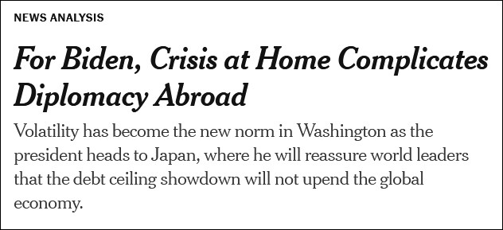
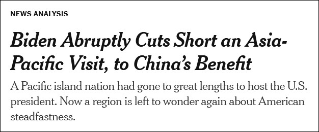

# 债务上限谈判紧迫，拜登缩短亚洲之旅，21国领导人被“放鸽子”

（观察者网讯）

美国国内债务危机阴影笼罩，拜登17日赴日本出席G7峰会前一天，白宫宣布缩短总统本次亚洲之行，提早返美协商债务上限事宜。从有18名成员国的太平洋岛国论坛，到美英日澳“四方安全对话”，原本计划好与拜登会面的20余国领导人这下都被“放了鸽子”。

《纽约时报》17日刊发分析称，这显示出美国国内政治不稳定性正在关键时刻、关键地区破坏其外交政策。美国民主党前资深议员、伍德罗·威尔逊国际学者中心主席简·哈曼直言，美国“最大的威胁是我们自己”。新加坡《海峡时报》17日援引专家说，缩减亚太行程的决定还将影响美国和拜登政府在亚洲的信誉。

_《纽约时报》新闻分析截图_

**“最大威胁是我们自己”**

美国民主、共和两党仍未就债务上限达成一致，拜登当地时间5月17日正式启程前往日本参加七国集团（G7）领导人峰会。《纽约时报》当天刊发新闻分析称，G7峰会的举行是为了“试图保持世界经济稳定”，“但事实证明，今年对全球经济稳定的主要潜在威胁是美国”。

白宫此前一天宣布，为“确保国会采取行动”避免联邦政府债务违约，拜登将在19日峰会结束后立即回国，取消之后原定访问南太平洋岛国巴布亚新几内亚（巴新）和澳大利亚的行程。白宫国家安全委员会发言人柯比16日将矛头直指共和党，称国内债务谈判波及总统在国际舞台上的表现，令人失望。

《纽约时报》17日另一篇新闻分析进一步渲染称，作为“首位访问太平洋岛国的美国现任总统”，拜登对巴新的访问原本“值得载入史册”。为了这次访问，东道主巴新动员了一千名安保人员，太平洋岛国论坛其他17国的领导人也纷纷出国参会，“只为与拜登会面几小时”。但如今，连同后续到澳大利亚参加“四方安全对话”在内，拜登G7峰会后的亚太行程全部告吹。

该分析认为，拜登取消后续行程意味着美国国内政治正在破坏美国的外交政策，还是在“关键时刻、关键地区”。该报的分析还称，长期的政府停摆、银行危机、债务上限之争甚至政治暴力曾经在美国是“不可想象的”，但自前总统特朗普上任以来，华盛顿的危机文化愈演愈烈，甚至成为了新常态，美国的盟友也对此“见怪不怪”。

“我认为我们最大的威胁是我们自己。”前加利福尼亚州民主党资深众议员、伍德罗·威尔逊国际学者中心主席简·哈曼说，“我们在世界上的领导地位正在被我们的内部失调所侵蚀。市场仍押注我们不会违约，但如果我们只是以繁重的预算上限为代价，设法挤出一个短期（债务上限）延期，我们将受到牵制。”

**中国“利用”美国留下真空？**

至于美国外交政策究竟将如何受制，《纽约时报》的两篇分析不约而同地将视线转向中国。约翰斯·霍普金斯大学全球事务教授哈尔·布兰兹声称，拜登提前回国的决定会加深人们对美国持久力的疑虑，而“中国会利用这一点，它向该区域国家发出的信息将是，‘你不能指望一个连基本治理都有障碍的国家’”。

除此之外，美媒还老调重弹起“中国在太平洋地区的影响力”。文章炒作称，中国在全球各地的外交使团比美国还多，而且主要集中在亚洲，中国企业在包括巴新在内的许多发展中国家的建筑和采矿业的参与度也越来越高，而华盛顿“最近才在亚太地区展开对抗中国影响力的布局”。文章引述分析人士宣称，拜登缩减行程加强了针对美国对亚太地区承诺的质疑，“留下了一个中国可能利用的真空”。

据此前报道，根据原定行程，拜登将于22日在巴新首都莫尔兹比港停留3个小时，并见证美国与巴新和密克罗尼西亚联邦签署新的战略安全协议。“不可否认，这是一个错失的重大机会。”兰德公司高级国防分析师德里克·格罗斯曼称，从某种程度上，拜登原计划对巴新的访问，比出席G7峰会、参加“四方安全对话”领导人会议都更重要，“这是一个为各种可能性打开大门的新机会——现在可能因为我们自己的国内情况正在关闭”。

针对美国所谓的与中国角逐影响力，中国外交部发言人毛宁此前曾回应指出，中方对各国同太平洋岛国发展关系不持异议。同时中方认为，各国同岛国合作的出发点应当是助力岛国的发展，不应该针对第三方。我们愿同有关各方一道，发挥优势，形成促进岛国发展振兴的国际合力。她强调，中国无意同任何人在太平洋岛国地区比拼影响力，也没有兴趣搞地缘争夺。

**新媒：此举损害美国在亚洲信誉**

对于准备齐聚莫尔兹比港与拜登会面的太平洋岛国领导人来说，还会有更多的挫败感。

去年，拜登政府在华盛顿主办了首届美国-
太平洋岛国峰会，这次在巴新的会议被白宫宣传为其后续会议。文章称，许多太平洋岛国领导人都就解决该地区生存威胁提出了具体要求，尤其是气候变化问题。

据英国《卫报》，巴新政府为这次会议足足准备了半年时间，还将22日设为公共假期，好让民众有机会一睹美国总统真容。据悉，拜登到访期间，该国原计划关闭领空和关键道路，并安排学生和文化舞蹈团体在拜登车队途径路上列队欢迎。在取消行程的消息传出前，巴新媒体《信使邮报》17日头条整版介绍了拜登来访期间安保措施。

_英国《卫报》报道截图_

美方官员则将拜登取消行程说成延后。美国驻澳大利亚大使馆在一份声明中称，“期待来年找到其他方式”与此次被“爽约”的领导人进行接触。不过，分析认为，美国总统大选即将起跑，拜登几乎不可能重新安排行程跑一趟南太。尽管白宫强调，最后一刻变卦并不反映承诺转弱，但是对于许多人来说，这种美式保证带着一股似曾相识的感觉。

1991年，时任美国总统老布什取消了为期两周的亚洲之行，以表明他专注于国内落后的经济。1995年联邦政府停摆期间，时任总统克林顿也取消了日本之行。奥巴马在2010年推迟了对印度尼西亚和澳大利亚的访问，以专注于推进“医改”。2013年他又缺席APEC峰会，以处理政府停摆。

文章称，从那时起，亚太国家尤其是南太岛国，对美国的疑虑一直没有平息，美国也“尚未证明它可以像中国的存在一样可靠和富有成效”。新西兰梅西大学安全研究高级讲师安娜·鲍尔斯对此表示：“信任是太平洋地区的圭臬，建立信任需要始终如一，靠得住、不缺席。”

新加坡《海峡时报》17日也引述专家指出，虽然这是为了美国国内紧急优先事项而做出的决定，但很可能伤害美国在海外的可信度。美国智库哈德逊研究所亚太安全事务主任帕特里克·克罗宁表示，了解美国政治的人会理解拜登的决定，但当美国连“现身”都做不到，美国形象将受影响。
美国企业研究所资深研究员扎克·库伯指出，这伤害的不仅是美国在亚洲的信誉，也是拜登政府在亚洲的信誉。

政治风险咨询公司欧亚集团美国董事总经理乔恩·利伯则认为，在美国国内政治两极分化的背景下，这似乎是一个无解的两难问题。“如果拜登在国内失去正当性，也无法在国际事务有所作为。”他说，“债务上限是一个关键问题，如果进展不顺利，可能会颠覆他的连任机会。不幸的是，这不可能不损害他的外交努力。”

**本文系观察者网独家稿件，未经授权，不得转载。**

