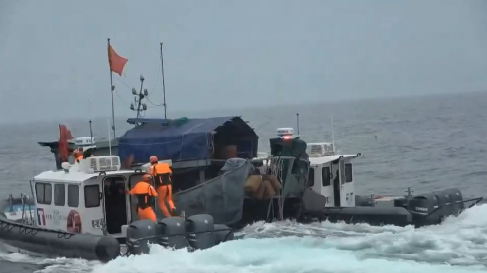

# 台媒：台当局又以“越界”为由查扣大陆渔船，5人被扣押

【环球网报道】台当局又以“越界”为由扣查大陆渔船。台湾联合新闻网18日报道称，台“海洋委员会海巡署”马祖海巡队17日在东引乡附近查扣一艘载有5人的大陆渔船，查获74.5公斤鳗鱼，除要求将鳗鱼全部抛入海里，还将人与船押到南竿乡留置调查。

_马祖海巡队5月17日查扣一艘大陆渔船。（图片来源：台湾“中央社”）_

台湾联合新闻网报道称，马祖海巡队18日称，17日中午12时许，马祖海巡队在东引的“禁止水域”查扣一艘“越界”大陆渔船“霞下浒水0323”，随即将渔船及船上5人押到南竿留置调查。报道称，由于东引距离南竿航程约60公里，海上押解历时6个小时。

据报道，台“海巡署”金马澎分署宣称，这次查扣的船舶来自福建省宁德市霞浦县，海巡将详细调查。

“越界”捕捞一直是台当局扣押大陆船只的惯用说辞。2022年1月，民进党当局曾以“越界”为由强行登上大陆渔船并扣押14名船员。国台办发言人朱凤莲此前曾表示，台湾有关方面应尊重两岸渔民长期在传统渔区作业的事实，立即停止用粗暴危险方式对待大陆渔民，停止抓扣大陆渔船，保证相关人员生命财产安全，尽速放人放船。

