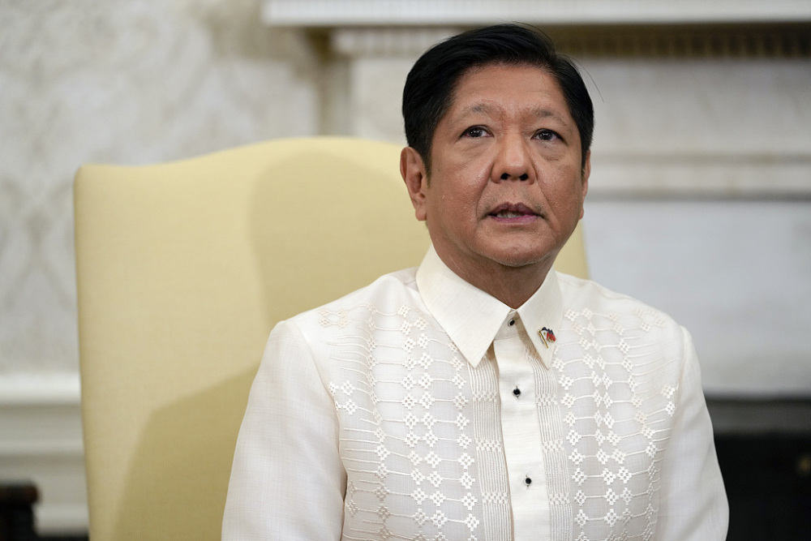

# 担心“中国切断菲电力供应”？菲国家电网再次否认中国“远程控电”

【环球时报驻泰国特约记者
景圆圆】据《菲律宾星报》报道，5月17日，菲律宾国家电网公司（NGCP）再次否认所谓“中国可以远程访问输电网”的说法。此前，菲律宾总统马科斯曾在一份声明中表示，政府将“在必要时”收回对菲律宾国家电网的控制权。

_菲律宾总统马科斯 资料图_

据《菲律宾每日问询者报》报道，在上周吕宋岛停电后，两名菲议员推动对菲律宾国家电网公司的国会特许经营权进行审查。参议员埃赫西托敦促政府用尽所有法律补救措施，重新获得菲律宾对该国能源传输系统的完全控制权。“任何涉及国家安全的公用事业，例如航空和电力分配，都应该在政府控制之下。”

公开资料显示，2009年中国国家电网公司与蒙特罗公司、卡拉卡公司三方共同组建了菲律宾国家电网公司，当年1月15日正式接管运营菲律宾国家输电网，其中，中国国家电网公司拥有菲律宾国家电网公司40%的股份。对此，参议院能源委员会担心“中国会切断菲律宾的电力供应”，这些参议员建议菲律宾政府收回该国电网的运营权。

实际上，菲律宾国家电网公司60%的股份都由一家菲律宾财团所有，这家私营电网运营商曾向参议员们保证，只有菲律宾人才可以经营他们的变电站。

菲律宾媒体报道称，菲律宾国家电网公司发言人阿拉班扎在一份声明中表示：“从我们获得特许经营权开始，我们一直本着透明原则履行责任。在输电网方面我们投资了3000亿比索（约合374亿元人民币），降低了输电转运费率，多年来还改善了输电服务。我们相信，如果有机会，这些努力将会得到认可。”

另外，参议院能源委员会副主席张侨伟认为，上周导致吕宋几个省大范围停电的输电线路跳闸只表明电网系统没有得到妥善维护。

自2009年项目运营以来，中国国家电网派驻技术管理团队，参与NGCP生产、运行、基建等各方面运营管理，和菲律宾当地合作方密切合作，按照规定的特许经营目标履行电网管理职责。但是早在2019年就有一些菲媒大力炒作，称中国可“遥控”切断电源。当时NGCP就否认了这种说法，称在日常运营中，中企的角色仅限于“技术顾问”。

5月17日，中国外交部发言人汪文斌就相关问题表示，菲律宾是中国的友好近邻和重要伙伴，中方支持中国企业合法依规在菲律宾开展务实合作，扩大互利共赢。

