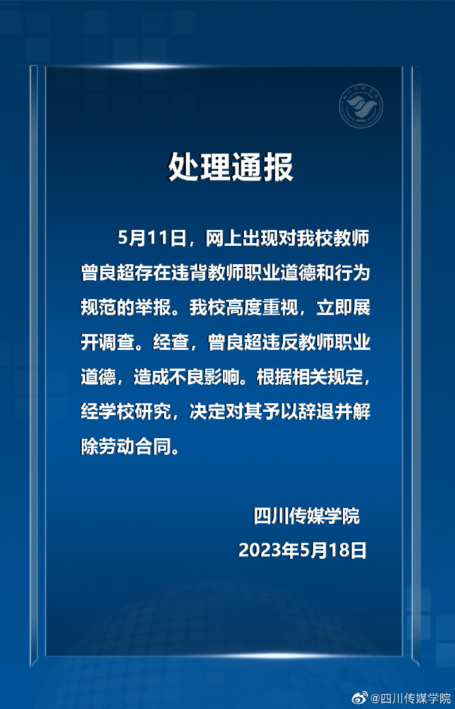

# 教师被妻子举报出轨多位女学生，四川传媒学院：辞退并解除劳动合同

四川传媒学院5月18日发布情况通报称，5月11日，网上出现对我校教师曾良超存在违背教师职业道德和行为规范的举报。我校高度重视，立即展开调查。经查，曾良超违反教师职业道德，造成不良影响。根据相关规定经学校研究，决定对其予以辞退并解除劳动合同。

**此前报道：**

四川传媒学院老师被妻子举报出轨多位女学生，学校回应：正联合调查

