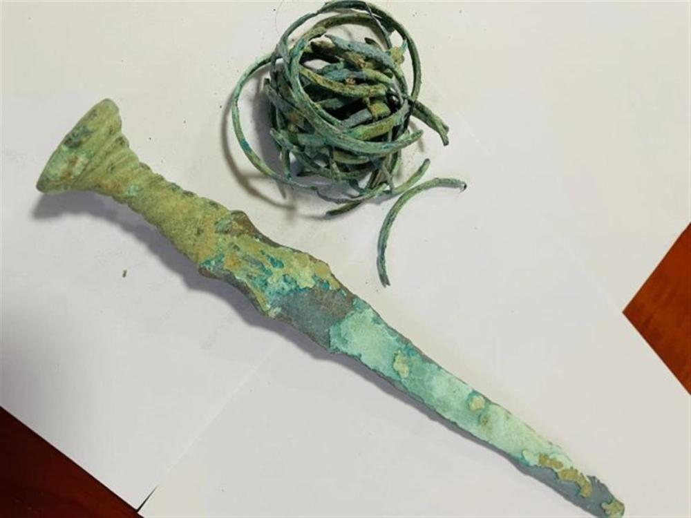
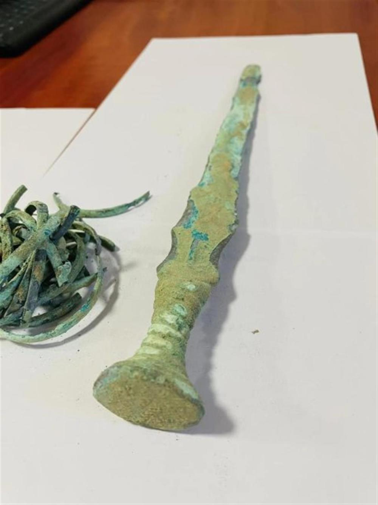
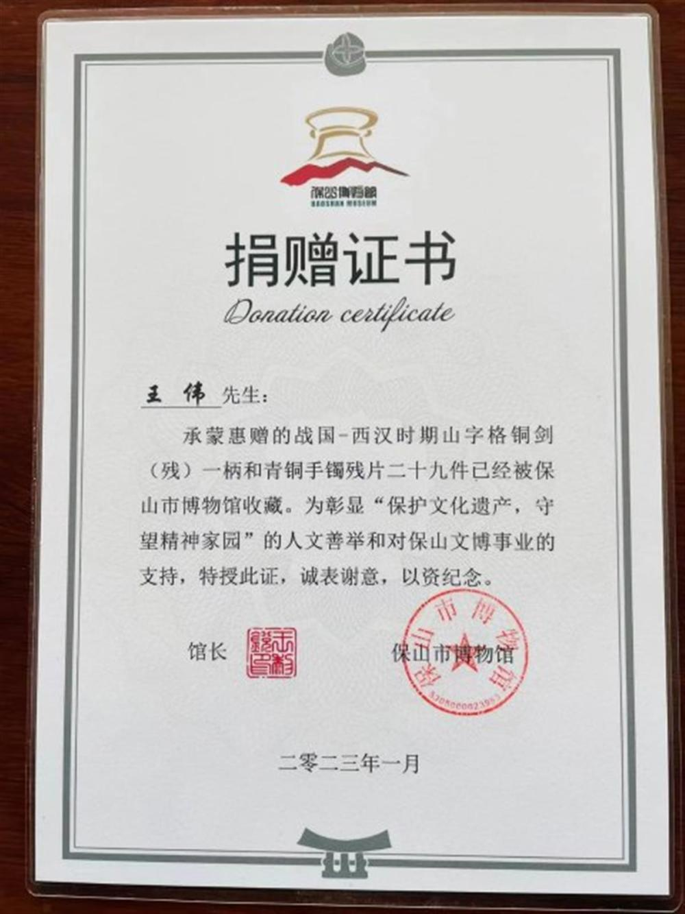

# 男子路边花5千多买到战国青铜剑，收藏一年后捐给博物馆获2千元补助

近日，因云南保山小伙王伟将一柄战国时期的古青铜剑和29件青铜手镯残片，捐赠给保山市博物馆，博物馆为其补办了一场捐赠仪式。

2021年底，王伟驾驶途中，遇到一个60多岁的老人在路边招手拦车，王伟便停下车。老人称想卖一样东西给王伟，从身后拿出一个帆布口袋，里面装着古青铜剑和青铜的残片。

_图源：春城晚报_

王伟说：“我问老人在哪里找的，他说在他家地里挖地的时候挖到的。我拿出来认真地看了一下，结合自己以前看的青铜剑和网上看到的图片。觉得这把剑应该是真的。”于是出价5600元买下了剑。

随后，王伟向一名做古玩的网友请教，网友看后回复他说这是真品。高兴之余，王伟偶然间从网上得知贩卖文物要判5年以下有期徒刑，情节严重的5年以上，便决定联系文物部门把古青铜剑捐了。

今年1月，经保山市博物馆鉴定，确认王伟捐赠的物品为：战国-西汉时期山字格铜剑（残）一柄和青铜手镯残片29件。

_图源：春城晚报_

5月15日，保山市博物馆为王伟补办了捐赠仪式。

“在完成捐赠的那一刻，我释然了，这件事困扰我一年多，现在终于完全放下了。”王伟说，曾有朋友问他花了5600元买的东西，捐了不是亏了吗？“我告诉他，不要说博物馆还给自己2000元的补助，就是一分钱没有我也愿意。”王伟说，通过这件事，也让自己认识到，作为一个收藏爱好者，一定要遵纪守法。

_图源：春城晚报_

（极目新闻综合春城晚报）

（来源：极目新闻）

