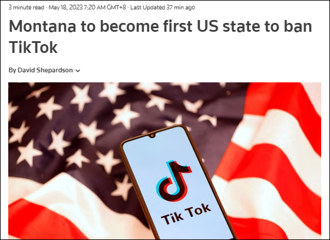
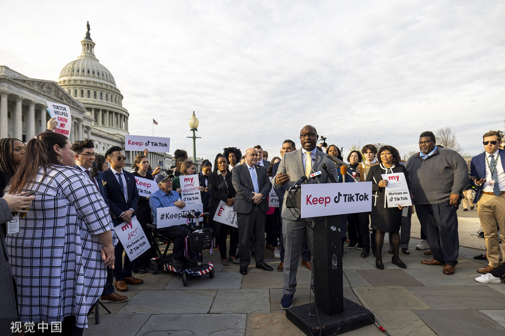

# 蒙大拿州成全美首个禁止TikTok的州，但遭批“违宪”

【文/观察者网 刘程辉】当地时间5月17日，蒙大拿州共和党籍州长格雷格·吉安福特（Greg
Gianforte）正式签署法案，禁止实体在全州提供TikTok下载，蒙大拿州由此成为全美首个彻底禁用TikTok的州。TikTok抨击该法案侵犯了宪法第一修正案赋予用户的言论自由权，还有美国行业学者预测该法案“几乎肯定”会因违宪而被推翻。

_路透社：蒙大拿州成全美首个封禁TikTok的州_

据路透社和美国哥伦比亚广播公司（CBS）报道，这项法案规定，谷歌和苹果公司的应用商店在蒙大拿州境内提供TikTok应用程序为非法行为，法案将于2024年1月正式生效。州长办公室在一份新闻稿中称，“处罚将由蒙大拿州司法部执行”，任何违法对象将为每次违规行为支付1万美元的处罚，而且违规期间每天还将额外罚款1万美元。

吉安福特在社交媒体推特上发文称：“为了保护蒙大拿人的个人和私人数据不受中国影响，我在蒙大拿州禁止了TikTok。”

上月中旬，蒙大拿州众议院二读通过了“封禁TikTok法案”，污蔑中国“意图收集该州民众和企业信息，以及用户的知识产权”；法案还妄称中国官方可指使TikTok“窃取用户数据和信息”，因此法案禁止下载TikTok；如果任何“实体”（应用商店或TikTok）为用户提供使用或下载TikTok的机会，则将面临罚款，但罚款不针对用户。当时就有媒体称“蒙大拿州接近成为第一个全面禁止TikTok的州”。

蒙大拿州人口超过100万，而TikTok在全美拥有超过1.5亿用户。

法案签署落地当天，TikTok发表声明回应说，该法案“非法封禁了TikTok，侵犯了第一修正案赋予蒙大拿州民众的权利。”声明指出，TikTok是一个让蒙大拿州数十万人行使言论自由权的平台，“我们想让蒙大拿民众放心，他们可以继续使用TikTok来表达自己和谋生，并找到社区，因为我们将继续努力捍卫蒙大拿州内外用户的权利”。

“蒙大拿民众在TikTok上发布和消费内容时，无疑是在行使他们的第一修正案权利。”哥伦比亚大学奈特第一修正案研究所执行主任贾米尔·贾弗（Jameel
Jaffer）在一份声明中表示，“因为蒙大拿州无法证明这项禁令是必要的，也无法证明它是针对任何合法利益制定的，所以这项法律几乎肯定会因违宪而被推翻。”

_3月22日，美国华盛顿特区，TikTok博主聚集在国会大厦外举行抗议可能的禁令/视觉中国_

其实早在封杀令起草阶段就有媒体预测，封杀TikTok的禁令可能会面临许多法律挑战，因为它违反了美国宪法第一修正案赋予用户的言论自由权。

今年3月24日，美国《纽约时报》曾发表题为《封杀TikTok有个问题，叫做宪法第一修正案》。文章指出，如果美国政府试图禁用TikTok这个重要的通讯平台，美国宪法第一修正案肯定会对此有所规定，政府必须满足宪法第一修正案最严格的审查，因为这一禁令的执行将是对TikTok潜在用户言论的预先限制。至少，政府必须表明禁令实质上与重要的政府利益有关。然而，美国政府是否能够证实这一全面禁令是为这些利益量身定制，这似乎值得怀疑。

《华尔街日报》4月26日发文称，除宪法第一修正案外，封杀令还将面临美国跨州商业活动和剥夺公民权方面的法律挑战，根据相关法律，美国政府不得在未经审判程序的情况下宣布某个实体犯有某种罪行。

近一段时间来，美国国内封禁TikTok的呼声“一浪高过一浪”，在联邦和州层面同时进行。

3月7日，由美国民主党参议员马克·沃纳（Mark Warner）和共和党参议员约翰·图恩（John
Thune）共同发起的，一份名为《限制危及信息和通信技术安全威胁出现法案》，简称“遏制法案”（RESTRICT
Act），将封禁Tiktok，违者有可能高达100万美元的罚款和20年监禁。

今年4月初，在共和党籍州长德桑蒂斯主政的佛罗里达州，当地多所公立大学被要求在校园网和公共设备中封杀包括TikTok在内的中国社交软件，而理由又是所谓的“保护数据安全”。

中方多次表示，美方在没有任何证据证明TikTok威胁美国国家安全的情况下，一再对有关企业搞有罪推定、无理打压。专业的问题应当通过专业的方式来解决，打压别人，不能让自己更强大。美方应当切实尊重市场经济和公平竞争原则，停止无理打压别国企业，为各国企业在美投资经营提供开放、公平、公正和非歧视的环境。

**本文系观察者网独家稿件，未经授权，不得转载。**

