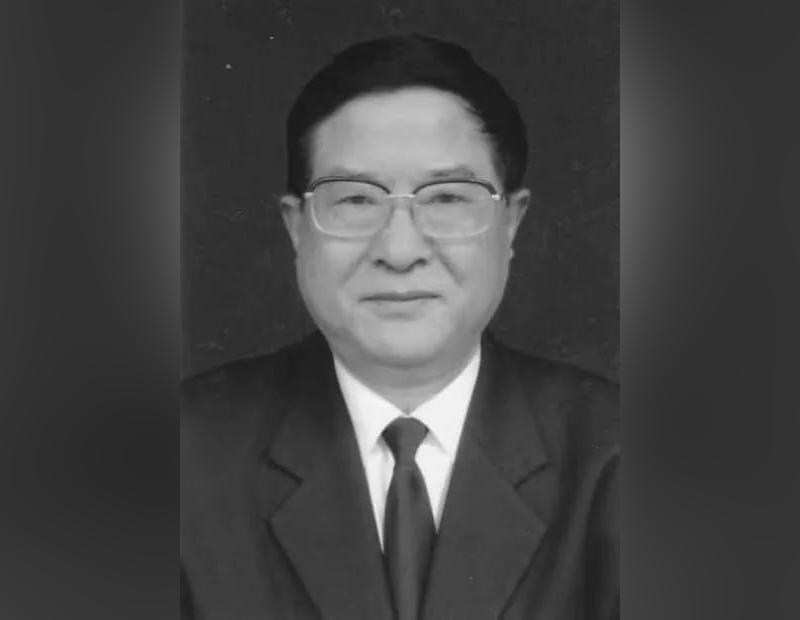

# 计算机战略科学家李思昆逝世，指导了三代战机和导弹被禁运关键芯片的研制

澎湃新闻记者从中国计算机学会方面获悉，计算机技术专家，国防科技大学计算机学院教授李思昆，于2023年5月14日在上海逝世，享年82岁。

公开资料显示，李思昆出生于1941年，
山东青岛市人，专业技术一级教授，博士生导师，文职一级，享受政府特殊津贴。他是中国电子设计自动化领域开拓者和学术带头人之一，国防科大计算机学院微电子方向奠基人，长期从事计算机辅助设计、集成电路设计、图形学、虚拟现实与可视化方面的研究。1965年12月于哈尔滨军事工程学院自动控制专业本科毕业后，留校任教，曾在哈尔滨军事工程学院计算机系、长沙工学院计算机系兼研究所、国防科技大学计算机学院从事科研与教学工作。

李思昆曾任中国计算机学会计算机辅助设计与图形学专业委员会副主任、中国计算机学会虚拟现实与可视化专业委员会副主任、中国人工智能学会理事、智能CAD专业委员会副主任、湖南省计算机学会理事、国防科大CAD研究中心主任、国防科大计算机学院研究室主任，银河系列工程主任设计师。获全国科技大会奖3项、国家科技进步一等奖2项、二等奖1项、三等奖1项，省部级科技进步一等奖7项、二等奖9项。获中国CAD与图形学2016年度突出贡献奖。荣立二等功2次、三等功3次。

在计算机辅助设计方面，李思昆是国内最早从事EDA方法研究和工具研发的学者之一，多次承担863、国家自然科学基金等项目，在自动布局布线技术、SOC设计方法学、软硬件协同设计、微处理器设计与验证、EDA算法与软件并行化等方面提出了创新方法，发表学术论文100余篇，出版了《数字系统并行CAD技术》等专著，为国内相关领域的技术与辅助设计软件奠定了基础。在集成电路设计方面，李思昆教授作为骨干和主任设计师，带领团队在国内最早完全自主设计实现了ARM指令集芯片，也是国际上首批开源微处理器。

李思昆教授视野开阔，战略前瞻性高，是国家泰山计划的主要撰稿人，指导了三代战机、导弹武器被禁运的关键配套芯片研制，是“飞腾”系列芯片的命名人，银河系列计算机咨询专家。

李思昆长期从事计算机辅助设计方面的教学工作，学风严谨，善于启发学生思维，鼓励学生创新，深受大家的尊敬和爱戴。培养的10多名本科生被保送到清华大学继续深造，培养指导硕士生、博士生、博士后及研究学者170多名。获军队教学优秀奖银奖1项，国防科技大学教学优秀奖一等奖1项、优秀导师奖3项。他所培养的学生许多已成为研究所、高等学校的业务骨干和学术带头人，有些已成为高科技公司创始人和带头人，在不同岗位上发挥着重要作用。

来源：澎湃新闻

