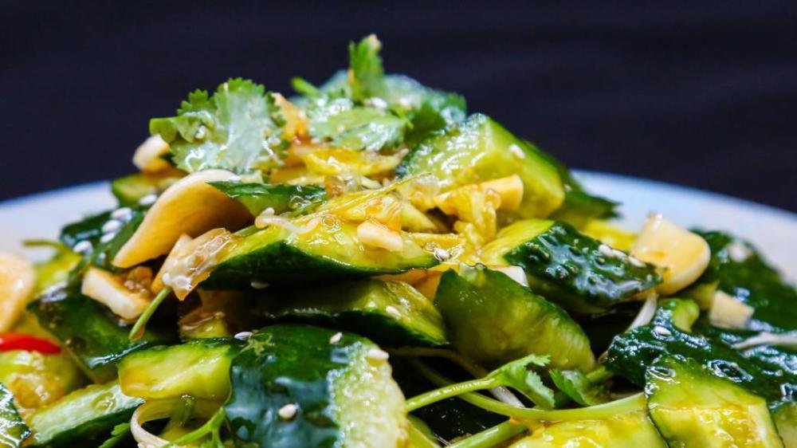

# 赔我几千块否则就举报！拍黄瓜如何变成“职业打假”最爱举报的项目

近日，湖南省株洲市餐饮行业协会公布的一份文件称，当地多家餐企向协会反映，当地一对晏姓父子利用餐企销售“拍黄瓜”等凉菜，通过频繁举报要求餐企高额赔偿，自2020年至今竟举报49次。某小餐馆的经营者刘某称，他家的菜单原本并没有“拍黄瓜”，晏某主动要求做一道“拍黄瓜”，没想到之后餐馆就被举报了。

其实，“拍黄瓜”的纠纷由来已久。去年7月，安徽合肥一餐饮店曾在外卖平台上售卖“拍黄瓜”，结果被处以5000元罚款，疑似是因为遭到“职业举报人”的举报。更早之前，2017年广州一家火锅店因为卖拍黄瓜被重罚1万元，引发舆论争议。

为什么小小一碟“拍黄瓜”屡屡引发轩然大波，成了“职业打假人”最爱举报的项目之一呢？

“拍黄瓜”看似是家家能做的家常菜，但在食品安全监管领域却属于特殊的品类——“冷食类食品制售、生食类食品制售”。拌黄瓜、盐水毛豆等夏季凉拌菜，因为不经过热加工，容易滋生细菌而变质，所以，市场监管部门对于“制售生食类食品”提出了更严格的要求，一般要求餐馆有一个不低于5平方米的制作凉菜的专间，具备二次更衣洗手的消毒设备。仅仅是5平方米的凉菜间，就把绝大多数的小餐饮店挡在合法经营“拍黄瓜”的外面了。

于是，这就形成了一个认知的严重落差：大家都以为“拍黄瓜”是家常菜，但是对没有取得冷菜经营许可的小餐馆，那就是违法行为。

此外，一些“职业打假人”兴风作浪，故意激化矛盾，浑水摸鱼。目前的一些职业打假人已经背离了监督商品、服务质量的初衷，转向“滥用技术规则”，以举报要挟商家，特别是小微企业就范，从中牟利。有的紧盯着商家广告里“最”“顶尖”“第一”等《广告法》禁止的极端字眼，有的紧盯一些初级农副产品的包装、标签问题，还有的就是针对小饭店的“拍黄瓜”下手。

老板夸口自家的栗子“最好吃”；农妇卖自家做的扣肉，没有标签；小饭店卖了“拍黄瓜”，这些行为是不是违法？当然是违法了。但是，违法情节有多重，社会危害有多大？老百姓心里自然有一杆秤，从相关新闻跟帖里就能读明白大家的态度。但是，因为这些违法行为，证据容易固定，认定标准比较简单，简直就是板上钉钉，非常易于被举报、易于被执法，成了执法舒适区。

因为有了这样的执法舒适区，结果这几项本不算严重的违法，就这么被筛选出来了，多年霸占新闻热榜，这也偏离了相关法律的立法初衷，也浪费了宝贵的执法资源、司法资源。

不是这些违法不应该管，而是行政资源要好钢用到刀刃上，不能被“职业打假人”牵着鼻子走，法律也不应该成为职业举报人的敲诈道具。

目前，《行政处罚法》明确的“轻微违法不罚”和“首违不罚”原则，成为依法妥善处理此类轻微违法的法律依据。这次株洲举报“拍黄瓜”的事，也得到稳妥的解决，株洲市优化营商环境中心组织市场监管局、餐饮行业协会以及被举报的餐饮企业代表，召开协调会，并就探索“首违免罚”的监管服务具体措施达成了共识。

走出执法舒适区，将执法资源投入到群众真正关心的急难愁盼的问题上，一定会收获群众的认可。

