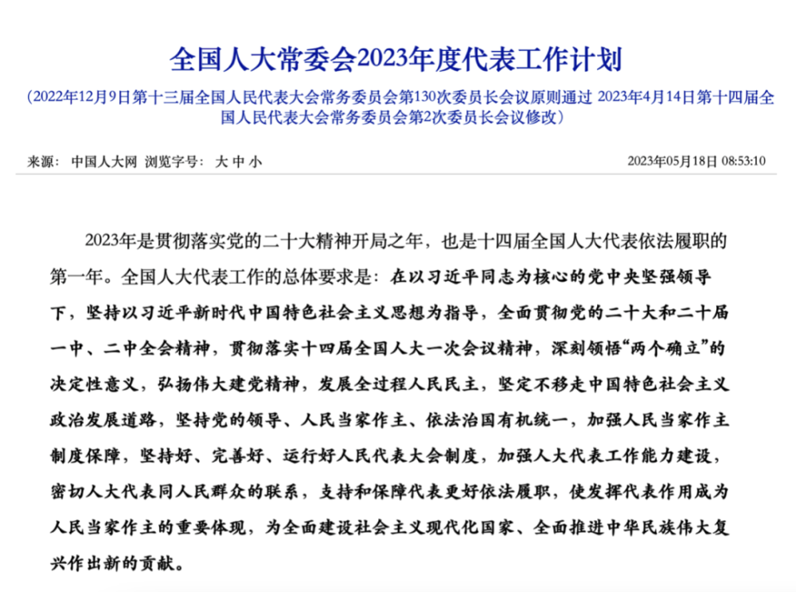
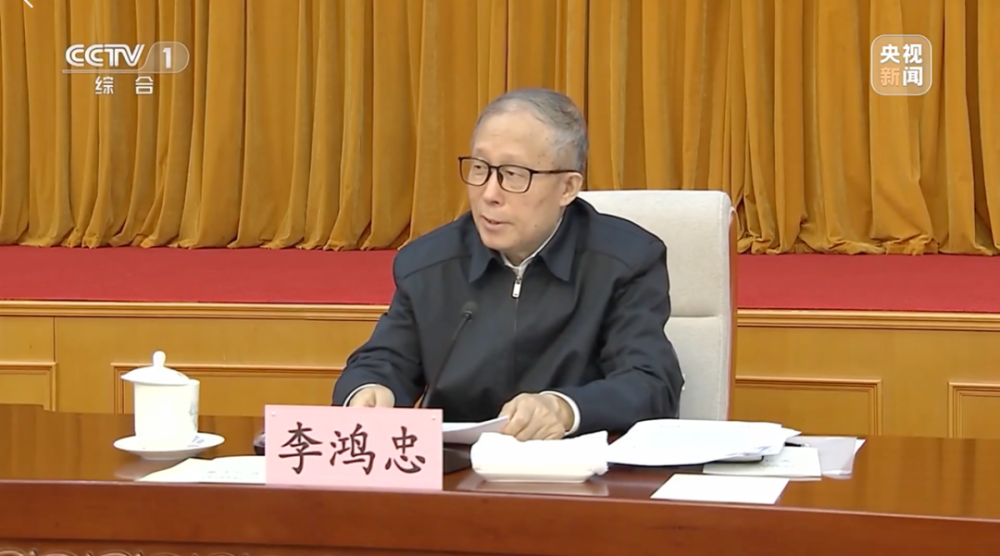
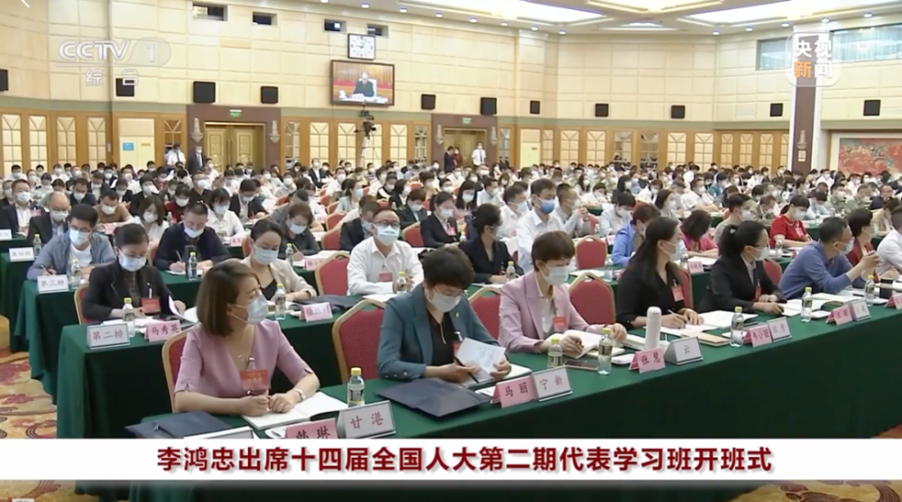
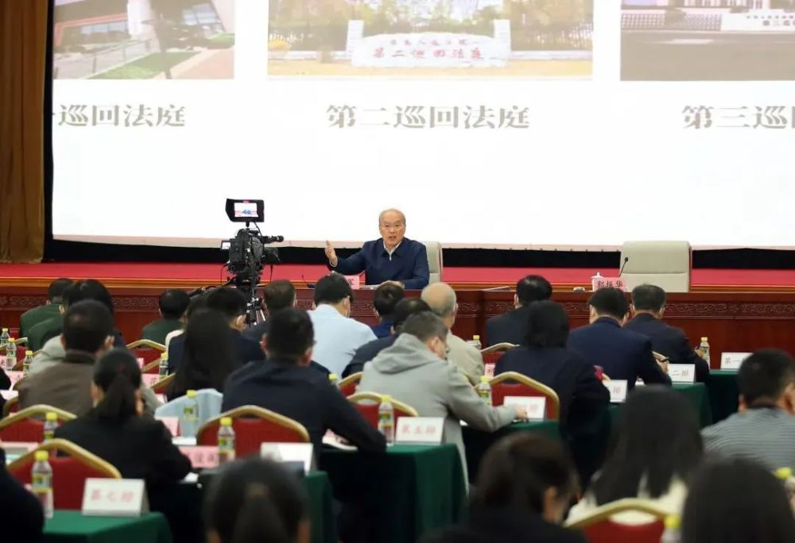
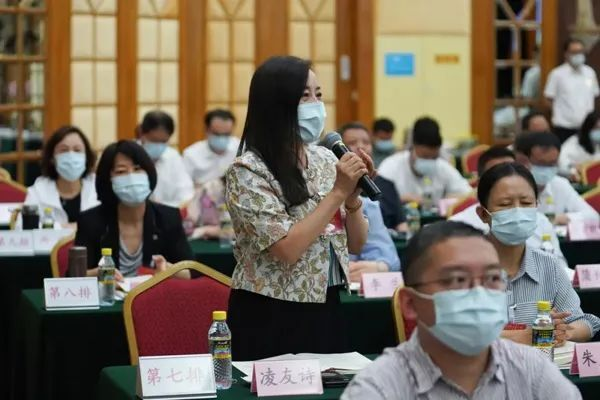

# 逾260人进京学习！李鸿忠出席开班式，张军作报告谈司法腐败问题

**撰文 | 余晖**

今天政知君关注的，是十四届全国人大代表学习班。

5月15日，十四届全国人大第二期代表学习班在京开班，中共中央政治局委员、全国人大常委会副委员长李鸿忠出席。

5月17日，最高人民法院党组书记、院长张军在学习班上作专题报告。

在现场，张军说，“对于司法腐败问题，法院和代表们一样，都感到非常痛心”“要把害群之马从法官队伍中清除出去”。

**李鸿忠出席开班式**

一个背景是，今年是十四届全国人大代表依法履职的第一年。官方数据显示，本届全国人大2977名代表中，新任代表超过70%。

就在5月18日，全国人大常委会2023年度代表工作计划对外公布。

工作计划显示，“ **举办4期代表履职基础学习班，组织1200余名代表参学** 。坚持集中学习培训重点向新当选的代表和来自基层的代表倾斜，
**争取实现新任基层全国人大代表履职基础学习全覆盖** 。”

目前，全国人大代表学习班已经举行了两场：

4月17日，十四届全国人大第一期代表学习班开班，来自33个选举单位的288名全国人大代表参加学习。

5月15日，十四届全国人大第二期代表学习班开班，来自33个选举单位的261名全国人大代表参加学习。

中共中央政治局委员、全国人大常委会副委员长李鸿忠出席了两次开班式。

央视披露了第二期代表学习班的现场画面：

在两次开班式上，李鸿忠都对人大代表提出了要求。

在第一期的开班式上，李鸿忠提到，全国人大代表 **要加强学习，站稳政治立场，忠实代表人民利益等。**

他说，要“密切联系群众， **大兴调查研究；担当作为，尽心尽力履行职责；自省自重，模范遵守宪法法律**
，为新时代发展全过程人民民主，坚持好、完善好、运行好人民代表大会制度作出贡献。”

谁来给全国人大代表讲课？

政知君了解到，在第一期学习班上，最高人民法院院长张军、最高人民检察院检察长应勇先后作了专题报告。

另外，全国人大宪法法律委主任委员信春鹰，全国人大常委会法工委主任沈春耀、预算工委主任史耀斌、副秘书长郭振华等也作了专题报告。

**对司法腐败问题，感到非常痛心**

最新的消息显示，时隔一个月之后，最高人民法院党组书记、院长张军再度去了全国人大代表学习班。

据最高法5月18日消息，5月17日，张军在十四届全国人大第二期代表学习班上作专题报告。

在作报告时，张军 **重点介绍了法院结合主题教育要求，深刻检视问题，抓实问题整改** ，推动理念创新、机制完善等方面的做法。

在现场，有一位香港代表提出了问题，“我是来自香港的代表，我调研了解到人民群众对于司法公正的质疑往往不是来自高层，而是基层法院，特别是司法腐败问题。请问最高人民法院是如何看待这个问题的？”

对此，张军说，“ **对于司法腐败问题，法院和代表们一样，都感到非常痛心。**
当前，我们正在结合学习贯彻习近平新时代中国特色社会主义思想主题教育开展干部队伍教育整顿，就是 **要把害群之马从法官队伍中清除出去。** ”

张军表示，“ **人民法院将始终牢记，反腐败永远在路上，也希望代表们能够一如既往监督我们，积极建言献策** 。”

值得一提的是，从这几年法院系统的反腐情况来看，落马的法院系统干部中，有不少人都曾插手司法活动。

比如，2022年3月被查的最高人民法院原党组副书记、原副院长沈德咏，就被指“罔顾党中央三令五申，大肆干预插手司法活动，从公平正义的守护者沦为法律秩序的践踏者，严重破坏司法公信力，对抗组织审查”。

再比如，2020年1月被开除党籍的安徽省高级人民法院原党组书记、院长张坚被指“执法犯法、以案谋私，大肆干预插手司法执法活动，甚至违规帮助涉黑涉恶罪犯减刑假释、再审改判”。

另外，2022年9月被开除党籍的内蒙古自治区高级人民法院原党组书记、院长胡毅峰，也被指“执法犯法、以案谋私，大肆干预和插手司法活动”。

张军还特别强调，“ **‘三个规定’落实不到位问题是人民法院主题教育专项整治的突出问题**
，希望各位代表能够监督我们落实好，帮助我们把队伍管好，把廉洁自律做实。”

“三个规定”是指中办、国办、中央政法委、“两高三部”等先后出台的《领导干部干预司法活动、插手具体案件处理的记录、通报和责任追究规定》《司法机关内部人员过问案件的记录和责任追究规定》《关于进一步规范司法人员与当事人、律师、特殊关系人、中介组织接触交往行为的若干规定》。

多说几句。

政知君注意到，张军在回答代表提问时，用了很多“接地气”的话语。

比如，他提到，“
**老百姓来法院打官司，首先要求的是公正，同时希望越快越好。法院不仅要实现实体公正，也要做实程序公正，程序公正本身就是实体公正的重要保障** 。”

张军说，“ **有人说迟到的正义不是正义，人民法院也在努力平衡把握公正与效率的关系，让当事人的权益能够及时得到保障** 。”

**资料｜新华社 人民网 最高人民法院官网等**

**【版权声明】本文著作权归政知新媒体独家所有，未经授权，不得转载。**

