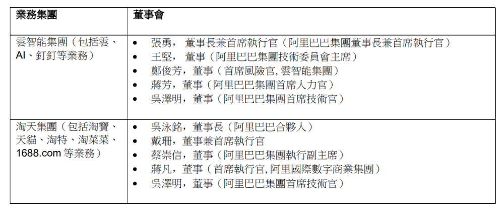
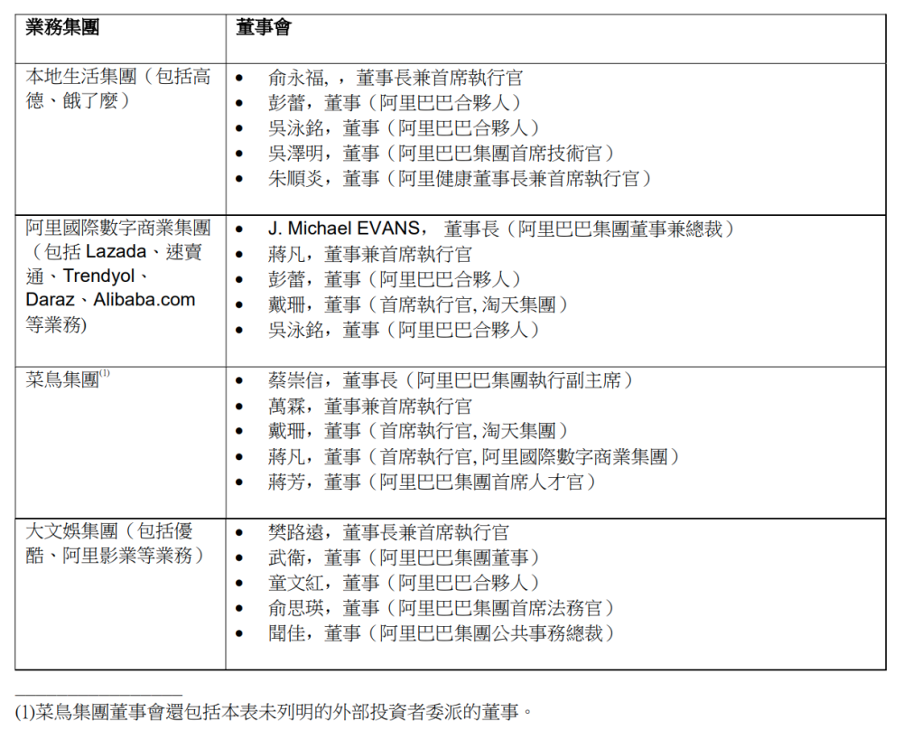

# 阿里2023财年第四财季营收2082亿元 同比增长2%

腾讯科技讯
阿里巴巴今日发布了截至2023年3月31日的2023财年第四季度及全年财报（编者注：阿里巴巴财年与自然年不同步，从每年的4月1日开始，至第二年的3月31日结束）。财报显示，该公司第四季度营收为2082亿元（约合303.16亿美元），同比增长2%；净利润为219.96亿元（约合32.03亿美元），而去年同期净亏损为183.57亿元。不按美国通用会计准则（Non-
GAAP），净利润为273.75亿元（约合39.86亿美元），同比增长38%。

2023财年，阿里巴巴总收入为8686.87亿元（1264.91
亿美元），同比增长2%；净利润为655.73亿元（95.48亿美元），同比增长39%，不按美国通用会计准则计算，净利润为14.13.79亿元（205.86亿美元），同比增长4%。

阿里巴巴董事会已批准探索菜鸟智能物流集团的IPO进程，并执行盒马鲜生的IPO。目标在未来12至18个月内完成菜鸟智能物流的首次公开募股。预计盒马鲜生的首次公开发行计划将在未来6至12个月内完成。

此外，阿里巴巴董事会批准了云智能部门的分拆。（中文同传｜阿里财报业绩电话会：菜鸟、盒马、阿里云启动上市）

**阿里巴巴第四财季及全年财报业绩要点：**

\- 第四财季，阿里巴巴中国商业营收1360.73亿元，同比下滑3%。该业务全年营收5827.31亿元，同比下滑1%。

\- 第四财季，阿里巴巴国际商业营收185.41亿元，同比增长29%。该业务全年营收692.04亿元，同比增长13%。

\- 第四财季，阿里云第四季度收入185.82亿元，同比下滑2%。该业务全年营收772.03亿元，同比增长4%。

\- 第四财季，阿里本地生活营收125.49亿元，同比增长17%。该业务全年营收501.12亿元，同比增长12%。

\- 第四财季，阿里巴巴数字媒体和娱乐业务营收82.73亿元，同比增长3%。该业务全年营收314.82亿元，同比下滑2%。

\- 第四财季，阿里巴巴第四季度菜鸟收入136.19亿元，同比增长18%。该业务全年营收556.81亿元，同比增长21%。

\- 第四财季，阿里巴巴创新及其他业务营收5.63亿元，同比增长47%；该业务全年营收22.74亿元，同比下滑20%。

**架构重组**

2023年3月28日，阿里巴巴宣布了新的组织和治理架构，目的是推动各项业务更加敏捷，让决策链路变短，更快响应市场变化，通过抓住各自市场和行业机遇，进一步释放股东价值。

**业务集团董事和首席执行官**

新架构下，阿里巴巴集团作为控股公司持有六大业务集团和其他业务公司。六大业务集团由各自的首席执行官和董事会（或同等管理机构）独立运营。业务集团的董事和首席执行官人选由阿里巴巴集团董事会批准任命。

阿里巴巴集团董事会批准的六大业务集团的董事和首席执行官为：

**资本管理委员会**

阿里巴巴董事会批准新设资本管理委员会，负责筹划实施全面的资本管理，提升股东价值。该委员会将审议并决策与阿里巴巴集团作为控股公司相关的重要事项，包括各类资本市场交易、股东回报计划、子公司股权激励计划、融资、上市和分拆。该委员会由董事长兼首席执行官张勇担任主席，成员包括董事兼执行副主席蔡崇信、董事兼总裁
J． Michael Evans 和董事及前首席财务官武卫。

**股份回购**

本季度继续执行股份回购计划。截至3月31日季度，以约19亿美元回购了约2150万股美国存托股（相当于约1.724亿股普通股）。

截至2023年3月31日，阿里巴巴流通的普通股为约205亿股（相等于约26亿股美国存托股）。在目前授权下，有约194亿美元回购额度，有效期至2025年3月。

