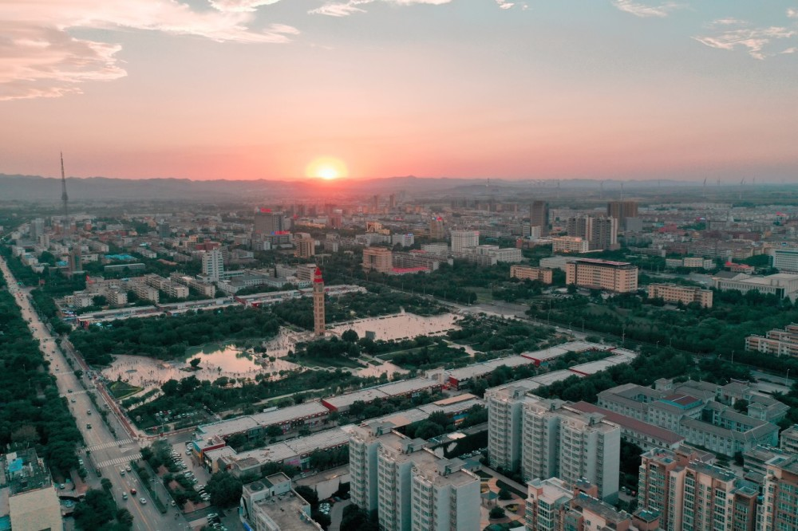
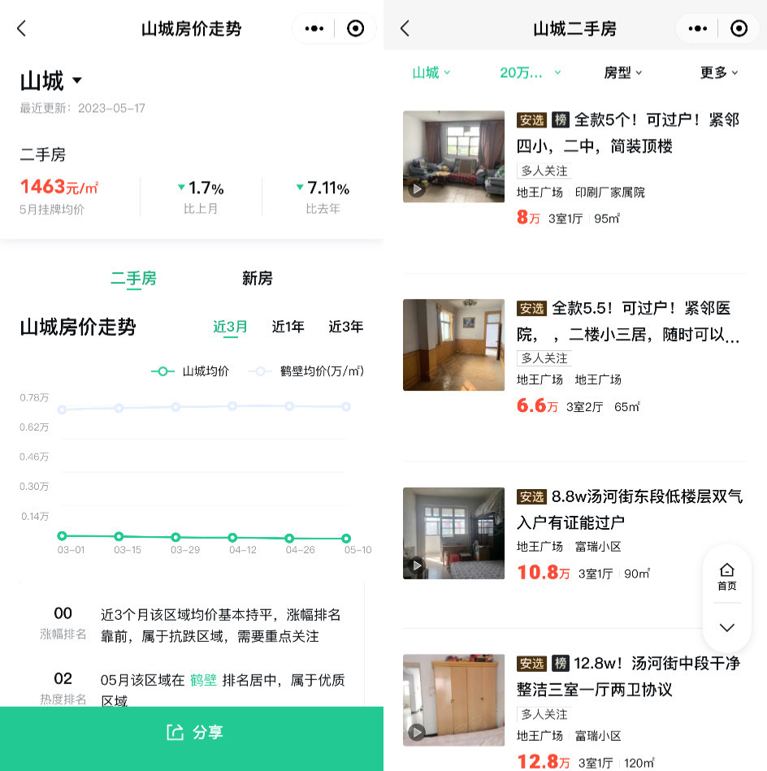
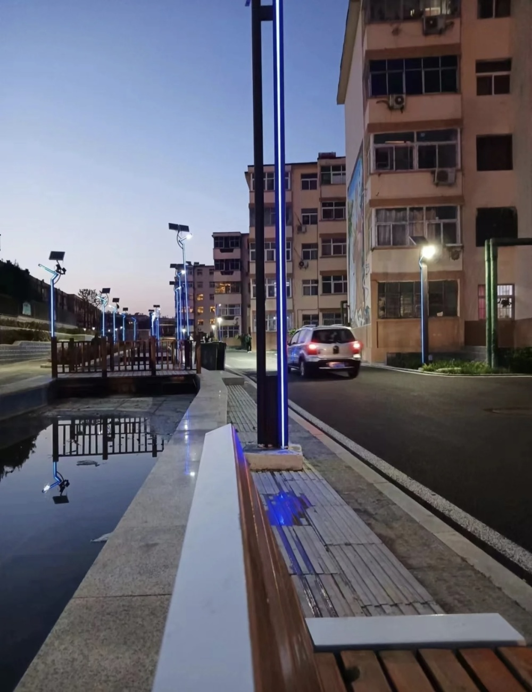

# 鹤壁“10万元买8套房”走红：当事人已买14套，中介电话接爆但零成交

本文来源：时代财经 作者：王莹岭

豫北小城鹤壁最近有点火。

起因是一则“10万元买8套房”的消息，成功引起了大家的关注。当事人北京市民丁乐告诉时代财经，目前为止，他已经在鹤壁山城区、鹤山区拥有了14套房子，最贵的近8万，最便宜的则是2020年在鹤山区“捡漏”买的1000元一套的房子，“是一栋二层小楼的顶楼，没水没电没燃气，屋顶还漏水，至今还放在那里没怎么动过。”

5月17日，山城区的房产中介洪丽告诉时代财经，这两天从各地打来的咨询电话明显增多了，一天有二十几人咨询买房，以前从没有见过这样的“盛况”，“还有大学生觉得好奇，打电话来问，不过目前为止还没有成交，外地咨询的客人也还没来实地看房。”

对于鹤壁本地人不买老区房子、老区房子卖不出去，洪丽是不认同的，“其实老区没有网上传得那么破，本地人还是有买房的需求的，有很多下面的乡镇或者村里来买房的，有些人则是为了陪读才买房。”

另一位中介吕辉则和洪丽不同，从5月16日起，就已经接待了不少来自外地的客户，“河南周边、河北、北京、山东的都有，都是慕名前来看房的。”

5月17日，鹤壁公布了最新购房补贴政策，每套最高补贴1万元。据鹤壁融媒，鹤壁市2023住房博览会于5月19日至5月21日在市会展中心广场举办，在住博会期间买房每套可最高补贴1万元。

不过，住博会主推的是鹤壁精品特色楼盘项目，或与老区的“白菜房”无关。

_图片来源：图虫创意_

**鹤壁“买房如买菜”走红背后**

丁乐告诉时代财经，自己买房的时候“不怎么挑”，看对眼了就“买着玩玩”，“到后来有些是中介说要冲业绩了，让我帮着买一套，我觉得挺便宜的，就又买了几套”。

不过，丁乐说，房价极低的现象仅在鹤壁的老区——山城区、鹤山区才有，新区淇滨区还是正常的房价水平。

据某二手房交易网站显示，截至5月17日，鹤壁全市二手房挂牌均价为7831元/平方米，其中，“新区”淇滨区二手房均价为7555元/平方米，而“老区”山城区二手房均价则仅为1463元/平方米。此外，鹤壁全市新房均价4967元/平方米，比去年下降6.79%。

此外，时代财经在该交易网站看到，在山城区，单价700元、800元/平方米的房源为最多数，总价最高的一套房则为50万，单价不到3000元/平方米。

**新、老城区之间为何会出现“天壤之别”？**

鹤壁市政府官网资料显示，鹤壁现辖浚县、淇县、淇滨区、山城区、鹤山区5个行政区和鹤壁国家经济技术开发区、市城乡一体化示范区、宝山经济技术开发区3个功能区，是中原城市群核心发展区14个城市之一。

其中，鹤山区和山城区是最初因煤而兴的老城区，被当地人称为“老区”，而以淇滨区为代表的部分区域则被称为“新区”。

“老区以前是因煤矿而兴起的，是鹤壁市原来的市中心，后来资源慢慢枯竭，新区开发好后，大多数人都流入了新区，房价自然就便宜了。”在老区土生土长的吕辉告诉时代财经。

据鹤壁日报，2001年12月26日，鹤壁市人民政府驻地从山城区迁至淇滨区，同时鹤壁市郊区也更名为了鹤壁市淇滨区。

鹤壁新区则是在淇滨区基础上发展而来的新中心。2012年7月30日， 河南省委常委会研究通过《鹤壁新区建设总体方案》，同年9月28日，鹤壁新区奠基仪式举行。

随着城市空间结构的调整，人口也随之流动。

本地人刘伊告诉时代财经，周围人从“老区”转移到“新区”的不在少数，“基本都是在2010年前后搬的，有人因为工作单位迁到了新区，一家人就搬过来了，有人则是因为有好学校搬家。”

“新城区和老城区不是连在一起的，走快速道的话，开车都要二三十分钟，很多人搬到新区后就很少再去老区了。”刘伊补充道。

人口普查的数据也印证了这样的人口流向。从全市看来，人口流失并不严重，但城市内部各区之间的人口流动则十分明显。

鹤壁市第七次全国人口普查公报显示，2020年，全市常住人口为 156.6万人，与2010年相比，减少3127人，下降0.20%。

与2010年第六次全国人口普查相比，鹤山区减少68700
人，山城区减少75503人，浚县减少40564人，淇县减少6827人，而作为“新区”的淇滨区则增加188467人，几乎承接了“老区”和县城转出的全部人口。

_丁乐在鹤山区的一个小区内买了三套房，以前是矿区家属院，受访者供图_

**鹤壁不是鹤岗**

鹤壁老区低房价的“出圈”，再度引发了房产“鹤岗化”的讨论。

和鹤岗一样，鹤壁也是一座因煤而兴的城市。

1956年，党中央、国务院决定在全国新建一批工业城市，当时鹤壁集地区尚被称为鹤壁矿区，归属现安阳市汤阴县管辖，拥有丰富煤炭资源的鹤壁矿区已经建成了一矿、二矿、三矿、四矿。

1957年3月26日，国务院正式批准建立鹤壁市，鹤壁至此“以煤立市”。

统计年鉴显示，1995年，鹤壁市的原煤产量就已突破千万吨，在2005年的巅峰时期，原煤产量曾达到1224.9万吨。

不过，2009年至2014年间，煤矿的颓势开始显现。原煤产量逐年下降，从上千万吨，骤降至600万吨。据2022年鹤壁市国民经济和社会发展统计公报，到了2022年，原煤产量就仅有300.1万吨，同比下降17.2%。

鹤壁市正在努力摆脱一个资源型城市的标签。公开报道显示，鹤壁这些年一直在推进产业转型。

据国家发改委，2021年，鹤壁市煤炭产业占工业比重下降至5.1%，高新技术产业占比达到47.7%，数字经济核心产业增加值占比居河南省第2位。2023年鹤壁市政府工作报告还强调了，“煤炭产业占比稳步下降”。

GDP方面，从2012年到2022年，鹤壁GDP总量从544.7亿元增加到1107.44亿元，接近翻倍。虽在河南省内排名第17，位列倒数第二，但人均GDP在全省排名均处于第7名，位列中上游。

对比同样是煤炭资源型城市起家的鹤岗，2021年原煤产量达到1046.7万吨，增长3%，洗煤产量达754万吨，增长22.2%。尽管今年一季度GDP增速达到8.5%，排名黑龙江全省第一，但不少分析将其归结为“家里又找到了矿”——石墨。

易居研究院总监严跃进对时代财经指出，鹤壁和鹤岗还是有差异性的，“应该说它的问题严重程度要小很多，鹤壁还是因为当地房产市场的支撑力和吸引力不够。”

同时，严跃进指出，“此次购房者购房后作为仓储使用，恰也说明房源的利用有了新的用处。地方政府要从此类热搜事件中挖掘新的机会，比如说宣传低房价、低生活成本的优势，积极导入各类新产业和新资源。”

“各地对于此类老旧二手房的再利用应该有更好的规划，要系统对此类存量住房进行盘活，进而培育城市发展的新价值和新的机会。”严跃进建议道。

（文中采访对象丁乐、洪丽、吕辉、刘伊均为化名）

