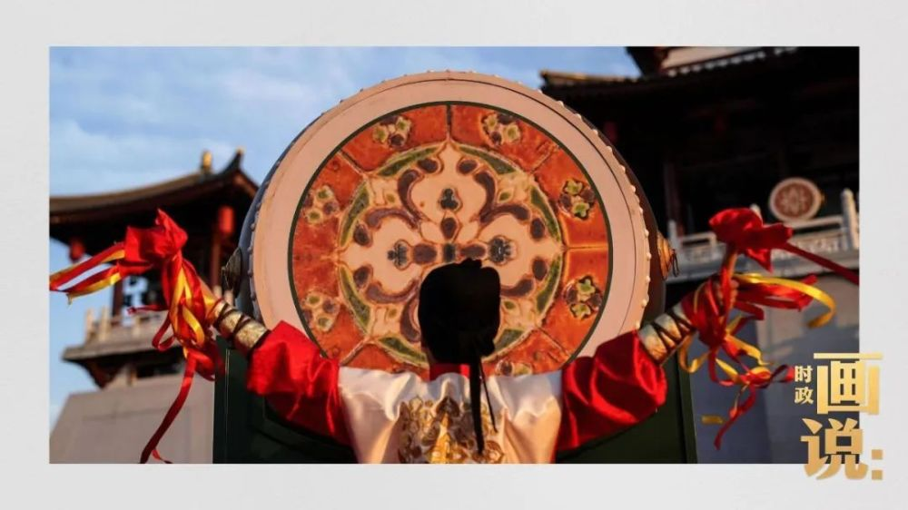
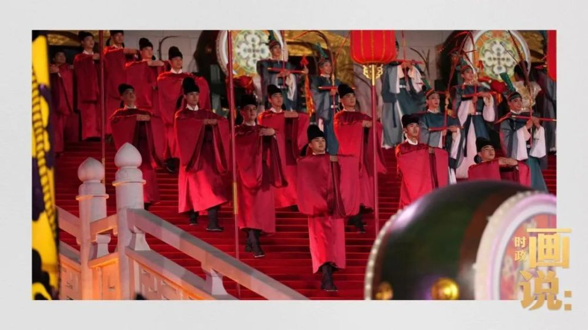
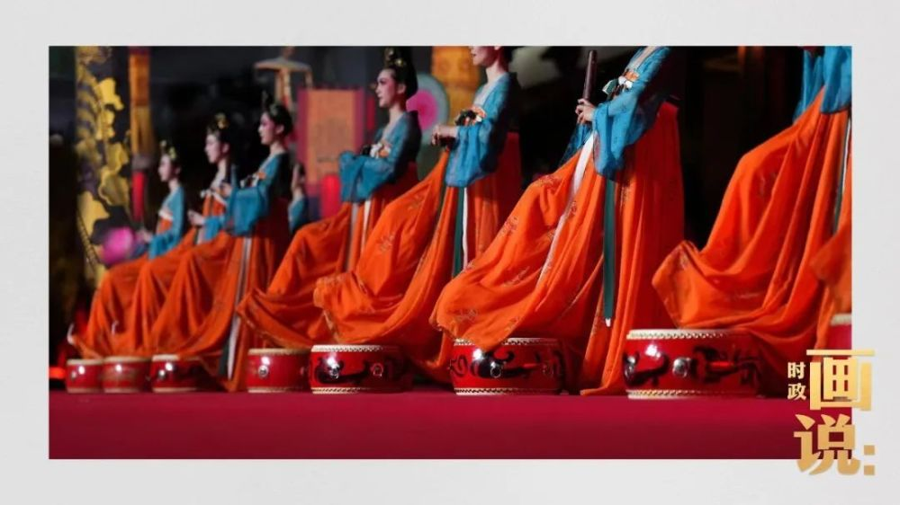
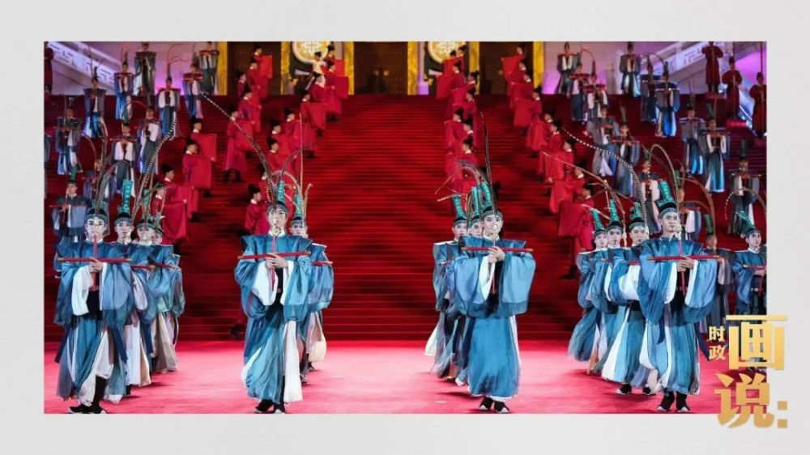

# 31年来首次举办！最高规格的欢迎仪式上，这个细节很特别

**撰文 | 董鑫**

5月18日至19日，中国—中亚峰会在陕西省西安市举行。

这是中国和中亚五国建交31年来，六国元首首次以实体形式举办峰会，也是今年中国首场重大主场外交活动。

18日晚，习近平主席和夫人彭丽媛为出席中国－中亚峰会的中亚国家元首夫妇举行欢迎仪式。

政知道注意到，这场欢迎仪式在地点选择、形式设计上都独具特色，传递深意。

**细节一**

**大唐芙蓉园**

欢迎仪式地点在大唐芙蓉园。

这是一座在唐代芙蓉园遗址以北、仿照唐代皇家园林式样重建的大型文化主题遗址公园，位于陕西西安城南、毗邻大雁塔，全方位展示了盛唐风貌。

紫云楼是大唐芙蓉园最主要的仿唐建筑群之一，18日晚的迎宾表演就是以紫云楼为背景。

在唐朝鼎盛时期，西安曾经汇聚了来自各国的商旅，是当时全世界最繁华的国际大都市之一，也是中国和中亚、西亚乃至欧洲贸易往来的重要枢纽。

两千多年前，西安是古丝绸之路的起点，伴随着驼铃声，丝绸之路从这里绵延万里，连接起中国与中亚的友好交往。

两千多年后，“驼铃”变“汽笛”，西安依然是中国和中亚经贸往来的枢纽。

2022年全年，中欧班列长安号开行量达到4639列，创年度开行量新高，西安成为全国中欧班列开行城市中首个年度开行量突破4600列的城市；2023年至今，在不到5个月的时间里，西安在全国率先实现通航全部中亚五国。

据中国海关统计，今年前4个月，我国与中亚五国进出口1730.5亿元，同比增长37.3%。尤其是4月当月，我国与中亚五国月度进出口规模首次突破500亿元，达到502.7亿元，迈上了新台阶。

具体到陕西省。

近两年，陕西与中亚五国外贸进出口呈现较快增长态势，年均增长31.1%。2022年，陕西与中亚五国货物进出口总额达到20.85亿元、增长32.5%。中亚五国也已成为陕西对外投资合作的重要伙伴，截至2022年底，陕西省18家企业对中亚五国累计投资8.2亿美元，占全省对外投资总额的15.1%。

**细节二**

**“大唐盛礼”**

据新华社和央视新闻报道，18日当晚迎宾表演以“大唐盛礼”为主题，复原唐朝时期迎宾礼仪，以传统文化之“礼”，迎远道而来之“宾”。

这样独具中国传统和特色的迎宾仪式，在近些年来中国主场外交活动中并不多见。

仪式中的“唐”元素很多。

现场有八面大鼓，鼓的颜色来源于唐三彩的花纹，也就是宝相花纹。

宝相花是中国古代传统装饰纹样的一种，集合了莲花、牡丹、菊花的特征，包含了花瓣、花苞、叶片的完美变形，在唐代是非常流行的装饰题材，被广泛地使用于各种丝织品、工艺品及建筑装饰上，含有吉祥、美满的寓意。

迎宾表演中身着唐代红色官服的男子，双手平伸，指尖交错，左手在外，掌心向内，举手至额，欠身行礼，以中国传统的“天揖礼”表达对宾客的敬意。

迎宾表演中的“芙蓉花舞”，创意取自唐诗“清水出芙蓉”，通过芙蓉花开绽放起舞，呈现出“曲水映芙蓉，相聚在长安”的美好场景。表演还引用了唐代乐伎盘鼓舞的元素，踏鼓、拍板等。

**细节三**

**佾舞**

佾（yi，四声）舞是中国五大古礼之首，作为国礼流传千年至今。

古代乐舞的行列称为“佾”，佾舞有“二佾”、“四佾”、“六佾”、“八佾”之分。“八佾”为规格最高，即每行八人，共八行六十四人。

此次迎宾仪式现场跳起的“八佾舞”就是规格最高的礼仪舞蹈。央视新闻报道说，这也是我们用最高礼仪迎接中亚五国远道而来的友人。

表演中，“八佾舞”的演员们着墨绿、朱红两色中国最具代表性，最富丽色彩的简化唐制汉服出场，左手横拿“籥”（yue，四声）、右手直拿“翟”，籥翟结合，展现“仁义礼智信”的精神特质。

**值得一提的是，这场在“陆上丝绸之路”起始地跳起的舞蹈还与“海上丝绸之路”有密不可分的关系。**

2021年6月，佾舞入选第五批国家级非物质文化遗产代表性项目名录，申报地区就来自福建。

北宋时期，福建福清籍乐师刘诜主持制订的《大晟乐》被宋徽宗钦定为国家正统音乐，颁行天下。《大晟乐》中，对唐宋以来佾舞的程式、动作等乐理和乐制进行了系统梳理总结，成为后世各代礼乐制度的典范。

清代后期，福建闽县（今福州）人王元穉受命赴台传礼，佾舞传入台湾。自1893年以来，佾舞在闽台两地的交流中得以存续，至今已有130年的历史。

2015年，福清佾舞团作为“海上丝绸之路”的代表文化元素，应邀赴泰国、柬埔寨参加“中国福建周”和澳门“福建文化节”，这也是佾舞首次赴境外表演。

从古丝绸之路的起点携手再出发，中国-中亚合作未来可期。

**资料｜新华社、央视新闻、陕西日报、东南网等**

**【版权声明】本文著作权归政知新媒体独家所有，未经授权，不得转载。**

