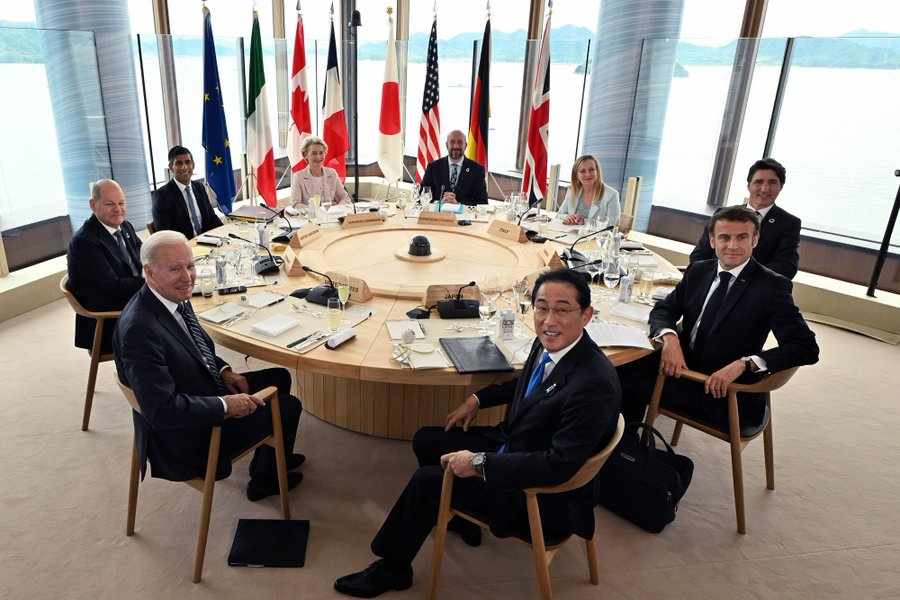

# G7广岛峰会宣布同意对俄实施新制裁，俄方此前已发出警告

【环球网报道 记者
张晓雅】法新社最新消息称，七国集团(G7)领导人当地时间19日在广岛峰会期间宣布，同意对俄罗斯实施新制裁。早在4月底，就有外媒披露G7酝酿“近乎全面禁止对俄出口”，俄方当时警告此举只会加剧全球经济危机风险。

法新社报道说，G7领导人称新的制裁将“使俄罗斯无法获得用于支持其战争机器的G7国家技术、工业设备和服务”。制裁措施包括限制“在战场上对俄至关重要”的物品出口以及打击被控帮助俄罗斯向前线运送物资的实体等。

_七国集团峰会于5月19日至21日在广岛举行。
图自日本首相岸田文雄社交平台_

美国彭博社、日本共同社等多家媒体今年4月21日报道称，以美国为首的西方国家考虑近乎全面禁止对俄出口。这些报道披露，G7官员将在5月19日至21日召开广岛峰会前就对俄全面加码的提案进行讨论，目的是拉拢欧盟各个成员国，一同削弱俄罗斯的经济和军事实力。对此，俄罗斯迅速作出回应。俄罗斯《消息报》当时报道称，俄总统新闻秘书佩斯科夫表示：“我们知道美国和欧盟都在积极考虑新的制裁。我们认为，这些新的额外措施，肯定会打击全球经济。这只会加剧全球陷入经济危机的风险。”

