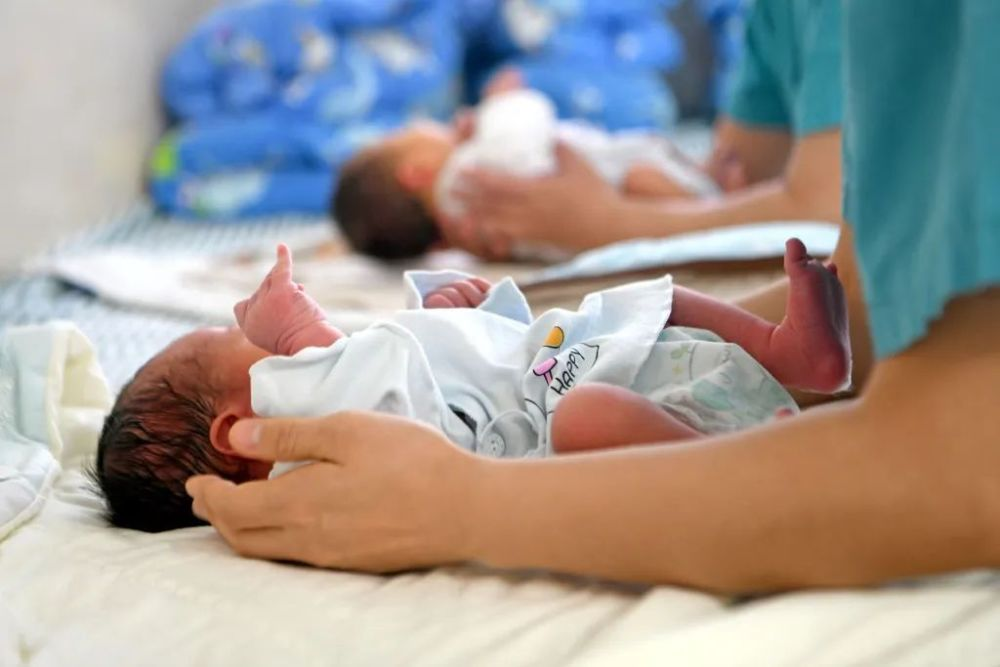
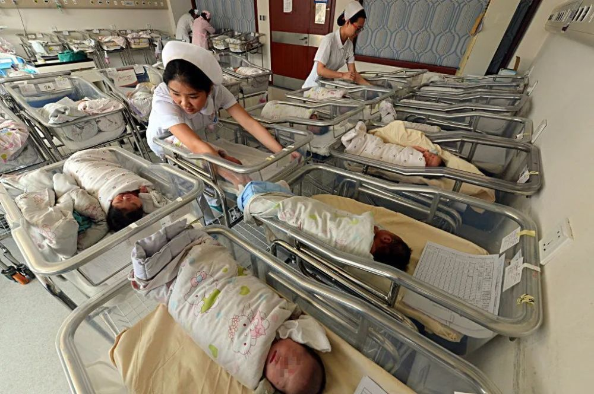
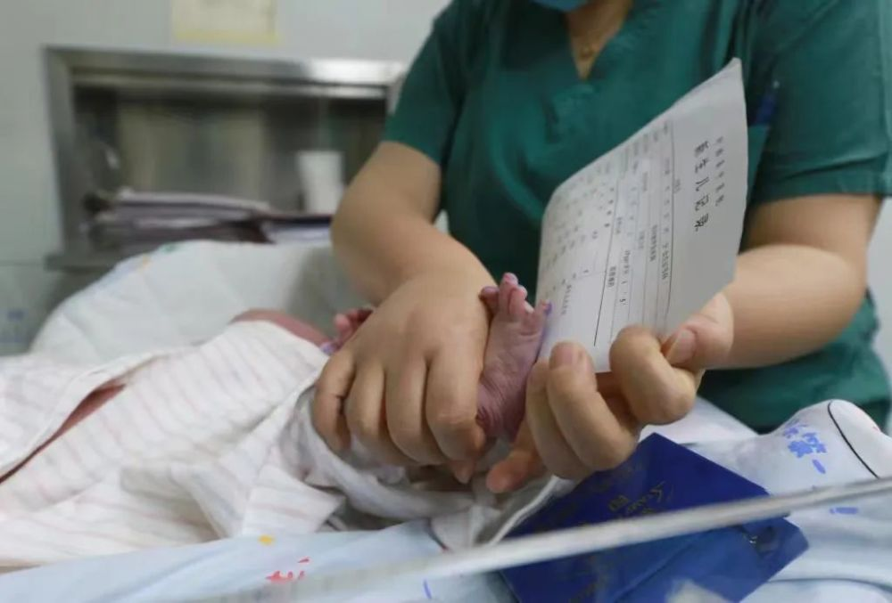
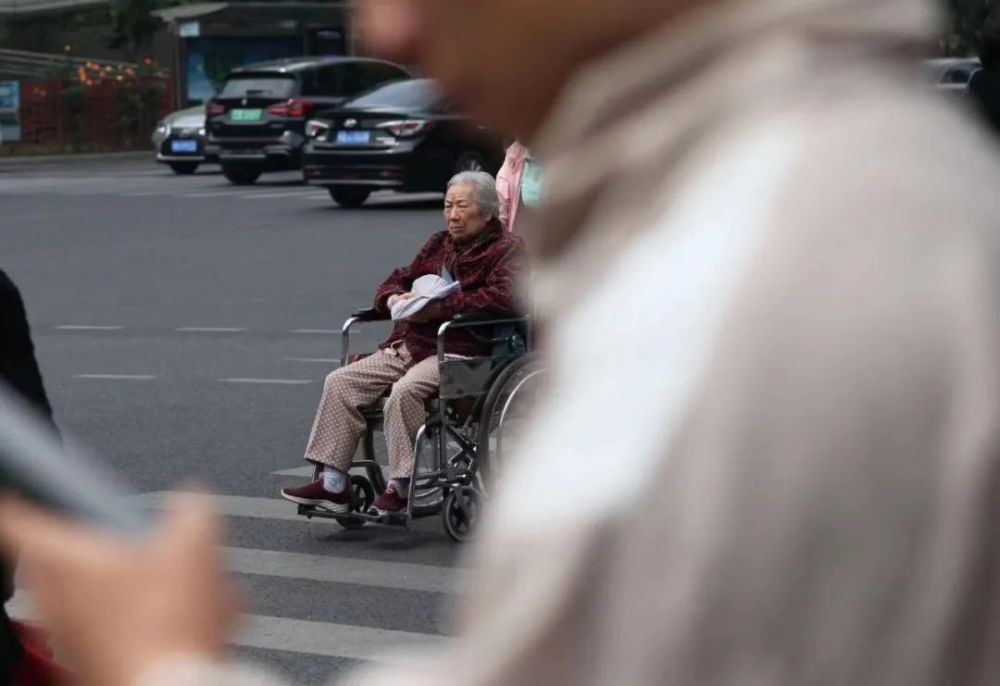

# 今年新出生人口可能不足800万？媒体称建档孕妇数量确实在下降

_2023年1月，安徽理工大学第一附属医院妇产科医护人员为新生儿进行沐浴、护理。_

最近，有消息称今年的产妇建档基本已经完成，大致可以根据建档情况估算出全年出生人数，结论是今年新出生人口不足800万。

《中国慈善家》从多个基层医院了解到，今年建档孕妇数量确实在下降，有医生表示建档数量减少了三分之一。

专家指出，未来很长一段时间里，中国新生人口下降趋势很难改变。当务之急仍是建立完善的政策体系鼓励生育，为年轻人生育解决后顾之忧。

**新生儿“6连降”**

国家统计局数据显示，2022年我国全年出生人口956万人，比2021年减少106万人；人口出生率为6.77‰，比2021年下降0.75‰。

《中国慈善家》梳理国家统计局发布的数据发现，2016年全年出生人口1883万人，达到了近年来的峰值，随后以平均每年减少150万人的速度连续下降6年。2021年全年出生人口为1062万人，2022年首次跌破千万。

国家统计局人口和就业统计司司长王萍萍解释说，人口增长持续放缓，主要受两方面因素影响：一是育龄妇女人数持续减少；二是受生育观念转变、初婚初育年龄推迟等多方面的影响，导致2021年育龄妇女总和生育率继续下降。

_2016年2月，甘肃省妇幼保健院新生儿护理区，护士在护理“猴宝宝”。_

从地方的数据来看，虽然2022年广东常住人口几十年来首次下降，但户籍人口达到10049.7万人，成为全国常住人口与户籍人口同时达到过亿体量的省份。

2017年，广东省全年出生人口151.63万人，随后逐年走低，2022年仅105.2万人。

河南省作为中国的人口大省，2022年的自然增长人口是62年来首现负增长，出生率下降0.58‰。

另一个值得关注的数据是民政部公布的婚姻登记情况：2021年，全年依法办理结婚登记764.3万对，比上年下降6.1%。这一数据创下了近30年新低。

2022年前三季度全国共有544.5万对新人办理结婚登记，同比下降7.49%。记者梳理发现，这一数据也同样出现连续9年下降的局面。

**比以往更安静的产科**

2023年5月7日，浙江省苍南县中医院发布公告，暂停产科助产服务。

年初的时候，就有媒体报道，全国各地的产科一同经历着一场“寒冬”——新生儿数量持续减少，有的医院因此缩小产科规模，甚至直接取消产科。

国家统计局最新数据显示，2021年，中国21—35岁育龄妇女减少约300万人，而到了2022年，这个减少的幅度已经达到近500万人。

_2023年5月，江苏淮安，盱眙县中医院的医护人员在产房为新生儿做登记。_

广东某综合医院妇产科一位不愿意透露姓名的主任在接受《中国慈善家》采访时介绍说，这几年孕妇的数量明显减少，今年更为明显，“我所在的医院至少减少了三分之一”。

“疫情之前，时常能看到生三胎四胎家庭，现在就很少有生二胎三胎的，大部分来医院的都是生第一胎。”这位医生说，“实际上，不管一孩还是多孩的孕妇，都在减少。”

从全国范围看，孕妇数量锐减始于2016年，但这位医生说，他真正感觉到变化比较大的是从2021年开始。“疫情期间，很多人阳了以后推迟了生育计划。但这并不是主要原因，关键还是年轻人不想生孩子，考虑到生活压力，即使生也只生一个。”

为了争夺产妇资源，很多医院开始给产妇提供各种优惠服务。例如江西省一家知名妇幼医院特需病房床位打出5折优惠。

河南一家医院的妇产科医生告诉记者，目前孕妇数量与前几年相比有了明显下降，“现在产检几乎不用排队，产科清静了很多。为了吸引更多孕妇，有的医院还提供免费接送。”

**生娃发钱杯水车薪**

为了鼓励生育，地方政府纷纷放出“大招”。今年5月12日，武汉东湖高新区发布方案，生娃最高补贴6万，被称“史上最强”补贴政策。方案明确对2023年1月1日后满足相关条件生育三孩及以上子女的家庭，每年每孩可享受育儿补贴1万元，最长可享受至6周岁，这意味着最高补贴6万元。

此前，四川省攀枝花市在2021年首先开启“生娃发钱”模式，规定从二孩开始，每月每孩发放500元，直至孩子3岁，三年每孩可领1.8万元补贴金。

随后，山东、甘肃、黑龙江、云南、宁夏等地多个市县相续出台补贴政策。

《中国慈善家》梳理发现，大部分地区的补贴范围集中在二孩、三孩家庭，只有少数地区将补贴对象拓展到一孩，比如温州市给生育一孩的家庭一次性补贴1000元，二孩补贴2000元，三孩3000元。

除了“生娃发钱”模式外，多地在孩子高考、带薪产假、购房购车优惠方面打出“组合拳”。比如湖南长沙让符合条件二孩家庭可购买第三套住房、杭州多孩家庭可直接申领车牌、山西泽州在二（三）孩满周岁前父母可晚上班或早下班1小时。

_2023年4月，北京，公园里一位老年人正在看护孩子。_

西南财经大学教授、中国人口学会副会长杨成钢在接受《中国慈善家》采访时表示，生育补贴表明了政府鼓励生育的态度，但必须看到，补贴的钱相对于家庭的育儿成本仍然是杯水车薪。

“目前，中国二孩及以上对生育率的贡献达到了40%以上，而一孩的贡献率太低，这不是正常现象。现在主要是解决一孩问题。”杨成钢说。

不少国内人口学者主张加大对“一孩”生育的支持力度，但也有人认为，与无孩家庭相比，一孩家庭更有生育意愿，相对做工作容易，用一些政策去激励，就会生育二孩或三孩。

杨成钢认为，目前，中国抚育孩子的成本仍然偏高，社会必要消费标准的提高，使得中产家庭也有些力不从心。此外，观念因素也极大影响生育问题。

“现在的年轻人个人主义、享乐主义的价值观及文化潮流短时间内很难改变，这对于人口增长伤害很大。凡是经济发达国家都面临这个问题。”杨成钢说，这在人口学中称为“第二次人口转变”，它有三个特征：一是未婚同居的比例上升，而结婚的比例下降；二是平均初婚年龄推迟，普遍都在30岁以上；三是离婚率高。

**短期内难以触底反弹**

国务院第七次全国人口普查领导小组办公室负责人在接受媒体采访时表示，根据第七次全国人口普查结果，2020年我国育龄妇女总和生育率为1.3，已处于较低水平，实施全面两孩政策后，生育水平出现短期回升，之后逐渐下行，在低水平徘徊。

据了解，国际上通常认为总和生育率1.5左右是一条高度敏感警戒线，一旦降至1.5以下，就有跌入低生育率陷阱的可能。因为构成低生育率陷阱需要有两个条件，一是总和生育率降至1.5以下，二是需要持续一段时间。

上述负责人表示，第七次人口普查结果是自2010年第六次人口普查以来，我国总和生育率首次低于1.5，是否会持续低于1.5还需要进一步观察。

_2035年左右，60岁及以上老年人口将突破4亿，在总人口中的占比将超过30%。_

杨成钢指出，总和生育率为2.1才能达到生育更替水平，但我国目前的总和生育率远远没有达到这一水平。“从理论上讲，等上一次人口出生高峰那代人的下一代进入生育年龄，人口总量和现在相比会出现反弹。但从近年中国的总和生育率来看，短期内没有触底反弹的苗头，短期内人们的生育观念很难改变。”

杨成钢认为，政府激励生育的政策不能碎片化，要进行系统化设计，形成完整的体系。而且要把生育激励、支持的重心和着力点放在一孩生育上。

“除了育儿补贴、幼儿照料外，孩子将来的入托、上学等多方面都要有政策发力。还要对母亲在就业、社会地位方面给予一定的政策倾斜，减少他们的后顾之忧。”杨成钢建议，必须尽快构建生育友好型社会，解决与生育直接密切相关的“不愿生、生不了、养不起、没人带”等问题。

作者：温如军

图片来源：视觉中国、IC

图片编辑：张旭

值班编辑：邱宇

