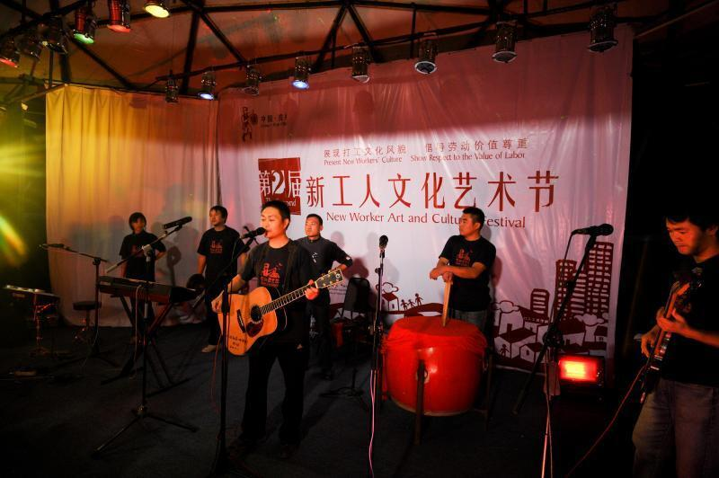
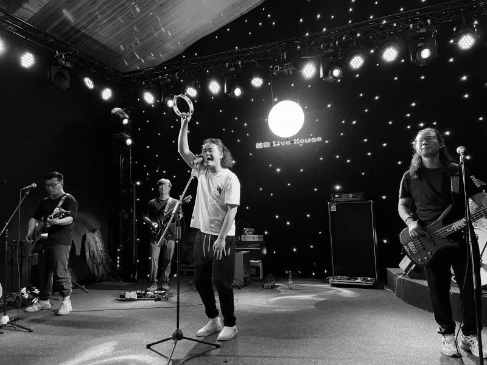
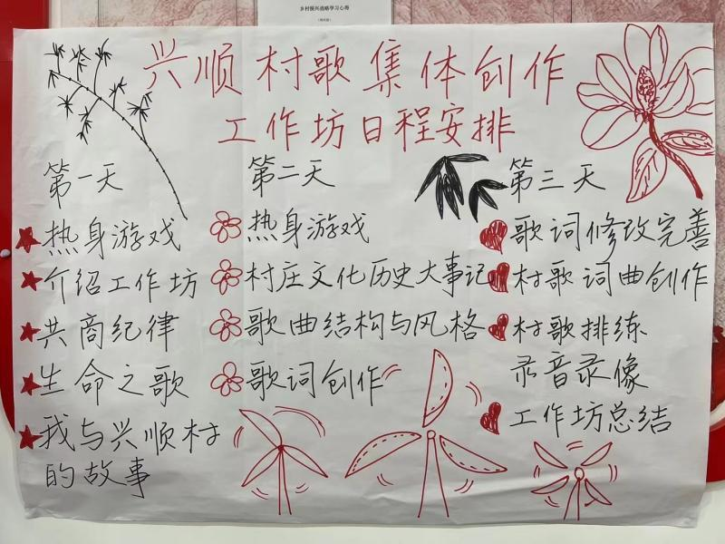
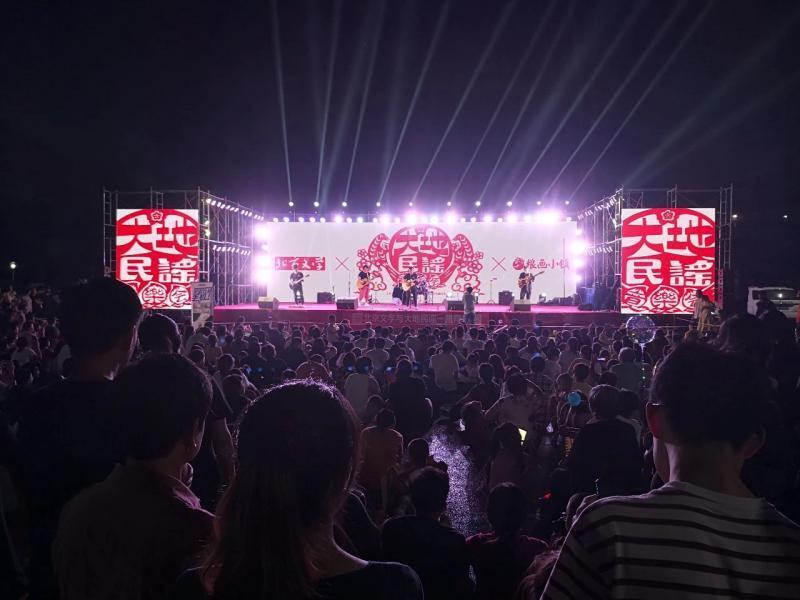
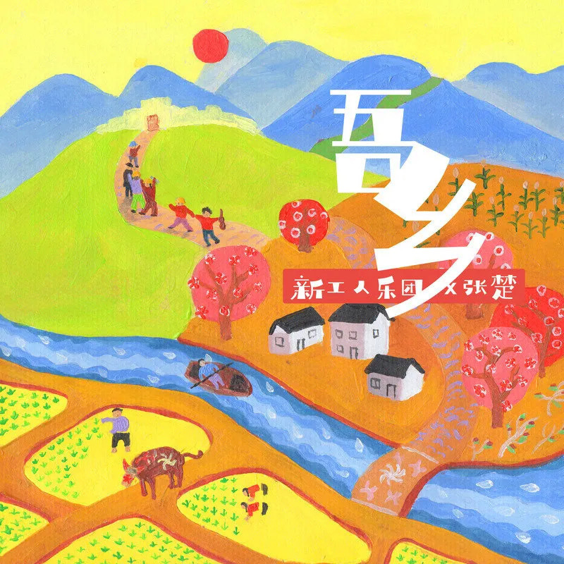
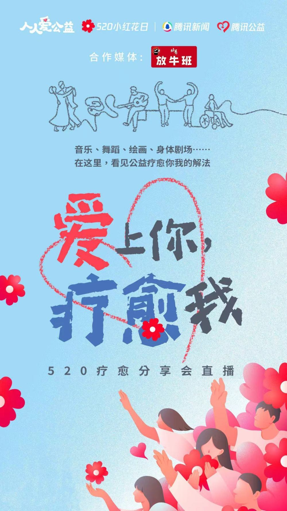

# 从工厂流水线到乡间小院，这群打工人跋涉21年为普通人歌唱

这是一支成立21年的乐队。他们曾经是矿工、老师、小镇青年，后来成为“北漂”一员。

2002年至今，他们的名字几经更改。从“打工青年文艺演出队”“打工青年艺术团”，到“新工人艺术团”“新工人乐团”，再到如今的“谷仓乐队”。他们用音乐表达自我、也用音乐治愈他人。

他们不仅是乐队，更是“音乐社会工作者”。在音乐创作之外，他们兴办打工子弟学校、创办年轻打工者职业培训班，在全国各地乡村进行巡演、与38个村寨共创村歌。

他们行走在中国大地上，演出、倾听、创作、歌唱。他们用朴素、真挚的歌声与生活在这片土地上的无数普通人互相滋养、治愈。这是一群音乐社会工作者的21年跋涉。

01 在田野上创作和歌唱

金色夕阳隐入山峦，湛蓝天空逐渐变得深邃。石头基底、土黄色砖墙、斜坡屋顶，“谷仓音乐厅livehouse”灯牌亮起，附近居民开着汽车、三轮车驶进公社，走进厅内。

北京市平谷区同心音乐公社内，谷仓乐队正在演出。这是一支有着21年历史的乐队。团队成员曾是老师、小镇青年、矿工，后来成为“北漂”一员。他们以前为城市打工青年歌唱，如今走向乡村，为乡村歌唱、创作。

舞台上，鼓手、吉他手、贝斯手就位，厚重的鼓声响起，主唱许多用低沉的嗓音唱起原创歌曲《吾乡》。结尾处，他用家乡浙江海宁方言唱道：“吾在江南向北望，侬在梦里翻红浪，今朝桃花又开放，平谷无恙好生长。”

_谷仓音乐厅演出_

台下观众大多是平谷当地中老年居民，平时很少观看摇滚/民谣现场演出。即使没有完全听懂歌词内容，但大家的情绪还是被旋律感染了。演出到中途，原本端坐的阿姨们站起身来，随着音乐节奏挥手、鼓掌。

55岁的朱阿姨感觉“回到了年轻的时候”，她鼓动72岁的王大爷拿着葫芦丝和小音响上台，吹奏一首《酒醉的蝴蝶》。王大爷的演奏与乐队风格迥异，但二者在这场乡村音乐会中奇妙融合。正像乐队过去和现在的无数次演出一样，他们在工地与工友共同欢呼，在村庄与老中青三代互动创作。

同心音乐公社的活动正在进行时，团队的另一位主要成员孙恒则带队在重庆兴顺村走访调研，听村里的退休教师、乡贤、老革命、老党员讲述个人故事、村庄历史，与村民共创村歌。

拜访途中，一位88岁的老人拿出了保存完好的薅草锣鼓——一种集体劳动生产时会用到的传统民间音乐形式。锣鼓声一响，附近居民都围拢来。老人和村民脸上都露出笑容，孙恒内心也感到震撼。“这是从咱们大地里长出的音乐，我觉得特别接地气，这种音乐直击人心。”

_孙恒带队在重庆进行村歌创作_

“目前歌词创作还没有完成，后续我们可能会在曲调中结合这些本地的音乐元素进行创作。”孙恒说，每到一个地方，村歌的创作都尽量跟当地音乐元素结合。既要传承传统，也要创新，同时要照顾到老中青三代村民的需要。

02 从城市到农村

“谷仓乐队”最初成立时名叫“打工青年文艺演出队”，后来曾更改名为“打工青年艺术团”“新工人艺术团”“新工人乐团”。那时，他们主要在城市的工地上为工友歌唱。

为工友演出的种子是某年冬天在天津一处工棚演出时埋下的。那时，孙恒在打工子弟学校做志愿者，认识了一些学生、家长。他第一次走进工棚为工友们唱歌，天气寒冷，工棚没有任何取暖设施，味道难闻，但大家像过年一样热闹。工友也加入孙恒的演唱，用方言唱起民歌。

后来，孙恒、许多等人组建演出队，创作打工歌曲，常常跑到工地演出。一个夏天傍晚，团队来到某处学校工地。没有专业设备，他们拿着钢筋棍往地上一插，把话筒一捆，就开始唱歌。工友们刚刚下工，端着饭缸子，坐在砖头上，放下安全帽，最初只是拘谨地听着，后来开始“用力拍巴掌”，逐渐在音乐中松弛下来。

_为工友演出_

音乐创作、演出之外，他们也进行了大量与工人相关的社会实践。2004年，团队机缘巧合发行专辑《天下打工是一家》。后来，他们用赚得的七万多元版税在朝阳区皮村创办打工子弟学校，招募志愿者做老师。2010年，团队在平谷兴办“同心创业培训中心”——实际接近于年轻打工者职业培训班，为大家提升计算机等职业技能。

2017年，团队开始在全国进行乡村音乐会巡演，工作重心逐渐从城市转向农村。连续三年，团队每年都会进行大约1个月的巡演。陕西、山西、山东、河南、湖北、湖南、四川、贵州······他们的足迹遍布中国大江南北。在近四万里行程中，他们沿途举办大地民谣音乐会义演50多场，直接参与观众超过3万人。

_团队进行乡村巡演_

让团队成员路亮至今印象深刻的演出是在河南老井村。演出结束，他在院子里遇到了一位留守女孩，父母去世，叔叔婶婶在外打工，她跟着爷爷留在老家。他想到了自己远在山东老家的孩子。

路亮常常想起对孩子的亏欠。2016年，他刚到北京不久，住在皮村终日不见阳光的潮湿屋子里。妻子和孩子来看望他，分别前去肯德基吃了饭。他借口上洗手间离开，原本一声不吭的孩子突然从餐厅冲到门外：“爸爸，你跟我一起回家。你不要走！”

巡演结束不久，他创作了《孩子》。在这首歌里，他写道：“……那些为了生活还在漂泊地挣扎 和那些酒醉以后的错觉 让我丧失了思念的眼泪 同嘲笑一起逃跑
只有在清晨迷迷糊糊的醉梦中醒来 我才看到你 羞涩地 悄悄来到我那不再僵硬的怀抱……”

“这首歌送给那些留守孩子，也是送给自己。我们大多数人，为了理想和生活在外面打工。希望这首歌，能够成为另外一种形式的陪伴，也是一种疗愈。”路亮说。

03 与38个村共创村歌

乡村巡演途中的见闻触动了孙恒，他萌发了村歌计划的想法。

孙恒记得，在四川一个村子，他们邀请村里一位70多岁的老人拉二胡加入演出。那位老人已经四十年没有拉二胡了，当他从屋里拿出那把满是灰尘的二胡，丝弦声重新响起，村民都聚拢来，老人脸上露出了笑容。

“相对城市而言，乡村的精神文化生活、公共文化活动是比较匮乏的。国家实行乡村振兴其中一点就是文化振兴。我们想通过村歌把老百姓的心凝聚起来，激发老百姓对村庄的热爱。”孙恒说。

目前，团队已经与全国38个村庄共创村歌。提起这项计划，孙恒、许多都对团队在鄂尔多斯木凯淖尔镇的村歌创作印象深刻。他们先后在当地14个村庄与村民共同创作村歌。

_团队在鄂尔多斯与村民共创村歌_

“乌兰吉林好地方，西靠滩来东靠梁。刨开黄土挖水库，蓝天白云绿草场。土打墙来盖新房，亲朋好友来帮忙。大锅炖肉小锅茶，边吃边喝边叨啦。茄子开花颠倒颠，老人是咱一层天。马兰开花在路边，村里回来了小青年。西蒙特牛排成行，阿白山羊都养上。春耕秋收不用人，一社五部幸福村。”这是团队与乌兰吉林村村民共同创作的村歌，村歌的治愈力正是源于与村民集体共创的工作方法。

许多说，歌词的前3句源于村民对村庄历史的回忆，以及对村庄自然环境、风俗的描写。“叨啦”则是当地方言，意为聊天、唠嗑。第五、六句通过比兴的手法，前半句用村庄俗语描写自然风物，后半句则表现了村里的某种文化特征，“老人是咱一层天”表达了对老人的尊重，“村里回来了小青年”则隐含着一则故事——一户村民的儿子回村做起了养殖业。

“村民们从没想过自己会写歌创作，当他们真的把一首歌写出来，并且融入自己的生活情感，心里就像乐开了花，特别痛快。这确实对他们自身是一种疗愈。”许多说。

当地文化站站长在推进乡村文化建设工作中常常感到苦闷，村歌计划的实施让乡村工作得以更好地开展，也“治愈”了这位基层工作人员。

村歌不仅记录了村庄的自然风貌、历史变革、传统习俗，还捕捉了村庄当下的变化。同样的情况也发生在福建四坪村。在共创村歌过程中，他们请老人参加工作坊，拾起十多年没唱过的地方戏（平讲戏）。村歌创作完成后，本来被搁置了的当地剧团又建了起来，还有年轻人回乡成立传习所。

_团队在福建四坪村_

全国各地村歌创作收获了不小成效。有人用村歌直播带货，有人回乡开民宿、做工作室，有的村庄成立村歌演出队、举办村歌村舞大赛，村里的文化活动热闹起来。

04 为劳动者歌唱初心不变

二十一年来，乐队名字几经变化。不断更改的称呼反映了劳动群体的变化，也折射出团队在音乐创作和社会实践上的尝试、突破、改变。

许多回忆，2002年，团队成立之初只有3人，取名为“打工青年文艺演出队”。随着人员逐渐增多，他们改名叫“打工青年艺术团”。作为“北漂”一员的许多、孙恒等人，恰逢城市化、工业化浪潮，怀抱着音乐梦想的他们在工地、工厂为工友歌唱，也逐渐关注到周围工友的故事，尝试用音乐做表达。2009年，团队改名为“新工人艺术团”，后来又改名为“新工人乐团”。

_团队专辑_

“当时我们觉得这个群体的方向是成为时代的新工人，不满足于普通的生存状态，希望城市给这个群体更多的支持。”许多说，团队名字的变化代表了打工群体的变化，也折射出团队在音乐创作和社会实践上的尝试、突破、改变。2022年，团队改名为“谷仓乐队”，寓意为乡村生产有机的精神食粮。他们不仅是“乐队”，更是“音乐社会工作者”。许多说：“我们希望通过音乐等艺术形式触及一些社会问题，试图改变一些现状。”

“处于困境中的人尤其需要精神上的动力。音乐可以带给人勇气、信心、力量、温暖。”孙恒把过往二十一年的音乐创作和社会实践粗略划分为两个阶段，第一阶段，在城市化、工业化浪潮中，到工地、工厂唱歌，兴办打工子弟学校、打工者职业培训班；第二阶段，工作重心由城市转向乡村，创办同心音乐公社，进行乡村巡演，协助村寨进行村歌创作。

孙恒说：“我们能坚持21年去做这件事，原动力一定是来自内心深处。无论是以前在工地给工友唱歌，还是现在到乡村唱歌，我的内心都在不断丰富成长，这是一个双向滋养的过程。”

路亮也把在乡村的演出理解为一个互补的过程。“我觉得能到乡村演出是一件特别有意义的事。我们想表达的东西可以传递到更多地方，乡村也需要精神文化生活。我们在演唱也在倾听，我们也把村庄的特色用我们的形式记录下来。”

_团队在贵州演出_

“在乡村巡演、与村民共同创作村歌的过程中感受到了祖国大地的辽阔、民族文化的多元和丰富。”许多回忆起，此前在贵州侗族村寨演出时，当地有句俗语“饭养身歌养心”，当地村民的生活也有大量自发的音乐歌唱。“一个人在生活中可能被挤压得都佝偻着背了，在音乐中站起来成为一个顶天立地的人，堂堂正正去发出自己的声音。这是让一个人站起来的过程，也是以歌养心。”

“无论是在城市还是在乡村，无论是为工友还是为村民歌唱，我们为劳动者歌唱的初心不曾改变。”许多说。

孙恒期待着把同心音乐公社作为原创音乐人聚集地，吸引更多人参与到乡村建设中，用音乐的方式助力乡村振兴。未来3-5年，他希望推动100个村庄进行村歌创作，也希望把集体创作的工作方法传递给更多人。

**今年的520，他们也将带着20多年的经历和体验，参与腾讯新闻的疗愈分享会，讲述他们用歌声疗愈普通劳动者、疗愈村庄、也疗愈了自己的故事。**

（图片为受访者供图）

撰文/北京青年报记者 陈静

统筹/林艳 张彬

